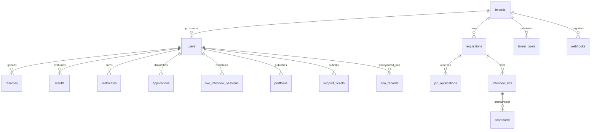
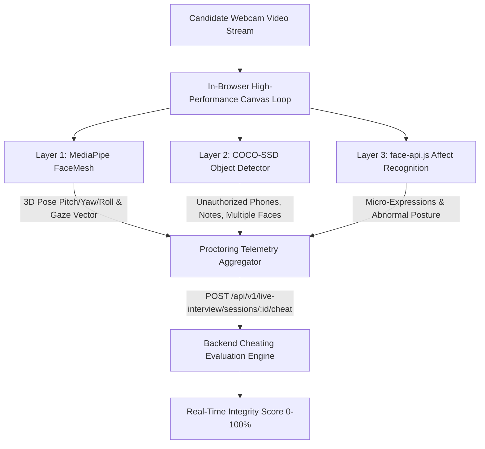

# 🚀 CareerShala — Enterprise AI Career Copilot, Next-Gen ATS & B2B Talent Cloud

> **Single Source of Truth (SSOT) Architectural & Technical Specification Manual**  
> *Exhaustive Production Documentation for Enterprise AI Career Acceleration, Dual-Engine ATS Intelligence, B2B SaaS Hiring Cloud, Multi-Tenant Data Isolation, AI Portfolio Generation, Vision Proctoring, Brevo Mailer & Gmail OAuth Infrastructure*

---

## 🌟 Live Demo & Quick Links

- 🌐 **Production Web Application**: [https://resume-screening-system-lyart.vercel.app](https://resume-screening-system-lyart.vercel.app)
- ⚙️ **Backend API Documentation (Interactive Swagger)**: `http://localhost:8000/docs` or `https://resume-screening-system-hb2d.onrender.com/docs`
- 📚 **Alternative ReDoc API Specifications**: `http://localhost:8000/redoc`
- 🤖 **AI Copilot In-Depth Architecture**: [`AI_COPILOT_ARCHITECTURE.md`](./AI_COPILOT_ARCHITECTURE.md)
- 📜 **Public Skill Certificate Verification Portal**: `/verify/:certificateId`
- 💼 **Public Candidate Showcase Portfolios**: `/portfolio/:username`
- 🏢 **Public Employer Company Profiles**: `/company/:companySlug`

---

## 📖 Executive Summary & Core Platform Overview

**CareerShala** is an enterprise-grade AI Career Ecosystem and B2B SaaS Talent Acquisition Platform built with **FastAPI (Python 3.10+)** and **React 18 (Vite 5)**. 

Initially developed as an intelligent candidate career companion, the platform has expanded into a full-lifecycle talent infrastructure serving two distinct stakeholders:
1. **Candidates**: Automated ATS resume optimizer, AI portfolio builder, 4-layer vision-proctored live mock interviewer, automated cold job outreach suite, verified skill certificates, gamified career quest, and persistent AI Copilot.
2. **Employers & Enterprise Hiring Teams**: Multi-tenant B2B hiring platform with job requisitions, structured interview kits and scorecards, opt-in talent pools, EEOC/OFCCP-compliant anonymized demographic vaults, outbound event webhooks, enterprise SSO (SAML/OIDC), SCIM 2.0 directory sync, and role-based access control (Owner, Admin, Recruiter, Hiring Manager, Interviewer, Executive).

```mermaid
graph TD
    subgraph Client Layer [Frontend SPA - React 18 + Vite 5]
        CandidateUI[Candidate Portal & Dashboard]
        RecruiterUI[Recruiter & Enterprise Portals]
        CopilotUI[Global AI Copilot Drawer]
        ProctorUI[4-Layer Vision Proctor Canvas]
    end

    subgraph Gateway Layer [FastAPI Micro-Core]
        TenantMW[Multi-Tenant Middleware x-tenant-id]
        AuthMW[JWT Security & RBAC Guard]
        RateLimiter[SlowAPI Distributed Limiter]
        TraceID[X-Trace-ID Distributed Telemetry]
    end

    subgraph Intelligence & Scoring Engines
        ATS[Hybrid ATS Engine: BM25 + BGE Dense + Cross-Encoder]
        Fairness[Fairness Vault & Bias Mitigation]
        Copilot[Multi-Provider Copilot: Groq + Gemini + Mistral]
        LangGraph[LangGraph Multi-Agent Application Dispatcher]
        Scheduler[Nightly AI Job Alerts Scheduler]
    end

    subgraph Storage & Cloud Infrastructure
        MongoDB[(MongoDB Atlas 7.0)]
        Cloudinary[Cloudinary Media CDN]
        Brevo[Brevo REST API v3 - Port 443]
        Gmail[Google Gmail OAuth Relay]
        ReportLab[Zero-Network ReportLab Vector Engine]
    end

    ClientLayer --> GatewayLayer
    GatewayLayer --> Intelligence & Scoring Engines
    GatewayLayer --> Storage & Cloud Infrastructure
```

---

## 🚀 Key Feature Modules & Capabilities

### 1. 🏢 Enterprise ATS & B2B SaaS Hiring Cloud (`/enterprise/*`, `/recruiter/*`)
* **Multi-Tenant Data Isolation**: Complete tenant segregation (`x-tenant-id`) across all database queries, candidate dossiers, and team actions via `TenantMiddleware`.
* **5 Dedicated Enterprise Dashboards**:
  * **Executive Cockpit (`/exec/dashboard`)**: High-level requisition velocity, time-to-hire metrics, cost-per-hire, offer acceptance ratios, and department headcount health.
  * **Recruiter Pipeline Manager (`/recruiter/dashboard`, `/recruiter/jobs`)**: 6-stage interactive Kanban board (`Applied`, `Reviewing`, `Shortlisted`, `Interview`, `Hired`, `Rejected`), resume preview stream, and candidate match scores.
  * **Hiring Manager Portal (`/hiring-manager/dashboard`)**: Requisition sign-offs, scorecard summaries, team calibration ratings, and candidate advancement.
  * **Interviewer Workbench (`/interviewer/dashboard`)**: Assigned upcoming interviews, 1-click launch of standardized interview kits, and real-time rubric scoring.
  * **Enterprise Team Management (`/enterprise/team`)**: Multi-seat team invitations (`/enterprise/accept-invite`), role assignment, and audit logs.
* **Structured Interview Kits & Rubrics (`/api/v1/interview-kits`)**: Standardized question sets, competency evaluation criteria (STAR method), and scorecard consolidation to eliminate interviewer bias.
* **Consented Talent Communities (`/api/v1/talent-pool`)**: Opt-in talent pools with tag filtering, skill indexing, and automated candidate re-engagement.
* **EEO-1 Vault & Compliance Auditing (`/api/v1/eeo`, `/api/v1/compliance`)**: Strict demographic anonymization vault ensuring protected class data (race, gender, veteran status, disability) is cryptographically isolated from hiring evaluators, compliant with EEOC, OFCCP, and NYC Local Law 144.
* **Enterprise SSO & SCIM 2.0 Directory Sync (`/api/v1/enterprise-auth`)**: SAML 2.0, OIDC identity provider integration, and automated user provisioning/deprovisioning via SCIM.
* **Outbound Event Webhooks (`/api/v1/webhooks`)**: Signed HMAC-SHA256 event notifications (`candidate.applied`, `interview.completed`, `offer.extended`) to sync with external platforms.

---

### 2. 💬 Interactive AI Career Copilot (`AICopilotWidget.jsx` & `/api/v1/copilot`)
* **Global Conversational Assistant**: Persistent drawer accessible across every page via decoupled window events (`careershala:open-copilot`).
* **Dynamic Context Assembly (RAG)**: Gathers live candidate data on demand:
  * **Resume Structure**: Skills, technical proficiencies, roles, and education.
  * **Latest ATS Report**: Missing keywords, fit percentage, and recommendations.
  * **GitHub Stats**: Repo counts, languages, and contribution scores.
  * **Interview Analytics**: Historical mock interview scores and weak areas.
  * **Certifications**: Validated skill credentials and scores.
* **Instant Shortcut Interception**: Direct navigation bypassing LLM inference (`/interview`, `/ats`, `/enhance`, `/upload`, `/gamification`, `/billing`).
* **Multi-Provider Cascade Failover**:
  $$\text{Groq (GPT-OSS-120B / Qwen)} \xrightarrow{\text{fallback}} \text{Google Gemini 2.5 Flash} \xrightarrow{\text{fallback}} \text{Mistral AI (open-mistral-7b)} \xrightarrow{\text{fallback}} \text{Contextual Guidance}$$
* **Multi-Key Thread-Safe Pools**: Automatically rotates through up to 5 keys per provider on rate limits (`429`) or model availability shifts.
* **Full Technical Blueprint**: See [`AI_COPILOT_ARCHITECTURE.md`](./AI_COPILOT_ARCHITECTURE.md).

---

### 3. 📊 Smart Dual-Engine ATS Resume Screening & Explainable AI (`/results`)
* **Hybrid Multi-Layer Matching Engine**:
  * **Dense Semantic Matching**: 768-dimensional BGE embeddings with hierarchical document chunking and MaxSim token alignment.
  * **Sparse Lexical Analysis**: TF-IDF vectorization and BM25 keyword density matching.
  * **Neural Cross-Encoder Reranker**: Deep token interaction score re-ranking top candidate matches.
* **Explainable AI (XAI)**:
  * Radar chart breakdowns across hard skills, experience depth, domain alignment, and education.
  * Side-by-side keyword matching grid highlighting critical missing competencies.
  * Formatting compliance check (margins, fonts, table readability, contact info).
* **AI Resume Enhancer Wizard (`/enhance`)**: Action-verb rewrite engine converting passive bullets into high-impact STAR accomplishments.
* **Ghost Text & Fraud Detection (`/fake-detect`)**: Analyzes white-text stuffing, invisible micro-fonts, timeline overlaps, and counterfeit credentials.

---

### 4. 🎥 Real-Time Mock Interviewer & 4-Layer Vision Proctoring (`/interview`, `/live-interview`)
* **Dynamic Conversational Interviewer**: LLM-driven voice/text technical and behavioral interviews that adapt follow-up questions in real time based on candidate answers.
* **4-Layer In-Browser Vision Proctoring**:
  1. *MediaPipe FaceMesh*: 3D head pose matrix calculation (pitch, yaw, roll) and iris gaze vector tracking.
  2. *COCO-SSD Real-Time Detector*: Neural frame analysis detecting smartphones, secondary monitors, notes, and unauthorized persons.
  3. *face-api.js Affect Recognition*: Facial expression analysis and posture anomaly tracking.
  4. *Telemetry Stream Aggregator*: Streams events to `/live-interview/sessions/:id/cheat` to compute a 0–100% Candidate Integrity Score.
* **Post-Interview Diagnostics**: Comprehensive report card evaluating technical depth, STAR structure, speech cadence, and integrity metrics.

---

### 5. 🎨 AI Portfolio Builder Studio & Public Showcase (`/portfolio-builder`, `/portfolio/:username`)
* **Automated Resume-to-Portfolio Conversion**: Instant extraction of bio, skills, education, and projects from uploaded PDFs.
* **6 Premium Visual Design Systems**:
  * `Bento Grid`: Apple/Linear-inspired sleek modular card layout.
  * `Glassmorphic Pro`: Frosted glass blur, translucent panels, and vibrant ambient lighting.
  * `Cyberpunk`: Neon cyan/magenta accents with terminal code aesthetics.
  * `Minimal Elegance`: Refined editorial typography and luxury monochrome minimalism.
  * `Neon Developer`: Terminal console styling tailored for software engineers.
  * `3D Interactive`: Canvas depth cards with responsive mouse physics.
* **Cloudinary CDN Sync**: Avatar uploads, resume downloads, and dynamic social previews.
* **Recruiter Relay Contact System**: Secure messaging portal forwarding recruiter inquiries directly to the candidate's personal inbox without exposing raw email addresses.

---

### 6. 🤖 AI Apply Assistant & Smart Cold Outreach (`/apply-assistant`)
* **Vision OCR Screenshot Parser**: Extract job requisitions, required qualifications, company name, and HR contact emails from screenshots of job boards (LinkedIn, Indeed, Naukri, Wellfound).
* **Instant Pre-Application ATS Check**: Evaluates candidate compatibility before outreach dispatch.
* **LangGraph Multi-Agent Draft Generation**: Synthesizes custom, human-toned cold emails and personalized cover letters.
* **Dual-Channel Dispatch**:
  * **Google Gmail OAuth 2.0**: Dispatches directly from the candidate's authenticated personal Gmail inbox.
  * **Brevo HTTP REST API (v3 / Port 443)**: Transactional dispatch with candidate `replyTo` routing ensuring recruiter replies land in the candidate's personal inbox.

---

### 7. 📜 Cryptographically Verified Skill Certificates (`/verify/:certificateId`)
* **Zero-Network ReportLab Vector Engine**: High-resolution vector PDF certificate generation executed locally with zero third-party rendering APIs.
* **Tamper-Proof Verification**: Embedded SHA-256 cryptographic hash, alphanumeric credential ID, and scannable QR verification code.
* **Public Verification Portal**: Dedicated rate-limited verification endpoint displaying certified skill badges, exam scores, and issuance timestamps.

---

### 8. 🎮 Gamification Engine & Career Quest (`/gamification`)
* **28-Day Monthly Activity Heatmap (`🔥`)**: Real-time GitHub-style activity grid tracking daily interview prep, ATS evaluations, and resume enhancements.
* **Rolling Streaks & Reward Chests**: Consecutive-day multipliers, XP progression rings, daily career missions, and weekly challenges.
* **Competitive Leaderboards**: Public candidate ranking system encouraging consistent career preparation habits.

---

### 9. 🛡️ Retention Loops, Dunning & Admin Operations (`/admin`, `/revenue-recovery`)
* **Nightly AI Job Alert Scheduler**: Autonomous background job matching newly posted positions with candidate profiles and emailing personalized job digest cards.
* **Automated Dunning & Revenue Recovery (`/api/v1/revenue-recovery`)**: Intelligent retry schedules, grace periods, and account retention flows for subscription billing.
* **Dynamic Skill Taxonomy Management (`/admin_ontology`)**: Administrative interface to expand skills, aliases, and occupation graph edges.
* **Support Ticket Desk (`/support`)**: Ticket management queue with file attachments, priority escalation, agent replies, and Brevo notification alerts.

---

## 🛠️ Verified Technology Stack Matrix

| Category | Technology / Library | Version / Spec | Operational Role & Architectural Purpose |
| :--- | :--- | :--- | :--- |
| **Backend Framework** | FastAPI | `^0.110.0` | High-performance asynchronous API engine with automatic OpenAPI/Swagger generation |
| **ASGI Server** | Uvicorn (Standard) | `^0.29.0` | Production server utilizing `uvloop` / Windows `ProactorEventLoop` for async concurrency |
| **Database & ODM** | MongoDB Atlas & Motor | `motor==3.4.0`, `pymongo==4.7.2` | Non-blocking async MongoDB client for multi-tenant document storage |
| **Data Validation** | Pydantic v2 | `^2.6.4` | Strict type validation, JSON schema serialization, and configuration settings |
| **LLM Inference** | Groq, Google GenAI, Mistral | `groq>=0.5.0`, `google-genai>=0.1.1` | Ultra-fast token streaming (`openai/gpt-oss-120b`, `gemini-2.5-flash`, `open-mistral-7b`) |
| **Key Management** | Multi-Key Thread-Safe Pools | Internal Custom | Round-robin key rotation across up to 5 API keys per LLM provider with rate-limit failover |
| **AI Workflows** | LangGraph & LangChain | `langgraph>=0.0.50`, `langchain-core` | Multi-agent stateful workflow graphs for ATS analysis & application drafting |
| **NLP & Vectors** | Scikit-learn, NLTK, NumPy | `scikit-learn==1.4.2`, `nltk==3.8.1` | TF-IDF vectorization, cosine similarity, skill ontology graph matching |
| **Proctoring Vision** | MediaPipe FaceMesh & COCO-SSD | `@mediapipe/face_mesh`, `coco-ssd@2.2.3` | Browser 3D head pose estimation, iris gaze tracking, and prohibited object detection |
| **Emotion Vision** | face-api.js | `@vladmandic/face-api` | Real-time facial expression analysis and suspicious affect detection |
| **PDF Generation** | ReportLab | `^4.1.0` | Zero-network local vector rendering for verified skill certificates & cover letters |
| **Document Parsing**| PDFPlumber, PyPDF, Docx | `pdfplumber==0.11.0`, `python-docx` | Structural extraction of resume text, tables, contact headers, and metadata |
| **Auth & Security** | Passlib (Argon2 / Bcrypt), Jose | `passlib==1.7.4`, `python-jose==3.3.0` | JWT HS256 authentication, 2FA OTP generation, and multi-tenant header isolation |
| **Email Services** | Brevo HTTP REST API & Gmail OAuth | `httpx==0.27.0`, `google-auth>=2.29.0` | Firewall-safe HTTPS Port 443 email delivery with candidate `replyTo` routing |
| **Payments** | Razorpay SDK | `^2.0.1` | Pro and Enterprise subscription checkout and signature webhook verification |
| **Media Storage** | Cloudinary SDK | `^1.40.0` | Permanent cloud storage for candidate avatars, company logos, and badge media |
| **Frontend Core** | React 18 & Vite 5 | `react^18.3.1`, `vite^5.3.3` | Modern Single-Page Application (SPA) with hot module reloading and code-splitting |
| **UI & Animation** | Tailwind CSS & Framer Motion | `tailwindcss^3.4.6`, `framer-motion` | Curated design system, responsive layouts, glassmorphism, micro-interactions |
| **Data Viz** | Recharts | `^2.12.7` | Interactive candidate analytics, skill radar charts, and ATS score gauges |

---

## 📁 Complete Workspace Tree & Architecture Map

```text
Resume-Screening-System/
├── README.md                          # Single Source of Truth Architectural Documentation
├── AI_COPILOT_ARCHITECTURE.md         # In-Depth AI Copilot Engineering Specification
├── package.json                       # Root NPM Workspace Metadata
├── requirements.txt                   # Production Python Dependencies
├── render.yaml                        # Multi-Service Cloud Deployment Manifest
│
├── backend/
│   ├── main.py                        # FastAPI Application Bootstrap, Middlewares & Lifespan
│   ├── requirements.txt               # Backend Production Python Dependencies
│   ├── api/
│   │   ├── deps.py                    # Auth Dependencies, JWT Validation, Role RBAC & Tenant Scoping
│   │   └── routes/                    # API Route Handlers (32 Modules)
│   │       ├── admin.py               # Admin Dashboard, System Health & Platform Analytics
│   │       ├── admin_ontology.py      # Dynamic Skill Ontology & Occupation Taxonomy APIs
│   │       ├── analytics.py           # User & Recruiter Platform Telemetry
│   │       ├── apply_assistant.py     # AI Job Outreach, Screenshot OCR & Draft Manager
│   │       ├── ats.py                 # Multi-Layer ATS Scoring & Keyword Gap Analysis
│   │       ├── auth.py                # Registration, Login, Password Reset & Session Management
│   │       ├── auth_github.py         # GitHub OAuth 2.0 Callback & Authentication
│   │       ├── auth_google.py         # Google OAuth 2.0 Sign-In Integration
│   │       ├── auth_linkedin.py       # LinkedIn OAuth 2.0 Callback Integration
│   │       ├── auth_otp.py            # 6-Digit Email OTP Verification (Signup & Trusted Device 2FA)
│   │       ├── careers.py             # Internal Platform Careers Portal & Job Applications
│   │       ├── certificates.py        # Verified Certificate Issuance & Public Validation
│   │       ├── company.py             # Employer Company Profiles & Verified Branding
│   │       ├── compliance.py          # GDPR "Right to be Forgotten", Data Export & Bias Audits
│   │       ├── copilot.py             # Interactive AI Career Copilot Streaming Endpoint
│   │       ├── eeo.py                 # EEO-1 Demographic Anonymization Vault & Parity Metrics
│   │       ├── enterprise_auth.py     # Enterprise SSO (SAML 2.0 / OIDC) & SCIM Directory Sync
│   │       ├── enhance.py             # AI Resume Bullet Enhancer & STAR Questionnaire Wizard
│   │       ├── github.py              # Candidate GitHub Profile & Codebase Tech Stack Analyzer
│   │       ├── gmail_oauth.py         # Gmail OAuth Authorize, Callback, Status & Token Refresh
│   │       ├── health.py              # Health Check & Uptime Monitoring
│   │       ├── integrations.py        # Enterprise ATS Connectors (Slack, Greenhouse, Lever, Workday)
│   │       ├── interview.py           # Standard Offline Practice Interview Sessions
│   │       ├── interview_ai.py        # Dynamic AI Interview Question Generator & Gamification APIs
│   │       ├── interview_kits.py      # Structured Scorecards, Interviewer Kits & Rubrics
│   │       ├── jobs.py                # Recruiter Job Postings, 768-D Embeddings & Applicant Kanban
│   │       ├── live_interview.py      # Real-Time Live Mock Interview & Proctoring Stream Ingestion
│   │       ├── notifications.py       # In-App Notification Dispatch & Read State Management
│   │       ├── payment.py             # Razorpay Order Creation & Webhook Verification
│   │       ├── pdf_gen.py             # Dynamic PDF Generation Endpoints
│   │       ├── portfolio.py           # AI Portfolio Generator, Themes & Recruiter Contact Relay
│   │       ├── requisitions.py        # Enterprise Job Requisitions, Approvals & Compensation
│   │       ├── resume.py              # Resume Upload, PDF/Docx Parsing & CRUD Management
│   │       ├── revenue_recovery.py    # Dunning Campaigns & Failed Payment Retries
│   │       ├── support.py             # Candidate Support Ticket Creation & Message Threads
│   │       ├── talent_pools.py        # Consented Candidate Communities & Talent CRM Pools
│   │       ├── team.py                # Enterprise Multi-Tenant Team Invitations & RBAC
│   │       ├── users.py               # User Profile, Plan Tiers & Gamification State
│   │       └── webhooks.py            # Enterprise Outbound HMAC Webhooks
│   ├── certificates/                  # Zero-Network ReportLab Vector PDF Engine & QR Generator
│   ├── config/                        # Database Connection (Motor) & Cloud Configurations
│   ├── core/                          # Settings, Security, Dual Key Pools & Structlog Logging
│   │   ├── config.py                  # Pydantic Settings & Environment Parsing
│   │   ├── llm_client.py              # Thread-Safe Groq & Gemini Key Pool Rotation Managers
│   │   └── security.py                # Argon2/Bcrypt Password Hashing, JWT & Device Cookies
│   ├── models/                        # MongoDB ODM Schemas (Users, Resumes, Portfolios, Requisitions, etc.)
│   ├── repositories/                  # Clean Architecture Data Access Layer (Base, User, Resume, Result, etc.)
│   ├── scheduler/                     # Cron Jobs & Background Schedulers (Nightly AI Job Alerts)
│   ├── services/                      # Business Logic Layer (46 Domain Services)
│   │   ├── copilot_service.py         # AI Copilot Multi-Provider Streaming & Context Aggregator
│   │   ├── scoring_engine.py          # Multi-Layer ATS Scoring Engine
│   │   ├── email_service.py           # Brevo HTTP REST & Gmail OAuth Dispatcher
│   │   ├── live_interview_service.py  # Live Adaptive AI Mock Interviewer
│   │   ├── portfolio_service.py       # Portfolio Content Extraction & Theme Formatter
│   │   ├── multi_tenancy/             # Tenant Isolation Middleware & Context
│   │   ├── fairness/                  # Four-Fifths Rule & Bias Mitigation Audits
│   │   └── scoring/                   # Replay Engines, Occupation Adapters & Experience Models
│   └── tests/                         # Pytest Automated Test Suite (50+ Unit & Integration Tests)
│
└── frontend/
    ├── package.json                   # Frontend Dependencies (React 18, Vite 5, Tailwind CSS)
    ├── vite.config.js                 # Vite Bundler, Proxy & Alias Configurations
    ├── src/
    │   ├── App.jsx                    # Route Registry, Protected Layouts & Role Guards
    │   ├── main.jsx                   # React Virtual DOM Bootstrap
    │   ├── index.css                  # Global Tailwind CSS Design System, Custom Gradients & Themes
    │   ├── components/                # Modular UI Components
    │   │   ├── AICopilotWidget.jsx    # Persistent Interactive AI Copilot Chatbot Drawer
    │   │   ├── AppLayout.jsx          # Application Shell with Responsive Sidebar & Navbar
    │   │   ├── Navbar.jsx             # Top Header with Notifications, Copilot Trigger & Profile
    │   │   ├── Sidebar.jsx            # Dynamic Navigation Drawer with Role-Aware Links
    │   │   ├── RoleGuard.jsx          # Declarative RBAC Component Wrapper
    │   │   ├── apply/                 # Screenshot OCR Dropzone & Email Draft Editor
    │   │   ├── ats/                   # Unified ATS Score Card, Breakdown Radars & Heatmaps
    │   │   ├── portfolio/             # 6-Step Studio Wizard & 6 Visual Theme Renderers
    │   │   ├── interview/             # Live Interview Question Stream & Media Controls
    │   │   ├── detection/             # In-Browser Proctoring Canvas Overlays & Integrity Alerts
    │   │   ├── gamification/          # 28-Day Heatmap Grid, XP Rings & Quest Cards
    │   │   ├── recruiter/             # Requisition Modals, Applicant Kanban & Candidate Cards
    │   │   └── support/               # Ticket Submission Forms & Message Thread UI
    │   ├── context/                   # React Contexts (AuthContext, TenantContext)
    │   ├── pages/                     # 35+ Application Views & Enterprise Portals
    │   │   ├── Dashboard.jsx          # Candidate Career Cockpit & Readiness Score
    │   │   ├── Results.jsx            # Deep ATS Scoring Breakdown & Keyword Insights
    │   │   ├── Interview.jsx          # Offline Practice Interview Studio
    │   │   ├── LiveInterview.jsx      # Proctored Real-Time AI Live Interview Session
    │   │   ├── CareerQuest.jsx        # Gamified Career Progress & Heatmap Hub
    │   │   ├── PortfolioBuilder.jsx   # Interactive 6-Step AI Portfolio Studio
    │   │   ├── PublicPortfolio.jsx    # Published Candidate Portfolio Showcase
    │   │   ├── ApplyAssistant.jsx     # Smart Job Application Outreach Studio
    │   │   ├── ApplicationTracker.jsx # Dispatched Job Application Kanban Tracker
    │   │   ├── JobFeed.jsx            # Candidate AI Job Match Marketplace
    │   │   ├── CompanyProfile.jsx     # Public Employer Brand & Openings Profile
    │   │   ├── VerifyCertificate.jsx  # Public Tamper-Proof Certificate Validator
    │   │   ├── Billing.jsx            # Subscription Plans & Razorpay Checkout
    │   │   ├── SupportTickets.jsx     # Customer Support Ticket Portal
    │   │   ├── AdminDashboard.jsx     # Platform Superadmin Control Center
    │   │   └── enterprise/            # Phase 5 Enterprise B2B SaaS Dashboards
    │   │       ├── ExecDashboard.jsx         # C-Suite Headcount & Hiring Velocity Analytics
    │   │       ├── HiringManagerDashboard.jsx# Requisition Sign-offs & Team Calibration
    │   │       ├── InterviewerDashboard.jsx  # Structured Candidate Scorecard Workbench
    │   │       ├── TeamManagement.jsx        # Enterprise Seats, Invitations & RBAC
    │   │       └── AcceptInvite.jsx          # Team Member Invitation Onboarding
    │   └── services/                  # API Client Layer (api.js, supportApi.js, etc.)
```

---

## 🗄️ Database Architecture & Collections

The MongoDB database (`ai_career_platform`) operates with Motor async drivers across 20+ collections structured for high concurrency and strict multi-tenant isolation:



### Key Data Collections
* **`tenants`**: Enterprise accounts, custom domains, allowed seats, SSO metadata, and subscription tier.
* **`users`**: Candidate and enterprise identities, Argon2/Bcrypt password hashes, assigned roles (`candidate`, `interviewer`, `hiring_manager`, `recruiter`, `executive`, `admin`), XP points, streaks, and heatmap arrays.
* **`resumes`**: Indexed on `{ user_id: 1, created_at: -1 }`. Stores extracted text, contact metadata, and parsed skill buckets.
* **`results`**: Indexed on `{ user_id: 1, created_at: -1 }`. Stores ATS match scores, missing keywords, density heatmaps, and recommendation strings.
* **`requisitions`**: Indexed on `{ tenant_id: 1, status: 1 }`. Stores job postings, hiring team assignments, salary bands, and 768-D BGE embeddings.
* **`interview_kits`**: Indexed on `{ requisition_id: 1 }`. Standardized rubrics, STAR questions, and score weightings.
* **`talent_pools`**: Consented talent community candidate records and tags.
* **`eeo_records`**: Cryptographically isolated collection storing voluntary demographic declarations for OFCCP compliance audits.
* **`live_interview_sessions`**: Transcripts, dynamic questions, audio/video scores, and cheating telemetry.
* **`certificates`**: Signed certificate snapshots, SHA-256 validation hashes, and issuing metadata.
* **`portfolios`**: Candidate showcase documents, active visual themes, projects, and publication status.
* **`applications`**: Dispatched job outreach logs, cover letters, and email delivery provider IDs.

---

## 🛣️ Comprehensive API Route Registry

All backend endpoints are mounted under the `/api/v1` prefix:

### 1. Authentication, Sessions & Security (`/api/v1/auth`)
| Method & Route | Description |
| :--- | :--- |
| `POST /auth/register` | Register new candidate or enterprise account. |
| `POST /auth/login` | Authenticate credentials; triggers 6-digit OTP challenge for untrusted devices. |
| `POST /auth/verify-email` | Validate 6-digit email registration OTP code. |
| `POST /auth/verify-login-otp` | Validate 6-digit login verification OTP challenge. |
| `POST /auth/refresh` | Refresh JWT access token using long-lived refresh token. |
| `GET /auth/me` | Fetch active user session, assigned roles, plan tier, and gamification state. |
| `GET /auth/google`, `/github`, `/linkedin` | Multi-provider OAuth 2.0 login redirect handlers. |
| `GET /auth/gmail/authorize` | Initiate Gmail OAuth 2.0 connection for direct application dispatch. |
| `POST /auth/gmail/callback` | Exchange Gmail OAuth authorization code for persistent user tokens. |
| `GET /auth/gmail/status` | Fetch candidate Gmail authorization and connection status. |
| `DELETE /auth/gmail/disconnect` | Revoke stored Gmail OAuth tokens and disconnect integration. |

### 2. Resume Parsing & Asset Management (`/api/v1/resume`)
| Method & Route | Description |
| :--- | :--- |
| `POST /resume/upload` | Upload PDF/Docx resume; extract text, skills, experience, and education. |
| `GET /resume/` | List all resumes associated with the authenticated candidate. |
| `GET /resume/{id}` | Retrieve structured resume document, categorized skills, and metadata. |
| `PUT /resume/{id}` | Update candidate resume data fields. |
| `POST /resume/{id}/reparse` | Re-trigger deep NLP and AI parser on stored resume. |
| `DELETE /resume/{id}` | Permanently delete resume and purge associated cloud files. |

### 3. Smart ATS Screening & Explainability (`/api/v1/ats`, `/api/v1/enhance`, `/api/v1/fake-detect`)
| Method & Route | Description |
| :--- | :--- |
| `POST /ats/match` | Compute dense BGE + BM25 hybrid ATS compatibility score against target JD. |
| `POST /ats/bulk-match` | Screen multiple candidate resumes against a single job requisition. |
| `GET /ats/history` | List candidate's past ATS evaluation reports. |
| `GET /ats/result/{id}` | Retrieve granular score breakdown, radar metrics, and missing keyword weights. |
| `POST /enhance/resume` | Rewrite resume bullets using action verbs and STAR metrics. |
| `POST /enhance/wizard-questions` | Generate dynamic targeted interview questions to extract missing metrics. |
| `POST /fake-detect/analyze` | Detect white-text keyword stuffing, timeline anomalies, and fake credentials. |

### 4. Interactive AI Career Copilot (`/api/v1/copilot`)
| Method & Route | Description |
| :--- | :--- |
| `POST /copilot/chat` | Context-aware streaming career assistant with automatic multi-provider failover. |

### 5. Live AI Mock Interview & Vision Proctoring (`/api/v1/live-interview`, `/api/v1/interview`)
| Method & Route | Description |
| :--- | :--- |
| `POST /live-interview/sessions` | Initialize a real-time AI mock interview session. |
| `POST /live-interview/sessions/{id}/start` | Launch interview and stream the first dynamic question. |
| `POST /live-interview/sessions/{id}/answer` | Ingest candidate answer and return adaptive follow-up question. |
| `POST /live-interview/sessions/{id}/cheat` | Ingest real-time browser computer vision proctoring telemetry. |
| `POST /live-interview/sessions/{id}/complete` | Finalize session, calculate integrity score, and generate comprehensive scorecard. |
| `GET /live-interview/sessions/{id}` | Fetch full session transcript, proctoring events, and scoring breakdown. |
| `GET /live-interview/history` | List candidate's historical interview sessions. |
| `POST /interview/generate` | Generate targeted interview questions for offline practice mode. |
| `POST /interview/feedback` | Evaluate candidate practice answers for technical depth and clarity. |

### 6. AI Portfolio Generator & Showcase (`/api/v1/portfolio`)
| Method & Route | Description |
| :--- | :--- |
| `POST /portfolio/parse-resume` | Extract structured projects, categorized skills, and bio from PDF for portfolio. |
| `POST /portfolio/upload-photo` | Upload candidate profile avatar to Cloudinary CDN. |
| `POST /portfolio/enhance-content` | AI-enhance project descriptions and biographical summaries. |
| `GET /portfolio/check-slug` | Validate custom portfolio username availability in real time. |
| `POST /portfolio/save`, `/publish` | Save draft or publish candidate public portfolio profile. |
| `GET /portfolio/me` | Fetch active user's portfolio data (auto-synced with parsed resume). |
| `GET /portfolio/public/{username}` | Public endpoint returning published portfolio data, projects, and theme. |
| `POST /portfolio/analytics/track/{username}/{event}` | Track visitor page views, project clicks, and resume downloads. |
| `GET /portfolio/analytics/{username}` | Fetch visitor traffic metrics and engagement statistics. |
| `POST /portfolio/contact/{username}` | Securely forward recruiter contact messages directly to candidate's email. |

### 7. AI Apply Assistant & Job Outreach (`/api/v1/apply`)
| Method & Route | Description |
| :--- | :--- |
| `POST /apply/extract-from-screenshot` | Vision OCR to extract job title, company, skills, and HR email from screenshot. |
| `POST /apply/ats-score` | Instant ATS compatibility pre-check before drafting outreach. |
| `POST /apply/draft` | Generate customized cover letter PDF and cold outreach email via LangGraph. |
| `PUT /apply/draft/{id}` | Save candidate edits to email subject, body, or cover letter content. |
| `GET /apply/draft/{id}` | Retrieve stored application draft details. |
| `GET /apply/active-draft` | Retrieve active `ready_for_review` job application draft. |
| `POST /apply/draft/{id}/send` | Dispatch application via Gmail OAuth or Brevo HTTP Mailer (candidate `replyTo`). |
| `GET /apply/history` | Paginated history of all dispatched job applications and status logs. |

### 8. Enterprise ATS Surface (B2B SaaS)
| Method & Route | Description |
| :--- | :--- |
| `GET, POST /requisitions` | Create, list, and manage enterprise job requisitions and salary bands. |
| `GET, POST /interview-kits` | Manage structured interviewer kits, scorecards, and competency rubrics. |
| `GET, POST /talent-pool` | Manage consented talent communities, candidate tagging, and search. |
| `POST /eeo/submit` | Anonymously submit voluntary demographic survey (OFCCP/EEOC). |
| `GET /eeo/analytics` | Anonymized demographic parity metrics and hiring conversion ratios. |
| `GET, POST /webhooks` | Register and manage outbound signed HMAC event webhooks. |
| `GET, POST /integrations` | Configure integrations (Slack notifications, Greenhouse/Lever sync). |
| `POST /enterprise-auth/sso/login` | Initiate Enterprise SSO login flow (SAML 2.0 / OIDC). |
| `GET, POST /enterprise-auth/scim/v2/Users` | SCIM 2.0 automated user provisioning and directory sync. |
| `GET, POST /team/invitations` | Invite team members to enterprise workspace with specific RBAC roles. |
| `GET, PUT /company/profile` | Manage verified employer profile, perks, culture media, and brand assets. |

### 9. Gamification, Certifications & Commerce
| Method & Route | Description |
| :--- | :--- |
| `GET /interview/gamification/profile` | Fetch candidate level, XP progression, streak, and 28-day heatmap array. |
| `GET /interview/gamification/leaderboard` | Public candidate leaderboard ranked by XP points and interview scores. |
| `POST /interview/gamification/daily-reward/claim` | Claim daily consecutive streak reward chest and bonus XP. |
| `POST /certificates/issue` | Issue verified skill certificate and render zero-network vector PDF. |
| `GET /certificates/verify/{id}` | Public rate-limited verification endpoint for recruiters and third parties. |
| `POST /payment/checkout` | Create Razorpay subscription checkout session (Pro / Enterprise). |
| `POST /payment/verify` | Verify Razorpay payment signature and upgrade account tier. |
| `GET, POST /revenue-recovery/*` | Dunning campaigns, grace periods, and payment recovery analytics. |

---

## ⚡ Outbound Email Architecture: Brevo HTTP REST API & Gmail OAuth

To eliminate outbound SMTP port-blocking (ports 25, 465, and 587 are blocked on Vercel, Render, AWS, and Heroku), CareerShala uses a dual-engine architecture:

### 1. Brevo HTTP REST API (v3 / Port 443 HTTPS)
* Operates over standard HTTPS (**Port 443**) with 100% firewall compatibility.
* **Candidate-Direct `replyTo` Routing**: Outreach emails sent on behalf of candidates inject the candidate's personal email into the `replyTo` header:
  ```json
  {
    "sender": { "name": "CareerShala", "email": "admin@careershala.tech" },
    "to": [{ "email": "recruiter@company.com", "name": "Hiring Team" }],
    "replyTo": { "email": "candidate@gmail.com", "name": "Candidate Name" },
    "subject": "Application for Senior Software Engineer — Candidate Name",
    "htmlContent": "<p>Tailored outreach letter...</p>",
    "attachment": [{ "name": "Resume.pdf", "content": "<base64_pdf>" }]
  }
  ```
  When the recruiter clicks **Reply**, their email goes directly to the candidate's personal inbox!

### 2. Google Gmail OAuth 2.0 Integration
* Candidates can link their personal Gmail account via OAuth 2.0.
* Applications are sent directly from the candidate's authenticated personal email address (`me/messages/send`) using secure refresh tokens.

---

## 👁️ 4-Layer Computer Vision Proctoring Pipeline



---

## 🛠️ Environment Configuration Reference (`.env`)

Configure your environment in `backend/.env`:

```bash
cp backend/.env.example backend/.env
```

| Variable Name | Required | Default / Example Value | Operational Purpose |
| :--- | :---: | :--- | :--- |
| **`APP_NAME`** | No | `"CareerShala AI Career Platform"` | Brand application title |
| **`ENV` / `ENVIRONMENT`** | **Yes** | `development` / `production` | Active runtime environment mode |
| **`APP_BASE_URL`** | **Yes** | `https://resume-screening-system-lyart.vercel.app` | Base URL used for public certificate verification links |
| **`FRONTEND_URL`** | **Yes** | `http://localhost:5173` | Allowed CORS frontend origin |
| **`API_V1_PREFIX`** | No | `/api/v1` | Global API route prefix |
| **`MONGO_URI`** | **Yes** | `mongodb+srv://<user>:<pass>@cluster.mongodb.net` | MongoDB Atlas async connection URI |
| **`MONGO_DB_NAME`** | **Yes** | `ai_career_platform` | Primary database name |
| **`SECRET_KEY`** | **Yes** | `256-bit-hex-secret-key` | Cryptographic JWT signing key (min 32 chars) |
| **`ALGORITHM`** | No | `HS256` | JWT signature algorithm |
| **`GROQ_API_KEY_1..5`** | **Yes** | `gsk_...` | Groq multi-key rotation pool (`openai/gpt-oss-120b`, `qwen/qwen3.8-27b`) |
| **`GOOGLE_API_KEY_1..5`**| **Yes** | `AQ.Ab8...` | Google Gemini multi-key rotation pool (`gemini-2.5-flash`) |
| **`MISTRAL_API_KEY`** | No | `pCVvGkf...` | Mistral AI API key (`open-mistral-7b`) |
| **`BREVO_API_KEY`** | **Yes** | `xkeysib-...` | Brevo REST API v3 key (HTTPS Port 443) |
| **`MAIL_FROM_EMAIL`** | **Yes** | `admin@careershala.tech` | Transactional sender email address |
| **`MAIL_FROM_NAME`** | No | `CareerShala` | Transactional email display name |
| **`GOOGLE_CLIENT_ID`** | **Yes** | `...apps.googleusercontent.com` | Google OAuth Client ID (Sign-In & Gmail Apply) |
| **`GOOGLE_CLIENT_SECRET`**| **Yes** | `GOCSPX-...` | Google OAuth Client Secret |
| **`GOOGLE_GMAIL_REDIRECT_URI`**| Yes| `http://localhost:5173/gmail-callback` | Gmail OAuth redirect callback URI |
| **`CLOUDINARY_CLOUD_NAME`**| **Yes** | `docxk5qop` | Cloudinary CDN cloud name (avatars & media) |
| **`CLOUDINARY_API_KEY`** | **Yes** | `348829864291724` | Cloudinary API key |
| **`CLOUDINARY_API_SECRET`**| **Yes** | `OasM1p92MK...` | Cloudinary API secret |
| **`RAZORPAY_KEY_ID`** | **Yes** | `rzp_test_...` | Razorpay API key ID for subscription checkout |
| **`RAZORPAY_KEY_SECRET`** | **Yes** | `...` | Razorpay API key secret |
| **`GITHUB_TOKEN`** | No | `ghp_...` | GitHub REST API access token for candidate repo analysis |

---

## 💻 Local Development Setup & Execution

### 1. Repository Setup & Virtual Environment

```bash
# Clone repository
git clone https://github.com/agrawalrohit937/Resume-Screening-System.git
cd Resume-Screening-System

# Create virtual environment
python -m venv backend/venv

# Activate virtual environment (Windows PowerShell):
.\backend\venv\Scripts\Activate.ps1
# Linux/macOS:
# source backend/venv/bin/activate

# Install backend dependencies
pip install -r backend/requirements.txt
```

### 2. Backend Server Execution

```bash
# Configure environment variables
cp backend/.env.example backend/.env

# Start FastAPI server via Uvicorn
$env:PYTHONPATH="backend"
python -m uvicorn main:app --reload --host 127.0.0.1 --port 8000
```
- **Interactive OpenAPI Documentation (Swagger)**: `http://localhost:8000/docs`
- **Alternative ReDoc Documentation**: `http://localhost:8000/redoc`

### 3. Frontend Web Application Execution

Open a separate terminal:

```bash
cd frontend

# Install dependencies
npm install

# Start Vite development server
npm run dev
```
- **Local Application URL**: `http://localhost:5173`

---

## 🧪 Automated Testing & Code Verification

Run the comprehensive Pytest test suite across ATS workflows, authentication, email delivery, and multi-tenancy:

```bash
$env:PYTHONPATH="backend"
backend/venv/Scripts/python.exe -m pytest backend/tests/
```

Run specific test modules:
```bash
# Test multi-tenant data isolation and RBAC:
pytest backend/tests/test_multi_tenancy_and_rbac.py

# Test ATS pipeline and bias mitigation:
pytest backend/tests/test_ats_pipeline.py backend/tests/test_cultural_names.py

# Test email and job application outreach:
pytest backend/tests/test_apply_assistant.py backend/tests/test_support_email_service.py
```

Build production bundle for frontend:
```bash
cd frontend && npm run build
```

---

## 🌐 Cloud Deployment Guide

### Frontend Deployment (Vercel)
* **Root Directory**: `frontend`
* **Build Command**: `npm run build`
* **Output Directory**: `dist`
* **Environment Variables**:
  * `VITE_API_URL`: `https://resume-screening-system-hb2d.onrender.com/api/v1`

### Backend Deployment (Render / Docker)
* Deploy `backend` as a Web Service on Render.
* **Build Command**: `pip install -r requirements.txt`
* **Start Command**: `uvicorn main:app --host 0.0.0.0 --port $PORT`
* **Set Production Environment Variables**:
  * `ENV`: `production`
  * `APP_BASE_URL`: `https://resume-screening-system-lyart.vercel.app`
  * `FRONTEND_URL`: `https://resume-screening-system-lyart.vercel.app`
  * `BREVO_API_KEY`: `xkeysib-...`
  * `MAIL_FROM_EMAIL`: `admin@careershala.tech`
  * `MAIL_FROM_NAME`: `CareerShala`

---

## 📄 License & Ownership

Designed and engineered with ❤️ by **CareerShala**.  
Copyright © 2026. All rights reserved.
