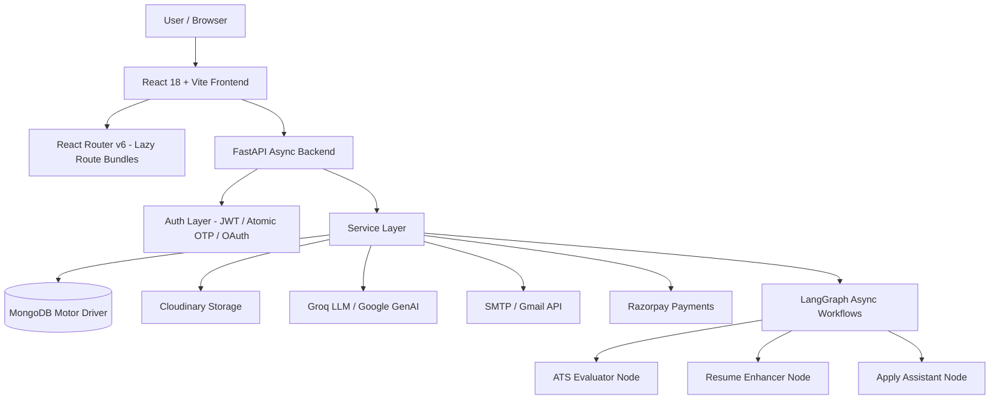
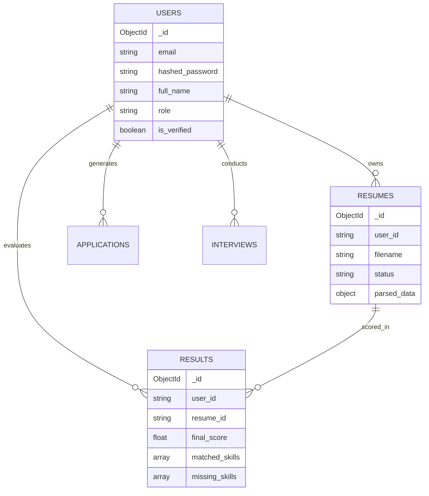

# CareerShala

> **AI Career Copilot & Smart ATS + Interview Platform**
> 
> *Master Technical Source of Truth, Developer Documentation & Portable AI Project Memory*

CareerShala is a full-stack, AI-powered career development platform that helps job seekers optimize their resumes, prepare for interviews, and manage job applications — all in one place. It combines a dual ATS (Applicant Tracking System) scoring engine, AI-driven interview simulation with proctoring, resume enhancement with human-in-the-loop verification, gamified career progression, and an AI application assistant that generates and sends tailored cover letters and emails.

---

## 1. PROJECT OVERVIEW

### What CareerShala Is
CareerShala is an intelligent career copilot that provides end-to-end job-seeking support. It analyzes resumes against job descriptions using both AI-powered semantic matching (LangGraph + Groq LLM) and deterministic keyword scanning, generates and sends personalized job applications via the Gmail API, conducts live AI mock interviews with cheating detection and face tracking, and issues verifiable certificates of achievement with instant QR validation.

### The Problem It Solves
Job seekers often struggle to understand why their resumes are rejected by corporate ATS software, lack realistic interview practice, and spend hours tailoring cover letters for each application. CareerShala bridges this gap by providing transparent, explainable ATS scoring (Explainable AI / XAI), realistic interview practice with real-time evaluation, and automated application generation.

### Target Users
- **Candidates / Job Seekers**: Primary users seeking resume optimization, ATS scoring, interview practice, and application assistance.
- **Recruiters**: Secondary users who search candidates using JD matching (`/recruiter/v2/match-jd`).
- **Students & Early Career Professionals**: Users who benefit from gamification (`CareerQuest`), skill gap analysis, and earning verifiable certificates.

### Primary Use Cases
1. **Resume Parsing & Dual ATS Analysis**: Upload resume → dual ATS scoring against job descriptions → detailed skill gap analysis and XAI score breakdown.
2. **Resume Enhancement**: AI-driven resume optimization with a Human-in-the-Loop (HITL) wizard to verify links, skills, and impact metrics.
3. **AI Mock Interviews**: Quick practice MCQs and live conversational interviews with proctoring (cheating detection, tab-switch tracking, face detection).
4. **AI Application Assistant**: LangGraph-powered generation of tailored cover letters and emails, integrated with Gmail API for automated sending.
5. **Gamified Career Progression**: Earn points, badges, daily login streaks, and advance through career level roadmaps (`CareerQuest`).
6. **Certificate Earning & Verification**: Issue and verify PDF certificates with embedded QR codes.

### Current Development State
CareerShala is in active production-ready development (v3.0.0+). The backend is built with FastAPI (Python 3.10+) on MongoDB Motor, and the frontend is built with React 18, Vite 5, Framer Motion, and Tailwind CSS. The codebase has undergone comprehensive security, performance, and dependency optimization — heavy ML packages (`torch`, `sentence-transformers`, `spacy`) were purged in favor of high-throughput async LLM API workflows.

---

## 2. CURRENT PROJECT STATUS

| Feature Module | Implementation Status | Evidence / File Location(s) |
|----------------|----------------------|----------------------------|
| **Resume Upload & Parsing** | ✅ Implemented | `backend/api/routes/resume.py`, `backend/services/parser_service.py` |
| **Dual ATS Scoring (AI Engine)** | ✅ Implemented | `backend/workflows/ats_graph.py`, `backend/api/routes/ats.py` |
| **Dual ATS Scoring (Strict Engine)** | ✅ Implemented | `backend/services/strict_ats_service.py` |
| **Explainable AI (XAI)** | ✅ Implemented | `backend/api/routes/explain.py` |
| **Resume Enhancement & HITL Wizard** | ✅ Implemented | `backend/workflows/enhancer_graph.py`, `backend/api/routes/enhance.py` |
| **AI Mock Interview (Quick Practice)** | ✅ Implemented | `backend/services/ai_interview_service.py`, `backend/api/routes/interview_ai.py` |
| **Live Interview & Proctoring** | ✅ Implemented | `backend/services/live_interview_service.py`, `backend/api/routes/live_interview.py` |
| **Cheating & Tab-Switch Detection** | ✅ Implemented | `backend/services/cheating_service.py`, frontend proctoring hooks |
| **Apply Assistant Workflow** | ✅ Implemented | `backend/workflows/apply_assistant_graph.py`, `backend/services/apply_assistant_service.py` |
| **Gmail OAuth & Email Dispatch** | ✅ Implemented | `backend/api/routes/gmail_oauth.py`, `backend/services/gmail_token_service.py` |
| **Gamification (`CareerQuest`)** | ✅ Implemented | `backend/services/gamification_service.py`, `frontend/src/pages/CareerQuest.jsx` |
| **Certificate System & QR Codes** | ✅ Implemented | `backend/certificates/` package, `backend/api/routes/certificates.py` |
| **Authentication (Email + Atomic OTP)** | ✅ Implemented | `backend/api/routes/auth_otp.py`, `backend/services/otp_service.py` |
| **OAuth (Google, GitHub, LinkedIn)** | ✅ Implemented | `backend/api/routes/auth_google.py`, `auth_github.py`, `auth_linkedin.py` |
| **Payment & Subscriptions (Razorpay)** | ✅ Implemented | `backend/services/razorpay_service.py`, `backend/api/routes/payment.py` |
| **Support Ticket System** | ✅ Implemented | `backend/api/routes/support.py`, `backend/services/support_service.py` |
| **AI Copilot Floating Widget** | ✅ Implemented | `backend/services/copilot_service.py`, `backend/api/routes/copilot.py` |
| **Fake Resume Detection** | ✅ Implemented | `backend/services/fake_detection_service.py`, `backend/api/routes/fake_detect.py` |
| **GitHub Profile Intelligence** | ✅ Implemented | `backend/services/github_service.py`, `backend/api/routes/github.py` |
| **Recruiter Candidate Search** | ✅ Implemented | `backend/api/routes/recruiter.py`, `backend/api/routes/recruiter_v2.py` |
| **Analytics & Trends** | ✅ Implemented | `backend/api/routes/analytics.py`, `backend/services/analytics_service.py` |
| **Async LLM Agent Workflows** | ✅ Implemented | `.ainvoke()` native async calls across all LangGraph graphs |
| **Code-Split Frontend** | ✅ Implemented | `React.lazy` route dynamic imports + Suspense fallback |
| **Mobile / Android Native App** | 📋 Planned | Planned via Capacitor PWA packaging |

---

## 3. COMPLETE FEATURE INVENTORY

### 3.1 Resume System
- **Purpose**: Upload, parse, store, and manage candidate resumes.
- **User Flow**: Candidate uploads PDF/DOCX → saved in `backend/temp_storage/` → uploaded to Cloudinary → async background parsing via `ParserService` → structured data saved to MongoDB → status updated (`pending` → `parsed`).
- **Frontend Route**: `/dashboard`, `/results`.
- **Frontend Components**: `frontend/src/components/ResumeUpload.jsx`, `frontend/src/pages/Dashboard.jsx`.
- **Frontend API Functions**: `uploadResume()`, `getResumes()`, `deleteResume()`, `reparseResume()` in `frontend/src/services/api.js`.
- **Backend Endpoints**: `POST /api/v1/resume/upload`, `GET /api/v1/resume/`, `DELETE /api/v1/resume/{id}`, `POST /api/v1/resume/{id}/reparse`.
- **Backend Router**: `backend/api/routes/resume.py`.
- **Backend Service**: `ParserService` in `backend/services/parser_service.py`.
- **Database Models**: `ResumeModel` & `ParsedResumeData` in `backend/models/resume_model.py` (collection: `resumes`).
- **Storage**: Cloudinary (`careerpilot/resumes`) + local `temp_storage/`.
- **Libraries**: `pdfplumber`, `python-docx`, `PyPDF2`, `lxml`.
- **Auth**: JWT Authorized (`get_current_user`).

### 3.2 Dual ATS Scoring Engine
- **Purpose**: Evaluate candidate resumes against job descriptions using two complementary scoring engines:
  1. **AI Potential Score**: Semantic evaluation via LangGraph + Groq LLM (`llama-3.3-70b-versatile`).
  2. **Strict ATS Score**: Deterministic knockout and exact keyword string matching simulating Taleo/Workday.
- **User Flow**: Candidate selects parsed resume + pastes JD → dual scoring pipeline executes → candidate gets overall score (0–100 scale), sub-scores, matched/missing skills, keyword analysis, and Explainable AI (XAI) breakdown.
- **Frontend Route**: `/results`.
- **Frontend Components**: `frontend/src/pages/Results.jsx`, `frontend/src/components/ATSResult.jsx`, `frontend/src/components/ScoreRing.jsx`.
- **Frontend API Functions**: `matchATS()`, `getATSHistory()`, `getATSResult()` in `frontend/src/services/api.js`.
- **Backend Endpoints**: `POST /api/v1/ats/match`, `GET /api/v1/ats/history`, `GET /api/v1/ats/result/{id}`, `GET /api/v1/explain/{result_id}`.
- **Backend Router**: `backend/api/routes/ats.py` & `backend/api/routes/explain.py`.
- **Backend Workflows & Services**: `backend/workflows/ats_graph.py` & `backend/services/strict_ats_service.py`.
- **Database Models**: `ATSResultModel` & `JobDescriptionModel` in `backend/models/result_model.py` (collections: `results`, `job_descriptions`).
- **AI Engine**: LangGraph async state graph with Groq `llama-3.3-70b-versatile` structured outputs (`ResumeExtraction`, `JDEvaluation`).
- **Auth**: JWT Authorized.

### 3.3 Resume Enhancement & HITL Wizard
- **Purpose**: Optimize candidate resume text for target job descriptions while preserving core professional identity and integrating human-verified data.
- **User Flow**: Select resume + JD → HITL wizard asks targeted questions (`/enhance/wizard-questions`) → candidate verifies skills/links/impact metrics → LangGraph enhancer generates enhanced summary, updated categorised skills dictionary, and preserved bullet points → PDF download available.
- **Frontend Route**: `/results` (Enhancement modal).
- **Frontend Page**: HITL Wizard inside `frontend/src/pages/Results.jsx`.
- **Frontend API Functions**: `enhanceResume()` in `frontend/src/services/api.js`.
- **Backend Endpoints**: `POST /api/v1/enhance/resume`, `POST /api/v1/enhance/wizard-questions`, `POST /api/v1/enhance/enhance-and-download`.
- **Backend Router**: `backend/api/routes/enhance.py`.
- **Backend Workflows & Services**: `backend/workflows/enhancer_graph.py` & `backend/services/enhancer_service.py`.
- **AI System**: LangGraph state graph with `@retry` backoff logic for Groq rate limits.

### 3.4 AI Mock Interview & Proctoring
- **Purpose**: Practice concept MCQs or undergo live conversational mock interviews with anti-cheating proctoring.
- **User Flow**: Candidate selects topic/difficulty or starts live session → webcam & tab-switch proctoring active → AI generates questions & evaluates candidate answers in real time → session summary, feedback, and cheating report returned.
- **Frontend Route**: `/interview`, `/live-interview`.
- **Frontend Components**: `frontend/src/pages/Interview.jsx`, `frontend/src/pages/LiveInterview.jsx`.
- **Frontend API Functions**: `generateAIInterview()`, `evaluateAnswer()`, `submitCheatingReport()` in `frontend/src/services/interviewApi.js`.
- **Backend Endpoints**: `POST /api/v1/interview/ai/generate`, `POST /api/v1/interview/ai/feedback`, `POST /api/v1/live-interview/start`, `POST /api/v1/interview/ai/cheating/report`.
- **Backend Router**: `backend/api/routes/interview_ai.py` & `backend/api/routes/live_interview.py`.
- **Backend Services**: `AIInterviewService`, `LiveInterviewService`, `CheatingService`.
- **Database Model**: `InterviewSessionModel` (collection: `interviews`).

### 3.5 Apply Assistant & Gmail Integration
- **Purpose**: Automatically generate tailored cover letters and application emails, dispatched via candidate's connected Gmail account.
- **User Flow**: Candidate enters target company, job title, HR email, and JD → LangGraph generates cover letter & email draft → draft quality validated → candidate approves draft → sent via Gmail OAuth API.
- **Frontend Route**: `/apply-assistant`.
- **Frontend Component**: `frontend/src/pages/ApplyAssistant.jsx`.
- **Frontend API Functions**: `generateDraft()`, `sendApplication()` in `frontend/src/services/applyAssistantApi.js`.
- **Backend Endpoints**: `POST /api/v1/apply/draft`, `POST /api/v1/apply/draft/{id}/send`, `GET /api/v1/auth/gmail/url`.
- **Backend Router**: `backend/api/routes/apply_assistant.py` & `backend/api/routes/gmail_oauth.py`.
- **Backend Workflows & Services**: `backend/workflows/apply_assistant_graph.py`, `backend/services/apply_assistant_service.py`, `backend/services/gmail_token_service.py`.
- **Database Model**: `ApplicationModel` in `backend/models/application_model.py` (collection: `applications`).

### 3.6 Gamification System (`CareerQuest`)
- **Purpose**: Drive user engagement through points, badges, daily login streaks, weekly challenges, and rank leaderboards.
- **Frontend Route**: `/gamification`.
- **Frontend Component**: `frontend/src/pages/CareerQuest.jsx`.
- **Frontend API Functions**: `getGamificationProfile()`, `getLeaderboard()` in `frontend/src/services/interviewApi.js`.
- **Backend Endpoints**: `GET /api/v1/interview/ai/gamification/profile`, `GET /api/v1/interview/ai/gamification/leaderboard`.
- **Backend Router**: `backend/api/routes/interview_ai.py`.
- **Backend Service**: `GamificationService` in `backend/services/gamification_service.py`.
- **Database Model**: `GamificationProfileModel` (collection: `gamification_profiles`).

---

## 4. TECHNOLOGY STACK

### Frontend
- **Core Framework**: React 18.3.1
- **Build Tool**: Vite 5.4.21 (configured with dynamic route code-splitting, 23 chunk bundles)
- **Routing**: React Router v6.23.1 with `React.lazy()` dynamic imports and `<Suspense>` fallback
- **Styling**: Tailwind CSS 3.4, Framer Motion 11.2 (micro-animations), Lucide React (icons)
- **HTTP Client**: Axios 1.7.2 with request/response interceptors & AbortController cancellation
- **UI Notifications**: React Hot Toast 2.4.0

### Backend
- **Framework**: FastAPI 0.110.0 (ASGI server with Uvicorn 0.29.0)
- **Database Driver**: Motor 3.4.0 (AsyncIOMotorClient for MongoDB)
- **Validation**: Pydantic v2.6.4 & Pydantic-Settings 2.2.1
- **Auth & Security**: Python-Jose 3.3.0 (JWT), Passlib 1.7.4 (Bcrypt), Argon2-cffi 23.1.0
- **Document Processing**: pdfplumber 0.11.0, python-docx 1.1.2, PyPDF2 3.0.1, lxml 5.2.1
- **PDF Generation**: ReportLab 4.1.0, Jinja2 3.1.4, Playwright 1.44.0

### AI / ML & Agent Workflows
- **Agent Workflows**: LangChain Core 0.1.52+, LangGraph 0.0.50+
- **LLM Engine**: Groq Client (`llama-3.3-70b-versatile`), Google GenAI 0.1.1+
- **Text Processing**: NLTK 3.8.1 (stopwords), NumPy 1.26.4

### External Integrations & Storage
- **Cloud Storage**: Cloudinary SDK 1.40.0 (`careerpilot/resumes`, `careerpilot/certificates`)
- **Payments**: Razorpay SDK 2.0.1
- **Email & OAuth**: `aiosmtplib` 3.0.1, Google API Python Client 2.198.0 (Gmail API)

---

## 5. HIGH-LEVEL SYSTEM ARCHITECTURE



---

## 6. REPOSITORY STRUCTURE

```text
Resume-Screening-System/
├── frontend/                         # React 18 + Vite Web Application
│   ├── src/
│   │   ├── components/               # Reusable UI Components
│   │   │   ├── Card.jsx              # Reusable Glassmorphic Card Container
│   │   │   ├── StatBox.jsx           # Metric Card with Progress Bar
│   │   │   ├── SectionHeader.jsx     # Section Title & Header Component
│   │   │   ├── SkillBar.jsx          # Animated Skill Bar Component
│   │   │   ├── ScoreRing.jsx         # Circular ATS Score Component
│   │   │   ├── AppLayout.jsx         # Main App Shell & Navigation
│   │   │   └── Navbar.jsx            # Top Navigation Bar
│   │   ├── context/
│   │   │   └── AuthContext.jsx       # Authentication & User State
│   │   ├── pages/                    # Lazy-Loaded Page Views
│   │   │   ├── Dashboard.jsx         # Main User Candidate Dashboard
│   │   │   ├── Results.jsx           # ATS Results & Skill Gap Analysis
│   │   │   ├── Interview.jsx         # AI Mock Interview Practice
│   │   │   ├── LiveInterview.jsx     # Live Interview & Proctoring
│   │   │   ├── ApplyAssistant.jsx    # Cover Letter & Email Assistant
│   │   │   ├── CareerQuest.jsx       # Gamification & Career Roadmap
│   │   │   ├── RecruiterDashboard.jsx# Recruiter Candidate Search
│   │   │   └── ...                   # Additional Page Components
│   │   ├── services/                 # Axios API Service Layer
│   │   │   ├── api.js                # Primary API Client & Interceptors
│   │   │   ├── interviewApi.js       # Interview & Gamification API
│   │   │   └── applyAssistantApi.js  # Apply Assistant API
│   │   ├── App.jsx                   # Root App Component & Lazy Router
│   │   └── main.jsx                  # React DOM Bootstrapper
│   ├── package.json                  # Frontend Dependencies & Scripts
│   └── vite.config.js                # Vite Build & Proxy Configuration
│
├── backend/                          # FastAPI Async Application Server
│   ├── api/                          # Router & Dependency Layer
│   │   ├── deps.py                   # Dependency Injection Guards
│   │   └── routes/                   # API Feature Routers
│   │       ├── auth.py               # Auth & Password Handler
│   │       ├── auth_otp.py           # Atomic OTP Handler
│   │       ├── resume.py             # Resume Upload & Management
│   │       ├── ats.py                # Dual ATS Scoring Handler
│   │       ├── enhance.py            # Resume Enhancement & HITL Wizard
│   │       ├── interview_ai.py       # AI Mock Interview Router
│   │       ├── live_interview.py     # Live Interview Router
│   │       ├── apply_assistant.py    # Apply Assistant Router
│   │       ├── recruiter_v2.py       # Recruiter Search Router
│   │       └── ...                   # Additional Endpoint Routers
│   ├── config/
│   │   └── db.py                     # MongoDB Motor Connection & Indexing
│   ├── core/
│   │   ├── config.py                 # Pydantic System Settings
│   │   └── security.py               # Password Hashing & JWT Processing
│   ├── models/                       # MongoDB Persistence Models (DB Layer)
│   │   ├── user_model.py             # User Document Model
│   │   ├── resume_model.py           # Resume Document Model
│   │   ├── result_model.py           # ATS Result Document Model
│   │   └── application_model.py      # Apply Assistant Document Model
│   ├── schemas/                      # Pydantic Schemas (API / LLM Layer)
│   │   ├── extraction_schema.py      # LLM Resume Extraction Schema
│   │   ├── ats_schema.py             # ATS API Response Schema
│   │   └── enhancement_schema.py     # Enhancer LLM Output Schema
│   ├── services/                     # Business Logic Services
│   │   ├── parser_service.py         # Document Parser Service
│   │   ├── strict_ats_service.py     # Deterministic Strict ATS Service
│   │   ├── ai_interview_service.py   # LLM Interview Service
│   │   ├── live_interview_service.py # Live Interview Session Service
│   │   ├── apply_assistant_service.py# Apply Assistant Service
│   │   ├── otp_service.py            # Atomic OTP Service
│   │   └── ...                       # Additional Domain Services
│   ├── workflows/                    # LangGraph Async Agent Pipelines
│   │   ├── ats_graph.py              # ATS Evaluator Graph
│   │   ├── enhancer_graph.py         # Resume Enhancer Graph
│   │   └── apply_assistant_graph.py  # Cover Letter & Email Graph
│   ├── tests/                        # Pytest Test Suite
│   │   ├── conftest.py               # Mock Fixtures & Overrides
│   │   └── test_apply_assistant.py   # Apply Assistant Tests
│   ├── main.py                       # FastAPI Application Entry Point
│   └── requirements.txt              # Production Dependency Manifest
│
├── README.md                         # Master Documentation & AI Memory
└── OPTIMIZATION.md                   # Resolved Technical Debt Tracker
```

---

## 7. IMPORTANT FILE INDEX

| Subsystem | File Path | Primary Responsibility |
|-----------|-----------|------------------------|
| **Application Entry Point** | `backend/main.py` | FastAPI app creation, CORS, router mounting, lifespan hook. |
| **Frontend Router** | `frontend/src/App.jsx` | React Router setup, `BootLoaderGate`, route code-splitting with `React.lazy`. |
| **Primary API Client** | `frontend/src/services/api.js` | Axios instance, JWT interceptors, base API endpoints. |
| **Database Lifecycle** | `backend/config/db.py` | Motor client init, `connect_db()`, automatic index creation. |
| **Auth Guards** | `backend/api/deps.py` | FastAPI dependency injection for JWT auth, database, and services. |
| **Resume Persistence Model** | `backend/models/resume_model.py` | MongoDB schema for stored resumes (`resumes` collection). |
| **LLM Extraction Schema** | `backend/schemas/extraction_schema.py` | Pydantic schema for Groq structured resume extraction. |
| **ATS AI Workflow** | `backend/workflows/ats_graph.py` | LangGraph async evaluator graph for semantic scoring. |
| **Strict ATS Engine** | `backend/services/strict_ats_service.py` | Deterministic Python-only keyword knockout engine. |
| **Resume Enhancer Graph** | `backend/workflows/enhancer_graph.py` | LangGraph resume optimization pipeline with retry logic. |
| **Apply Assistant Graph** | `backend/workflows/apply_assistant_graph.py` | LangGraph generator for cover letters and emails. |
| **Atomic OTP Service** | `backend/services/otp_service.py` | Single-use OTP generation and verification logic. |
| **Test Fixtures** | `backend/tests/conftest.py` | Pytest mock database and dependency overrides. |

---

## 8. FRONTEND ARCHITECTURE

### Complete Route Inventory Table

| Route | Page Component | Purpose | Auth Required | Main API Service Calls |
|-------|----------------|---------|---------------|-----------------------|
| `/` | `CareerPilotLanding.jsx` | Marketing landing page | No | None |
| `/login` | `Login.jsx` | User login view | Public Only | `login()`, `loginWithOTP()` |
| `/signup` | `Signup.jsx` | User registration view | Public Only | `register()` |
| `/forgot-password` | `ForgotPassword.jsx` | Password reset view | Public Only | `forgotPassword()` |
| `/dashboard` | `Dashboard.jsx` | Candidate dashboard | Yes | `getMyAnalytics()`, `getATSHistory()`, `getResumes()` |
| `/results` | `Results.jsx` | ATS score breakdown & HITL wizard | Yes | `matchATS()`, `getATSResult()`, `enhanceResume()` |
| `/interview` | `Interview.jsx` | Practice MCQ questions | Yes | `generateAIInterview()`, `evaluateAnswer()` |
| `/live-interview` | `LiveInterview.jsx` | Live interview with proctoring | Yes | `startLiveSession()`, `submitCheatingReport()` |
| `/apply-assistant` | `ApplyAssistant.jsx` | Cover letter & email generator | Yes | `generateDraft()`, `sendApplication()` |
| `/gamification` | `CareerQuest.jsx` | Points, badges, streak roadmap | Yes | `getGamificationProfile()`, `getLeaderboard()` |
| `/recruiter` | `RecruiterDashboard.jsx` | Recruiter candidate search | Yes (Recruiter) | `searchCandidates()`, `matchJD()` |
| `/verify/:certificateId` | `VerifyCertificate.jsx` | Public certificate verification | No | `verifyCertificate()` |

---

## 9. BACKEND ARCHITECTURE

### FastAPI Application Bootstrap (`backend/main.py`)
- Windows Proactor event loop policy configured on startup (`asyncio.WindowsProactorEventLoopPolicy()`) to enable Playwright Chromium subprocess execution.
- Lifespan context manager runs `connect_db()` with a 15s timeout to initialize Motor pooling and ensure indexes.
- Middlewares: CORS Middleware, GZip Middleware (min 1KB), Request Debug Middleware (promotes Prometheus metrics `http_requests_total`, `http_request_duration_seconds`), Global Exception Handler (returns structured 500 error trace).

---

## 10. COMPLETE API REFERENCE

### Authentication (`/api/v1/auth`)
- `POST /api/v1/auth/register` — Register user account.
- `POST /api/v1/auth/token` — Login with password → returns access/refresh JWT tokens.
- `POST /api/v1/auth/otp/request` — Request single-use email OTP.
- `POST /api/v1/auth/otp/verify` — Atomically verify email OTP.
- `POST /api/v1/auth/google` — Authenticate via Google OAuth.

### Resume Management (`/api/v1/resume`)
- `POST /api/v1/resume/upload` — Upload PDF/DOCX resume (returns 202 Accepted).
- `GET /api/v1/resume/` — List all candidate resumes.
- `DELETE /api/v1/resume/{id}` — Delete resume record and Cloudinary asset.

### Dual ATS Engine (`/api/v1/ats`)
- `POST /api/v1/ats/match` — Evaluate resume against JD using AI + Strict engines.
- `GET /api/v1/ats/history` — Fetch history of ATS evaluations.
- `GET /api/v1/ats/result/{id}` — Fetch detailed ATS evaluation result.

### Apply Assistant (`/api/v1/apply`)
- `POST /api/v1/apply/draft` — Generate cover letter and email draft via LangGraph.
- `POST /api/v1/apply/draft/{id}/send` — Dispatch draft via connected Gmail account.

---

## 11. FRONTEND ↔ BACKEND FEATURE MAPPING

| Feature Module | Frontend Page | Frontend Service Call | Backend Router | Backend Service / Workflow | Data Storage |
|----------------|---------------|----------------------|----------------|----------------------------|--------------|
| Resume Parsing | `Dashboard.jsx` | `uploadResume()` | `api/routes/resume.py` | `services/parser_service.py` | Cloudinary + MongoDB `resumes` |
| ATS Scoring | `Results.jsx` | `matchATS()` | `api/routes/ats.py` | `workflows/ats_graph.py` | MongoDB `results` |
| Resume Enhancement | `Results.jsx` | `enhanceResume()` | `api/routes/enhance.py` | `workflows/enhancer_graph.py` | Cloudinary + MongoDB `resumes` |
| Apply Assistant | `ApplyAssistant.jsx` | `generateDraft()` | `api/routes/apply_assistant.py` | `workflows/apply_assistant_graph.py` | MongoDB `applications` |
| Live Interview | `LiveInterview.jsx` | `startLiveSession()` | `api/routes/live_interview.py` | `services/live_interview_service.py` | MongoDB `interviews` |
| Gamification | `CareerQuest.jsx` | `getGamificationProfile()`| `api/routes/interview_ai.py` | `services/gamification_service.py` | MongoDB `gamification_profiles` |

---

## 12. DATABASE ARCHITECTURE & MODELS

### MongoDB Collections & Models



---

## 13. AUTHENTICATION & AUTHORIZATION

### Authentication Flow
1. Candidate logs in via Password, Email OTP, or OAuth (Google, GitHub, LinkedIn).
2. Backend returns JWT `access_token` (short-lived) and `refresh_token` (long-lived).
3. `api.js` request interceptor attaches `Authorization: Bearer <access_token>` to outbound API requests.
4. Response interceptor automatically handles `401 Unauthorized` by triggering `/api/v1/auth/refresh`.

---

## 14. AI / ML & AGENT ARCHITECTURE

### 1. ATS Evaluator Graph (`backend/workflows/ats_graph.py`)
- **Purpose**: Evaluates candidate resumes against job descriptions with semantic context.
- **Pipeline**:
```text
Resume Raw Text → LLM Extraction Node (ResumeExtraction) → JD Evaluation Node (JDEvaluation) → Score Computation Node → ATS Result State
```
- **Model**: Groq `llama-3.3-70b-versatile` (temperature=0).

### 2. Resume Enhancer Graph (`backend/workflows/enhancer_graph.py`)
- **Purpose**: Generates upgraded professional summaries and categorised skills while preserving bullet point counts and merging human-verified links.
- **Retry Logic**: Wrapped with `@retry` for exponential backoff on Groq rate limits.

### 3. Apply Assistant Graph (`backend/workflows/apply_assistant_graph.py`)
- **Purpose**: Generates cover letters and email drafts, verified by a tone/quality validator node.

---

## 15. MAJOR END-TO-END WORKFLOWS

### Workflow Sequence: Resume Upload & Background Parsing
```text
User selects PDF file → Frontend uploadResume() → POST /api/v1/resume/upload
  → Save temp file → Upload to Cloudinary → Create pending DB record → Launch async parsing task
  → Parse with pdfplumber → LLM structured extraction → Update DB record (status: parsed)
```

---

## 16. EXTERNAL SERVICES & INTEGRATIONS

| Integration | Purpose | Configuration Key | Required Env Var |
|-------------|---------|-------------------|------------------|
| **Groq API** | High-speed LLM inference for LangGraph workflows | `GROQ_API_KEY` | `GROQ_API_KEY` |
| **Cloudinary** | Secure cloud storage for uploaded resumes & PDFs | `CLOUDINARY_URL` | `CLOUDINARY_URL` |
| **Razorpay** | Payment processing for premium tier subscriptions | `RAZORPAY_KEY_ID` | `RAZORPAY_KEY_ID` |
| **Gmail OAuth2** | Automated email application dispatch | `GOOGLE_CLIENT_ID` | `GOOGLE_CLIENT_ID` |
| **MongoDB Atlas** | Managed cloud database instance | `MONGO_URI` | `MONGO_URI` |

---

## 17. ENVIRONMENT VARIABLES REFERENCE

```env
# --- Backend (.env) ---
SECRET_KEY=<generate-secure-256bit-secret-key>
MONGO_URI=mongodb://localhost:27017
MONGO_DB_NAME=careershala_db
GROQ_API_KEY=<your-groq-api-key>
RAZORPAY_KEY_ID=<your-razorpay-key-id>
RAZORPAY_KEY_SECRET=<your-razorpay-key-secret>
GOOGLE_CLIENT_ID=<your-google-client-id>
GOOGLE_CLIENT_SECRET=<your-google-client-secret>

# --- Frontend (.env) ---
VITE_API_URL=http://localhost:8000/api/v1
VITE_GOOGLE_CLIENT_ID=<your-google-client-id>
```

---

## 18. LOCAL DEVELOPMENT SETUP

### Prerequisites
- Python 3.10+
- Node.js 18+
- MongoDB Community Server or MongoDB Atlas instance

### Backend Startup
```bash
cd backend
python -m venv venv
.\venv\Scripts\activate
pip install -r requirements.txt
uvicorn main:app --reload --port 8000
```

### Frontend Startup
```bash
cd frontend
npm install
npm run dev
```

---

## 19. DEPLOYMENT ARCHITECTURE

- **Frontend**: Deployed on Vercel / Netlify with Vite production build (`dist/assets`).
- **Backend**: Deployed on Render / AWS EC2 using Uvicorn ASGI server with GZip middleware and Proactor event loop policy on Windows.

---

## 20. MOBILE / ANDROID STATUS

- **Current Status**: Web-first responsive application built with mobile-first CSS breakpoints.
- **Future Roadmap**: Packaging existing React/Vite web application as an Android APK using Capacitor PWA wrapper.

---

## 21. ERROR HANDLING & LOGGING

- **Backend**: Structured JSON logging via `structlog`, global exception handler middleware returning clean `500 Internal Server Error` responses, and Prometheus request metrics.
- **Frontend**: Axios response interceptors catching 401s for automatic token refresh and React Hot Toast notifications for user feedback.

---

## 22. DEVELOPMENT CONVENTIONS

- **Backend File Placement**: Routes in `api/routes/`, models in `models/`, Pydantic schemas in `schemas/`, business logic in `services/`, graphs in `workflows/`.
- **Frontend File Placement**: Pages in `pages/`, components in `components/`, API functions in `services/`.

---

## 23. KNOWN ISSUES & LIMITATIONS

- **Live Interview Camera Permission**: Requires user permission prompt before starting proctoring session.
- **Gmail OAuth Token Scope**: Requires `https://www.googleapis.com/auth/gmail.send` consent for email sending.

---

## 24. FUTURE / PLANNED ARCHITECTURE

- `Planned — Not Currently Implemented`: Capacitor Android app packaging.
- `Planned — Not Currently Implemented`: Real-time WebSocket multi-user recruiter candidate interview rooms.

---

# AI ASSISTANT CONTEXT

> **This section serves as a portable memory block for AI coding assistants working on CareerShala.**

### Project Identity
- **Name**: CareerShala
- **Domain**: AI Career Copilot, Dual ATS Evaluator, Resume Enhancer, and Live Interview Simulator.

### Core Architectural Rules
1. **Source of Truth**: Read this `README.md` and inspect referenced source files before making modifications.
2. **Schema Layering**:
   - `backend/models/resume_model.py` (`ResumeModel`) is the **Database Layer**.
   - `backend/schemas/extraction_schema.py` (`ResumeExtraction`) is the **LLM Extraction Layer**.
3. **Async Non-Blocking Pattern**: All LangGraph workflows use `.ainvoke()` natively. Never wrap LLM calls in blocking synchronous calls.
4. **ATS Score Scale**: `final_score` in ATS workflows and DB models is strictly on a **0–100 scale** (e.g. 75.5 = 75.5%).
5. **Component Structure**: Core UI elements are modularized in `frontend/src/components/` (`Card.jsx`, `StatBox.jsx`, `SectionHeader.jsx`, `SkillBar.jsx`).

---

## README MAINTENANCE GUIDE

Update this `README.md` whenever:
- A new API router or workflow is added.
- Database models or collection schema definitions change.
- New third-party external integrations are introduced.
- Frontend routing or state management patterns are modified.
