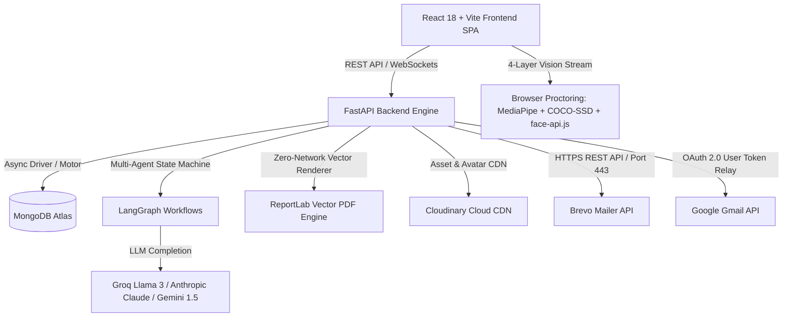
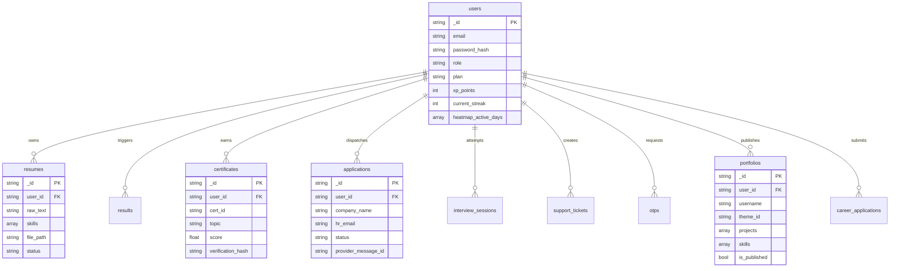
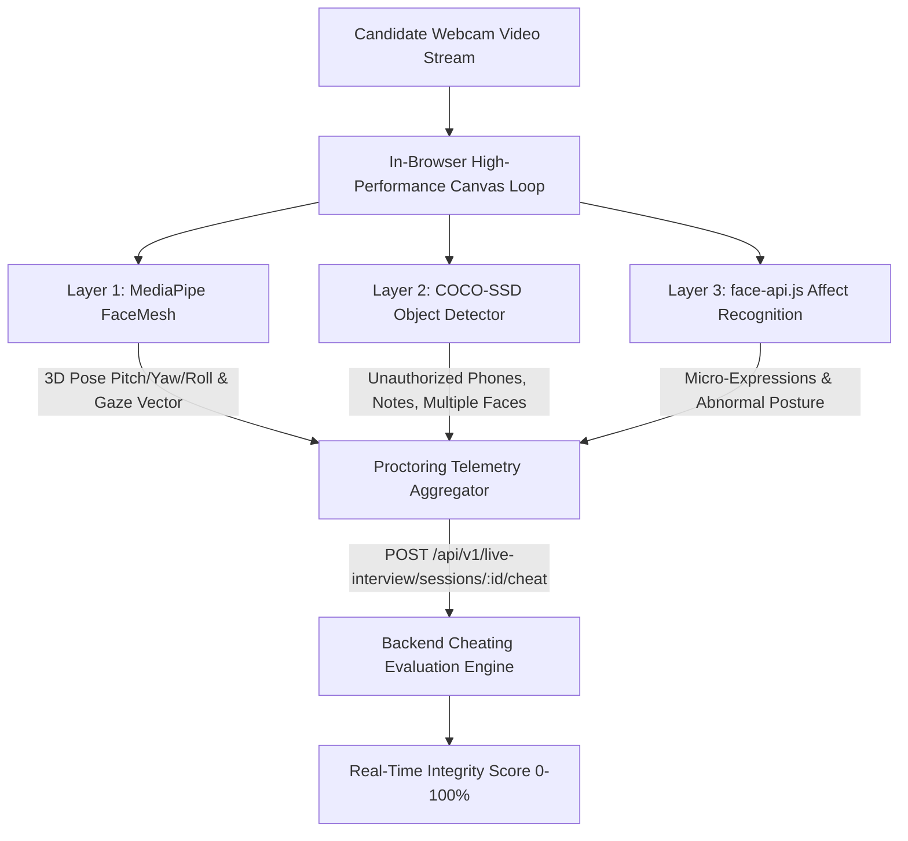

# 🚀 CareerShala — AI Career Co-Pilot, Smart ATS & Automated Job Application Platform

> **Single Source of Truth (SSOT) Architectural & Technical Specification Manual**  
> *Exhaustive Production Documentation for Enterprise AI Career Acceleration, ATS Intelligence, AI Portfolio Generation, Vision Proctoring, Brevo Mailer & Gmail OAuth Infrastructure*

---

## 🌟 Live Demo & Quick Links

- 🌐 **Production Web Application**: [https://resume-screening-system-lyart.vercel.app](https://resume-screening-system-lyart.vercel.app)
- ⚙️ **Backend API Documentation (Swagger/OpenAPI)**: `http://localhost:8000/docs` or `https://resume-screening-system-hb2d.onrender.com/docs`
- 📜 **Public Skill Certificate Verification Portal**: `/verify/:certificateId`
- 💼 **Public Showcase Portfolios**: `/portfolio/:username`

---

## 📖 Executive Summary & Core Platform Overview

**CareerShala** is an enterprise-grade AI career copilot, automated ATS resume optimizer, AI portfolio builder, visual cheating-proctored live mock interviewer, and automated job outreach suite built with **FastAPI (Python 3.10+)** and **React 18 (Vite 5)**.

The system integrates multi-agent **LangGraph** workflows, state-of-the-art browser computer vision proctoring (**MediaPipe FaceMesh**, **COCO-SSD**, **face-api.js**), **Gemini & Groq (Llama 3 70B)** LLM inference, zero-network **ReportLab** dynamic vector PDF generation, **Brevo HTTP REST API (v3 / Port 443)** email infrastructure, **Google Gmail OAuth 2.0** direct application dispatch, and **MongoDB** async ODMs to deliver an all-in-one AI career ecosystem.



---

## 🚀 Key Feature Modules & Capabilities

### 1. 🎨 AI Portfolio Builder & Public Showcase (`/portfolio-builder`, `/portfolio/:username`)
- **Hybrid Resume-to-Portfolio Extraction**: Automatically parses uploaded PDF resumes using Gemini AI structured extraction with a resilient PDFPlumber rule-based fallback.
- **6-Step Interactive Studio**:
  1. *Identity & Profile*: Name, headline, avatar upload to Cloudinary, custom hero metrics, social profiles.
  2. *Narrative Bio & Summary*: Professional summary with AI-powered action-verb enhancement.
  3. *Domain-Agnostic Skill Categorization*: Auto-groups skills into categorized buckets (AI/ML, Backend, Frontend, Databases, Tools).
  4. *Project Showcase & GitHub Sync*: Rich project cards, live URLs, GitHub repository sync, and metric callouts.
  5. *Experience & Education*: Structured career timeline and academic history.
  6. *Review & 1-Click Publish*: Custom username slug validator (e.g., `careershala.tech/portfolio/alex`) and live status toggle.
- **6 Premium Visual UI Themes**:
  - `Bento Grid`: Apple/Linear-inspired sleek modular grid layout.
  - `Glassmorphic Pro`: Frosted glass blur, translucent panels, and vibrant background lighting.
  - `Cyberpunk`: High-octane neon cyber aesthetic with glowing accents.
  - `Minimal Elegance`: Clean editorial typography and refined monochrome aesthetics.
  - `Neon Developer`: Terminal-inspired code aesthetics and neon green/cyan highlights.
  - `3D Interactive`: Dynamic interactive depth cards and subtle canvas animations.
- **Real-Time Analytics & Recruiter Contact Relay**: Tracks total page views, project clicks, and resume downloads. Recruiters can send direct messages forwarded securely to the candidate's personal inbox.

---

### 2. 🤖 AI Apply Assistant & Smart Job Outreach (`/apply-assistant`)
- **Screenshot OCR & Job Extraction**: Upload or paste job posting screenshots (LinkedIn, Indeed, Naukri, Glassdoor, etc.) or raw text. The AI vision parser extracts company, job title, mandatory qualifications, bonus skills, and HR contact email.
- **Instant ATS Pre-Check**: Evaluates real-time ATS match compatibility between the candidate's selected resume and the target job description before applying.
- **LangGraph Multi-Agent Draft Generation**: Synthesizes job requirements and candidate achievements to create human-grade tailored cold emails and professional cover letters.
- **Dual-Channel Dispatch Architecture**:
  - **Google Gmail OAuth 2.0**: Dispatch directly from the candidate's authenticated personal Gmail account with background token refresh.
  - **Brevo HTTP REST API (v3 / Port 443)**: Enterprise transactional email dispatch with custom candidate `replyTo` routing so recruiter replies go straight to the candidate's personal inbox.
- **Draft Editor & Application Tracker**: In-place markdown editor, instant PDF preview, send confirmation modal, and complete application history tracking (`ready_for_review`, `sending`, `sent`, `failed`).

---

### 3. 📊 Smart ATS Resume Screening & Explainable AI (`/dashboard`, `/results`)
- **Hybrid Multi-Layer Scoring**: Combines TF-IDF vectorization, semantic keyword cosine similarity, and strict deterministic structural format validation.
- **Explainable AI (XAI)**:
  - Match percentage breakdown across skills, experience, and education.
  - Identified matching skills vs. critical missing requirements.
  - Keyword density heatmap and comparative model evaluation analysis.
- **AI Resume Enhancer Wizard**: Interactive questionnaire to uncover hidden achievements, rewrite bullet points using the STAR methodology and action verbs, and export an ATS-optimized PDF.
- **Ghost Text & Fraud Detection**: Detects white-text keyword stuffing, fake credentials, nonexistent organizations, and overlapping career timelines.

---

### 4. 🎥 Live AI Mock Interviewer & 4-Layer Vision Proctoring (`/interview`, `/live-interview`)
- **Real-Time Live Interview**: Interactive voice/text interviews featuring dynamic, contextual follow-up questions generated on-the-fly based on the candidate's resume and target role.
- **4-Layer In-Browser Computer Vision Proctoring**:
  1. *MediaPipe FaceMesh*: Computes 3D head pose matrix (pitch, yaw, roll) and iris gaze tracking to identify candidates looking off-screen.
  2. *COCO-SSD Object Detection*: Real-time frame scanner detecting unauthorized smartphones, external notes, and multiple faces.
  3. *face-api.js Affect Recognition*: Analyzes facial expressions and alerts on abnormal posture or suspicious behavior.
  4. *Telemetry Ingestion Engine*: Continuously streams proctoring telemetry to calculate a real-time Candidate Integrity Score (0–100%).
- **Automated Scorecard & Feedback**: Instant post-interview grading on technical depth, STAR communication clarity, and confidence.

---

### 5. 📜 Cryptographically Verified Skill Certificates (`/verify/:certificateId`)
- **Zero-Network ReportLab Vector Engine**: Generates high-resolution vector PDF skill certificates locally without external rendering services.
- **Cryptographic Tamper-Proofing**: Embedded SHA-256 hash signature, unique alphanumeric certificate ID, and scannable QR verification code.
- **Public Verification Portal**: Dedicated rate-limited verification route displaying candidate score, issue date, and certified skills.
- **Automated Brevo Delivery**: Automatically sends the generated vector PDF certificate directly to the candidate's verified email.

---

### 6. 🎮 Gamification Engine & Career Quest (`/gamification`)
- **28-Day Monthly Activity Heatmap (`🔥`)**: Real-time GitHub-style activity grid tracking daily interview prep, ATS evaluations, and resume enhancements.
- **7-Day Rolling Streak & Daily Rewards**: Consecutive-day multipliers, XP reward claims, daily quests, and weekly challenges.
- **Level & Progression System**: Unlockable ranks (Novice to Master), badge catalog, and public recruiter leaderboard ranking top candidates.

---

### 7. 💬 Interactive AI Career Copilot Widget (`AICopilotWidget.jsx`)
- **Global Floating Assistant**: Persistent, intelligent career copilot available across all dashboard views.
- **Context-Aware Career Advisory**: Answers resume questions, generates interview prep advice, highlights skill gaps, and suggests tailored career roadmap milestones in real time.

---

### 8. 💼 Recruiter Intelligence V2 & Talent Search (`/recruiter`)
- **Natural Language Candidate Search**: Search candidate pools using conversational queries or paste raw job requisitions.
- **Automated Rank & Fit Scoring**: Ranks applicants based on semantic match, proctored interview scores, and verified skill badges.
- **Candidate Deep Dive**: Preview candidate GitHub repositories, verified skill credentials, and download parsed resume PDFs with 1 click.

---

### 9. 🛡️ Admin Control Center & Support Desk (`/admin`, `/support`)
- **System Health & Revenue Analytics**: Real-time monitoring of registered users, parsed resumes, dispatched job applications, proctored mock sessions, and Razorpay tier revenue.
- **Support Ticket Queue**: Ticket lifecycle management with file attachments, priority routing (`low`, `medium`, `high`, `urgent`), agent replies, and email alerts via Brevo.
- **Internal Careers Applicant Portal**: Review and manage job applications submitted to CareerShala's internal career openings (`/careers`).

---

## 🛠️ Verified Technology Stack Matrix

| Category | Primary Technology / Library | Version / Spec | Operational Role & Architectural Purpose |
| :--- | :--- | :--- | :--- |
| **Backend Core** | FastAPI | `^0.110.0` | Asynchronous high-performance web framework for API routing & OpenAPI docs |
| **Server Engine** | Uvicorn (Standard) | `^0.29.0` | ASGI server with Windows `ProactorEventLoop` support for subprocesses |
| **Async ODM / DB** | Motor & PyMongo | `motor==3.4.0`, `pymongo==4.7.2` | Non-blocking async MongoDB client for high-concurrency database queries |
| **Data Validation** | Pydantic v2 | `^2.6.4` | Strict schema validation, data serialization, and configuration settings |
| **AI Orchestration** | LangGraph & LangChain | `langgraph>=0.0.50`, `langchain-core>=0.1.52` | Multi-agent stateful workflow graphs for ATS analysis & application drafting |
| **LLM Inference** | Groq & Google GenAI | `groq>=0.5.0`, `google-genai>=0.1.1` | High-speed LLM completion (Llama 3 70B, Gemini 1.5 Flash/Pro, Mistral) |
| **NLP & Vectors** | NLTK, Scikit-learn, NumPy | `nltk==3.8.1`, `scikit-learn==1.4.2` | TF-IDF vectorization, cosine similarity, skill ontology matching, tokenization |
| **Proctoring Engine** | MediaPipe FaceMesh & COCO-SSD | `@mediapipe/face_mesh`, `coco-ssd@2.2.3` | In-browser 3D head pose estimation, iris gaze tracking, and object detection |
| **Emotion Vision** | face-api.js | `@vladmandic/face-api` | Real-time facial expression analysis & suspicious affect detection |
| **PDF Generation** | ReportLab | `^4.1.0` | Zero-network local vector rendering for verified skill certificates & cover letters |
| **Doc Parsing** | PDFPlumber, PyPDF, Docx | `pdfplumber==0.11.0`, `python-docx==1.1.2` | Structural extraction of resume text, tables, headers, and metadata |
| **Auth & Security** | Passlib (Bcrypt), Argon2, Jose | `passlib==1.7.4`, `python-jose==3.3.0` | JWT authorization, password hashing, 2FA OTP, and multi-provider OAuth |
| **Email Infrastructure** | Brevo HTTP REST API & Google Auth | `httpx==0.27.0`, `google-auth>=2.29.0` | Transactional email dispatch over HTTPS Port 443 with candidate `replyTo` routing |
| **Payments** | Razorpay SDK | `^2.0.1` | Secure subscription checkout (Pro/Enterprise tiers) and webhook verification |
| **Media CDN** | Cloudinary SDK | `^1.40.0` | Permanent cloud storage for candidate avatars, resume PDFs, and badges |
| **Frontend UI** | React 18 & Vite 5 | `react^18.3.1`, `vite^5.3.3` | Single-Page Application (SPA) with HMR and optimized bundle splitting |
| **UI Components** | Tailwind CSS & Framer Motion | `tailwindcss^3.4.6`, `framer-motion^11.18.2` | Dark/light design system, glassmorphism, micro-interactions, animations |
| **Data Viz** | Recharts | `^2.12.7` | Dynamic candidate analytics, skill radar charts, and ATS score gauges |

---

## 📁 Complete Workspace Tree & Architecture Map

```text
Resume-Screening-System/
├── README.md                          # Root Single Source of Truth Documentation
├── package.json                       # Root NPM Metadata
├── requirements.txt                   # Production Python Dependencies
├── render.yaml                        # Multi-Service Cloud Deployment Manifest
├── backend/
│   ├── main.py                        # FastAPI Application Bootstrap & Middleware Lifecycle
│   ├── requirements.txt               # Backend Production Dependencies
│   ├── api/
│   │   ├── deps.py                    # Auth Dependents, JWT Verification, Role RBAC
│   │   └── routes/                    # API Route Handlers
│   │       ├── admin.py               # Admin Dashboard, System Stats & Careers Pipeline
│   │       ├── analytics.py           # User & Recruiter Usage Analytics
│   │       ├── apply_assistant.py     # AI Job Outreach, Screenshot OCR & Draft Manager
│   │       ├── ats.py                 # Multi-Layer ATS Scoring & Keyword Gap Analysis
│   │       ├── auth.py                # Email/Password Register & Login Routes
│   │       ├── auth_github.py         # GitHub OAuth 2.0 Integration
│   │       ├── auth_google.py         # Google OAuth 2.0 Integration
│   │       ├── auth_linkedin.py       # LinkedIn OAuth 2.0 Integration
│   │       ├── auth_otp.py            # 6-Digit Email OTP Verification (Signup/2FA)
│   │       ├── careers.py             # Internal Careers Portal & Application Dispatch
│   │       ├── certificates.py        # Verified Certificate Issuance & Verification
│   │       ├── copilot.py             # Interactive AI Career Copilot Chatbot
│   │       ├── enhance.py             # AI Resume Bullet Enhancer & Wizard
│   │       ├── explain.py             # Explainable AI (XAI) ATS Score Breakdowns
│   │       ├── fake_detect.py         # Ghost Text & Resume Fraud Detection
│   │       ├── github.py              # Candidate GitHub Profile & Repo Skill Analyzer
│   │       ├── gmail_oauth.py         # Google Gmail OAuth Authorize, Callback & Token Refresh
│   │       ├── health.py              # Health Check & Service Heartbeats
│   │       ├── interview.py           # Standard Interview Session Endpoints
│   │       ├── interview_ai.py        # Dynamic AI Interview Generator & Gamification APIs
│   │       ├── interview_analytics.py # Mock Interview Performance Metrics
│   │       ├── live_interview.py      # Real-Time Voice/Text Interview & Proctoring Stream
│   │       ├── notifications.py       # In-App User Notifications System
│   │       ├── payment.py             # Razorpay Order Creation & Webhook Handler
│   │       ├── pdf_gen.py             # Dynamic PDF Generator Routes
│   │       ├── portfolio.py           # AI Portfolio Generator, Themes & Recruiter Contact Relay
│   │       ├── recruiter.py           # Recruiter Search & Candidate Match V1
│   │       ├── recruiter_v2.py        # Advanced Recruiter Talent Matcher & Requisition Screening
│   │       ├── resume.py              # Resume Upload, PDF/Docx Parsing & CRUD
│   │       ├── support.py             # User Support Ticket Creation & Message Thread
│   │       └── users.py               # User Profile, Plan Tiers & Gamification State
│   ├── certificates/                  # Zero-Network ReportLab Vector PDF Engine & QR Builder
│   ├── config/                        # Database Connection & Cloud Service Configs
│   ├── core/                          # Settings, Security, LLM Clients & Structlog Config
│   ├── models/                        # Asynchronous MongoDB ODM Schemas (10 models)
│   ├── services/                      # Business Logic & External Services (27 services)
│   ├── utils/                         # Text, Image, File & Validator Helpers
│   └── workflows/                     # LangGraph Stateful AI Multi-Agent Workflows
└── frontend/
    ├── package.json                   # Frontend React + Vite Dependencies
    ├── vite.config.js                 # Vite Bundler & Dev Proxy Configuration
    ├── src/
    │   ├── App.jsx                    # Route Registry & Auth Provider Guard Rails
    │   ├── main.jsx                   # React Virtual DOM Entrypoint
    │   ├── index.css                  # Global Tailwind CSS Design System & Theme Engine
    │   ├── components/                # Modular UI Components
    │   │   ├── AICopilotWidget.jsx    # Persistent Interactive AI Copilot Chatbot
    │   │   ├── apply/                 # Job Application Assistant (Screenshot OCR, Draft Editor)
    │   │   ├── portfolio/             # Portfolio Studio Steps & 6 Premium Themes
    │   │   ├── interview/             # Live Interview Controls & Audio/Video Widgets
    │   │   ├── detection/             # In-Browser Computer Vision Canvas Overlays
    │   │   ├── gamification/          # 28-Day Heatmap, XP Rings & Reward Chests
    │   │   ├── recruiter/             # Talent Search, Requisition Matcher & Candidate Cards
    │   │   └── support/               # Ticket Submission & Chat Thread Components
    │   ├── context/                   # Global React State Contexts (AuthContext)
    │   ├── hooks/                     # Custom Hooks (useProctoringEngine, useSpeechRecognition)
    │   ├── pages/                     # 29 Application Pages & Views
    │   └── services/                  # Frontend HTTP API Client Abstraction Layer
```

---

## 🗄️ Database Architecture & ODM Collections

The MongoDB database (`ai_career_platform`) uses Motor async drivers to manage 10 primary collections:



---

## 🛣️ Comprehensive API Route Registry

All backend routes are prefixed with `/api/v1`:

### 1. Authentication & Security (`/api/v1/auth`)
| Method & Endpoint | Description |
| :--- | :--- |
| `POST /auth/register` | Register new candidate or recruiter account. |
| `POST /auth/login` | Authenticate credentials; triggers 6-digit OTP challenge for new devices. |
| `POST /auth/verify-email` | Verify 6-digit email signup OTP code. |
| `POST /auth/verify-login-otp` | Verify 6-digit trusted device login OTP challenge. |
| `POST /auth/refresh` | Refresh JWT access token. |
| `GET /auth/me` | Fetch active user profile, plan tier, gamification XP, and heatmap array. |
| `GET /auth/google` & `GET /auth/github` & `GET /auth/linkedin` | Multi-provider OAuth 2.0 login redirect handlers. |
| `GET /auth/gmail/authorize` | Authorize candidate's Gmail account for direct job application dispatch. |
| `POST /auth/gmail/callback` | Exchange Gmail OAuth authorization code for persistent user tokens. |
| `GET /auth/gmail/status` | Retrieve current user's Gmail authorization and connection status. |
| `DELETE /auth/gmail/disconnect` | Revoke stored Gmail OAuth tokens and disconnect integration. |

### 2. Resume & Parsing Services (`/api/v1/resume`)
| Method & Endpoint | Description |
| :--- | :--- |
| `POST /resume/upload` | Upload PDF/Docx resume; extract structured text, skills, and experience. |
| `GET /resume/` | List all resumes associated with the authenticated candidate. |
| `GET /resume/{resume_id}` | Retrieve parsed resume structure, categorized skills, and metadata. |
| `PUT /resume/{resume_id}` | Update candidate resume data fields. |
| `POST /resume/{resume_id}/reparse` | Re-trigger deep NLP and AI parser on stored resume. |
| `DELETE /resume/{resume_id}` | Delete resume and its associated storage files. |

### 3. Smart ATS Screening & Explainability (`/api/v1/ats`, `/api/v1/explain`, `/api/v1/enhance`, `/api/v1/fake-detect`)
| Method & Endpoint | Description |
| :--- | :--- |
| `POST /ats/match` | Compute semantic TF-IDF and keyword compatibility score against job description. |
| `POST /ats/bulk-match` | Screen multiple candidate resumes against a single job requisition. |
| `GET /ats/history` | List candidate's past ATS evaluation reports. |
| `GET /ats/result/{result_id}` | Fetch granular ATS score breakdown and recommendation details. |
| `GET /explain/{result_id}` | Fetch Explainable AI (XAI) feature importance and missing skill weights. |
| `POST /enhance/resume` | Enhance resume bullet points using action verbs and STAR metrics. |
| `POST /enhance/wizard-questions` | Generate dynamic targeted interview questions to extract missing metrics. |
| `POST /fake-detect/analyze` | Detect white-text keyword stuffing, timeline anomalies, and fake credentials. |

### 4. AI Portfolio Generator & Showcase (`/api/v1/portfolio`)
| Method & Endpoint | Description |
| :--- | :--- |
| `POST /portfolio/parse-resume` | Extract structured projects, categorized skills, and bio from PDF for portfolio. |
| `POST /portfolio/upload-photo` | Upload candidate profile avatar to Cloudinary CDN. |
| `POST /portfolio/enhance-content` | AI-enhance project descriptions and biographical summaries. |
| `GET /portfolio/check-slug` | Check custom portfolio username/slug availability in real time. |
| `POST /portfolio/save` & `POST /portfolio/publish` | Save draft or publish candidate public portfolio profile. |
| `GET /portfolio/me` | Fetch active user's portfolio data (auto-synced with parsed resume). |
| `GET /portfolio/public/{username}` | Public endpoint returning published portfolio data, projects, and theme. |
| `POST /portfolio/analytics/track/{username}/{event}` | Log visitor page views, project link clicks, and resume downloads. |
| `GET /portfolio/analytics/{username}` | Fetch visitor traffic metrics and engagement statistics. |
| `POST /portfolio/contact/{username}` | Securely forward recruiter contact messages directly to candidate's email. |

### 5. AI Apply Assistant (`/api/v1/apply`)
| Method & Endpoint | Description |
| :--- | :--- |
| `POST /apply/extract-from-screenshot` | AI vision OCR to extract job title, company, skills, and HR email from screenshot. |
| `POST /apply/ats-score` | Instant ATS compatibility pre-check before drafting outreach. |
| `POST /apply/draft` | Generate customized cover letter PDF and cold outreach email via LangGraph. |
| `PUT /apply/draft/{application_id}` | Save candidate edits to email subject, body, or cover letter content. |
| `GET /apply/draft/{application_id}` | Retrieve stored application draft details. |
| `GET /apply/active-draft` | Retrieve active `ready_for_review` job application draft. |
| `POST /apply/draft/{application_id}/send` | Dispatch application email via Gmail OAuth or Brevo HTTP Mailer (candidate `replyTo`). |
| `GET /apply/history` | Paginated history of all dispatched job applications and status logs. |

### 6. Live AI Mock Interviewer & Vision Proctoring (`/api/v1/live-interview`, `/api/v1/interview`)
| Method & Endpoint | Description |
| :--- | :--- |
| `POST /live-interview/sessions` | Initialize a new real-time AI interview session. |
| `POST /live-interview/sessions/{id}/start` | Start live interview and receive the first dynamic question. |
| `POST /live-interview/sessions/{id}/answer` | Submit candidate spoken/written response and receive next contextual question. |
| `POST /live-interview/sessions/{id}/cheat` | Ingest real-time browser vision proctoring telemetry (gaze, objects, faces). |
| `POST /live-interview/sessions/{id}/complete` | Finalize interview session, calculate integrity score, and generate scorecard. |
| `GET /live-interview/sessions/{id}` | Fetch full session transcript, proctoring events, and scoring breakdown. |
| `GET /live-interview/history` | List candidate's past interview session history. |
| `POST /interview/generate` | Generate targeted interview questions for offline practice mode. |
| `POST /interview/feedback` | Evaluate candidate answers for technical depth and clarity. |

### 7. Gamification & Career Quest (`/api/v1/interview/gamification`)
| Method & Endpoint | Description |
| :--- | :--- |
| `GET /interview/gamification/profile` | Get candidate level, XP progression, active streak, and 28-day heatmap. |
| `GET /interview/gamification/leaderboard` | Public candidate leaderboard ranked by XP points and interview scores. |
| `GET /interview/gamification/daily-missions` | List active daily career preparation quests and completion states. |
| `GET /interview/gamification/weekly-challenge` | Retrieve active weekly challenge requirements and rewards. |
| `POST /interview/gamification/daily-reward/claim` | Claim daily consecutive streak reward chest and bonus XP. |

### 8. Verified Skill Certificates (`/api/v1/certificates`)
| Method & Endpoint | Description |
| :--- | :--- |
| `POST /certificates/issue` | Issue verified skill certificate and render zero-network vector PDF. |
| `GET /certificates/verify/{certificate_id}` | Public rate-limited verification endpoint for recruiters and third parties. |
| `GET /certificates/download/{certificate_id}` | Download signed certificate vector PDF file. |

### 9. AI Copilot Chatbot (`/api/v1/copilot`)
| Method & Endpoint | Description |
| :--- | :--- |
| `POST /copilot/chat` | Context-aware AI career assistant streaming real-time resume and interview advice. |

### 10. Recruiter Intelligence V2 (`/api/v1/recruiter/v2`)
| Method & Endpoint | Description |
| :--- | :--- |
| `POST /recruiter/v2/search` | Natural language semantic candidate talent search. |
| `POST /recruiter/v2/match-jd` | Batch screen and rank talent pool against uploaded job requisition. |
| `GET /recruiter/v2/candidate/{resume_id}` | Detailed candidate profile view with verified skill badges. |
| `POST /recruiter/v2/github-preview` | Analyze candidate's public GitHub repositories and technical stack. |
| `GET /recruiter/v2/resume/{resume_id}/download` | Direct candidate resume PDF download. |

### 11. Admin Control Center & Support Desk (`/api/v1/admin`, `/api/v1/support`, `/api/v1/careers`)
| Method & Endpoint | Description |
| :--- | :--- |
| `GET /admin/dashboard/stats` | Executive platform metrics (active users, total scans, mock tests, revenue). |
| `GET /admin/support/tickets` | Admin queue of all submitted candidate support tickets. |
| `PATCH /admin/support/tickets/{id}/status` | Update support ticket status (`open`, `in_progress`, `resolved`, `closed`). |
| `GET /admin/careers/applications` | Review incoming applications for internal CareerShala roles. |
| `POST /support/tickets` | Candidate technical support ticket submission with attachments. |
| `POST /careers/apply` | Public job application endpoint for CareerShala internal job openings. |

---

## ⚡ Outbound Email Architecture: Brevo HTTP REST API & Gmail OAuth 2.0

To eliminate outbound SMTP port-blocking (ports 25, 465, and 587 are frequently blocked on Vercel, Render, AWS, and Heroku), CareerShala uses a dual-engine architecture:

### 1. Brevo HTTP REST API (v3 / Port 443 HTTPS)
- Operates over standard HTTPS (**Port 443**) with 100% cloud firewall compatibility.
- **Candidate-Direct `replyTo` Routing**: Outreach emails sent on behalf of candidates inject the candidate's personal email into the `replyTo` header:
  ```json
  {
    "sender": { "name": "CareerShala", "email": "admin@careershala.tech" },
    "to": [{ "email": "recruiter@company.com", "name": "Hiring Team" }],
    "replyTo": { "email": "candidate@gmail.com", "name": "Candidate Name" },
    "subject": "Application for Senior Software Engineer — Candidate Name",
    "htmlContent": "<p>Tailored outreach letter...</p>",
    "attachment": [{ "name": "Resume.pdf", "content": "<base64_pdf>" }]
  }
  ```
  When the recruiter clicks **Reply**, their email goes directly to the candidate's personal inbox!

### 2. Google Gmail OAuth 2.0 Integration
- Candidates can link their personal Gmail account via OAuth 2.0.
- Applications are sent directly from the candidate's authenticated personal email address (`me/messages/send`) using secure refresh tokens.

---

## 👁️ 4-Layer Computer Vision Proctoring Pipeline



---

## 🛠️ Environment Configuration Reference (`.env`)

Create `backend/.env` from `backend/.env.example`:

```bash
cp backend/.env.example backend/.env
```

| Variable Name | Required | Default / Example Value | Operational Purpose |
| :--- | :---: | :--- | :--- |
| **`APP_NAME`** | No | `"CareerShala AI Career Co-Pilot"` | Platform brand title |
| **`ENV` / `ENVIRONMENT`** | **Yes** | `development` / `production` | Active runtime environment |
| **`APP_BASE_URL`** | **Yes** | `https://resume-screening-system-lyart.vercel.app` | Base URL used for public certificate verification links |
| **`FRONTEND_URL`** | **Yes** | `http://localhost:5173` | Allowed CORS frontend origin |
| **`API_V1_PREFIX`** | No | `/api/v1` | Global API route prefix |
| **`MONGO_URI`** | **Yes** | `mongodb+srv://<username>:<password>@cluster.mongodb.net` | MongoDB Atlas async connection URI |
| **`MONGO_DB_NAME`** | **Yes** | `ai_career_platform` | Primary database name |
| **`SECRET_KEY`** | **Yes** | `256-bit-hex-secret-key` | JWT cryptographic encryption key |
| **`ALGORITHM`** | No | `HS256` | JWT signing algorithm |
| **`BREVO_API_KEY`** | **Yes** | `xkeysib-...` | Brevo REST API v3 key (HTTPS Port 443) |
| **`MAIL_FROM_EMAIL`** | **Yes** | `admin@careershala.tech` | Verified transactional sender email address |
| **`MAIL_FROM_NAME`** | No | `CareerShala` | Transactional email display name |
| **`SUPPORT_EMAIL`** | Yes | `admin@careershala.tech` | Target inbox for candidate support tickets |
| **`GOOGLE_CLIENT_ID`** | **Yes** | `...apps.googleusercontent.com` | Google OAuth Client ID (Login & Gmail Apply) |
| **`GOOGLE_CLIENT_SECRET`**| **Yes** | `GOCSPX-...` | Google OAuth Client Secret |
| **`GOOGLE_GMAIL_REDIRECT_URI`**| Yes | `http://localhost:5173/gmail-callback` | Gmail OAuth redirect callback URI |
| **`CLOUDINARY_CLOUD_NAME`** | **Yes** | `docxk5qop` | Cloudinary CDN cloud name (avatars & media) |
| **`CLOUDINARY_API_KEY`** | **Yes** | `348829864291724` | Cloudinary API key |
| **`CLOUDINARY_API_SECRET`** | **Yes** | `OasM1p92MK5jtkLnRqqgWznZBHo` | Cloudinary API secret |
| **`RAZORPAY_KEY_ID`** | **Yes** | `rzp_test_...` | Razorpay API key ID for subscription checkout |
| **`RAZORPAY_KEY_SECRET`** | **Yes** | `...` | Razorpay API key secret |
| **`GROQ_API_KEY`** | **Yes** | `gsk_...` | Groq Llama 3 70B ultra-fast inference API key |
| **`GEMINI_API_KEY`** | **Yes** | `AIzaSy...` | Google Gemini 1.5 Pro/Flash LLM API key |
| **`MISTRAL_API_KEY`** | No | `pCVvGkf...` | Mistral AI API key (optional fallback) |
| **`GITHUB_TOKEN`** | No | `ghp_...` | GitHub REST API access token for candidate repo analysis |

---

## 💻 Local Development Setup & Execution

### 1. Repository Setup & Python Virtual Environment

```bash
# Clone repository
git clone https://github.com/agrawalrohit937/Resume-Screening-System.git
cd Resume-Screening-System

# Create virtual environment
python -m venv backend/venv

# Activate virtual environment (Windows PowerShell):
.\backend\venv\Scripts\Activate.ps1
# Linux/macOS:
# source backend/venv/bin/activate

# Install backend dependencies
pip install -r backend/requirements.txt
```

### 2. Backend Server Execution

```bash
# Configure environment variables
cp backend/.env.example backend/.env

# Start FastAPI server via Uvicorn
$env:PYTHONPATH="backend"
python -m uvicorn main:app --reload --host 127.0.0.1 --port 8000
```
- **Interactive OpenAPI Documentation (Swagger)**: `http://localhost:8000/docs`
- **Alternative ReDoc Documentation**: `http://localhost:8000/redoc`

### 3. Frontend Web Application Execution

Open a separate terminal window:

```bash
cd frontend

# Install dependencies
npm install

# Start Vite development server
npm run dev
```
- **Local Application URL**: `http://localhost:5173`

---

## 🧪 Automated Testing & Code Verification

Run Pytest suite for email delivery, support ticket notifications, and application assistant:

```bash
$env:PYTHONPATH="backend"
backend/venv/Scripts/python.exe -m pytest backend/tests/test_support_email_service.py backend/tests/test_apply_assistant.py
```

Run Python syntax and compilation check across core backend modules:

```bash
python -m py_compile backend/core/config.py backend/services/email_service.py backend/services/certificate_service.py backend/api/routes/apply_assistant.py backend/api/routes/portfolio.py backend/services/portfolio_service.py
```

Build production bundle for frontend:

```bash
cd frontend && npm run build
```

---

## 🌐 Cloud Deployment Guide

### Frontend Deployment (Vercel)
- **Root Directory**: `frontend`
- **Build Command**: `npm run build`
- **Output Directory**: `dist`
- **Environment Variables**:
  - `VITE_API_URL`: `https://resume-screening-system-hb2d.onrender.com/api/v1`

### Backend Deployment (Render / Docker)
- Deploy `backend` as a Web Service on Render.
- **Build Command**: `pip install -r requirements.txt`
- **Start Command**: `uvicorn main:app --host 0.0.0.0 --port $PORT`
- **Set Production Environment Variables**:
  - `ENV`: `production`
  - `APP_BASE_URL`: `https://resume-screening-system-lyart.vercel.app`
  - `FRONTEND_URL`: `https://resume-screening-system-lyart.vercel.app`
  - `BREVO_API_KEY`: `xkeysib-...`
  - `MAIL_FROM_EMAIL`: `admin@careershala.tech`
  - `MAIL_FROM_NAME`: `CareerShala`

---

## 📄 License & Ownership

Designed and engineered with ❤️ by **CareerShala**.  
Copyright © 2026. All rights reserved.
