# 🚀 CareerShala — AI Career Co-Pilot, Smart ATS & Automated Job Application Platform
> **Single Source of Truth (SSOT) Architecture & Engineering Documentation**  
> *Exhaustive Deep-Scan & Production Reference Manual*

---

## 📖 Executive Summary & Verified Tech Stack Matrix

**CareerShala** is an enterprise-grade, end-to-end AI career copilot, automated ATS resume optimizer, visual cheating-proctored mock interviewer, and automated job application suite built with modern Python (FastAPI) and JavaScript (React + Vite).

The system integrates multi-agent **LangGraph** workflows, state-of-the-art vision models (**MediaPipe FaceMesh**, **COCO-SSD**, **face-api.js**), **ReportLab** dynamic PDF generation, dual-provider email dispatch (SMTP + Gmail OAuth API), and **MongoDB** async ODMs to deliver real-time career advancement tools.

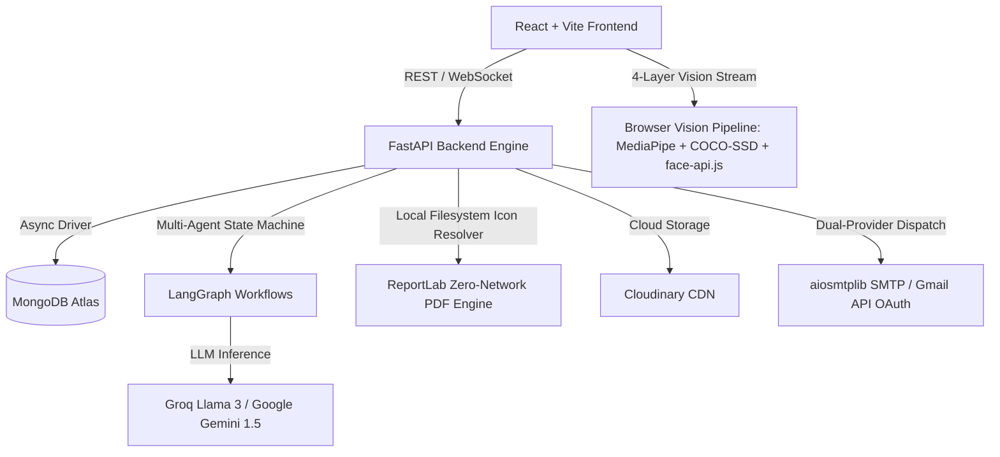

### End-to-End Candidate User Journey Flowchart

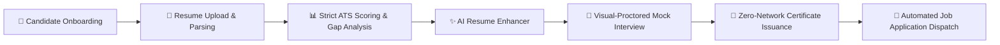

### Verified Technology Stack Matrix

| Category | Primary Technology / Library | Version / Spec | Operational Role & Architectural Purpose |
| :--- | :--- | :--- | :--- |
| **Backend Core** | FastAPI | `^0.110.0` | Asynchronous, high-performance web framework for API routing & OpenAPI spec |
| **Server Engine** | Uvicorn (Standard) | `^0.29.0` | ASGI web server with Windows `ProactorEventLoop` support for subprocesses |
| **Async ODM / DB** | Motor & PyMongo | `motor==3.4.0`, `pymongo==4.7.2` | Non-blocking async MongoDB driver for database collections & aggregation |
| **Data Validation** | PyDantic v2 | `^2.6.4` | Strict schema validation, data serialization, and settings management |
| **AI Orchestration** | LangGraph & LangChain | `langgraph>=0.0.50`, `langchain-core>=0.1.52` | Multi-agent stateful workflow graphs for ATS analysis & application drafting |
| **LLM Inference** | Groq & Google GenAI | `groq>=0.5.0`, `google-genai>=0.1.1` | High-speed LLM completion (Llama 3 70B, Gemini 1.5 Pro/Flash) |
| **NLP & Vectors** | NLTK, Scikit-learn, NumPy | `nltk==3.8.1`, `scikit-learn==1.4.2` | TF-IDF vectorization, cosine similarity, skill ontology matching, tokenization |
| **Proctoring Engine** | MediaPipe FaceMesh & COCO-SSD | `@mediapipe/face_mesh`, `coco-ssd@2.2.3` | Browser 3D head pose estimation, iris gaze tracking, and cheating object detection |
| **Emotion Vision** | face-api.js | `@vladmandic/face-api` | Facial expression analysis & suspicious affect detection |
| **PDF Generation** | ReportLab | `^4.1.0` | Zero-network local vector rendering for verified skill certificates |
| **Doc Parsing** | PDFPlumber, PyPDF, Docx | `pdfplumber==0.11.0`, `python-docx==1.1.2` | Structural extraction of resume text, tables, headers, and metadata |
| **Auth & Security** | Passlib (Bcrypt), Argon2, Jose | `passlib==1.7.4`, `python-jose==3.3.0` | JWT token authorization, password hashing, and OAuth token validation |
| **Email Services** | aiosmtplib & Google Auth API | `aiosmtplib>=3.0.1`, `google-auth>=2.29.0` | Dual-mode email dispatch: fallback direct SMTP + Gmail API refresh tokens |
| **Payments** | Razorpay SDK | `^2.0.1` | Secure subscription tier checkout, webhook verification, and order processing |
| **Media CDN** | Cloudinary SDK | `^1.40.0` | Permanent cloud storage for candidate avatars, resume PDFs, and badges |
| **Frontend UI** | React 18 & Vite 5 | `react^18.3.1`, `vite^5.3.3` | Single-Page Application (SPA) framework with HMR and optimized asset bundling |
| **UI Components** | Tailwind CSS & Framer Motion | `tailwindcss^3.4.6`, `framer-motion^11.18.2` | Dark-mode visual hierarchy, glassmorphism, micro-interactions, animations |
| **Data Viz** | Recharts | `^2.12.7` | Dynamic candidate analytics, skill breakdown radar charts, ATS score gauges |

---

## 📁 Complete Workspace Tree & Exhaustive Responsibility Map

```text
Resume-Screening-System/
├── README.md                          # Root Single Source of Truth Documentation
├── OPTIMIZATION.md                    # Performance & Caching Optimization Plan
├── package.json                       # Root NPM Metadata
├── requirements.txt                   # Production Python Dependencies
├── render.yaml                        # Multi-Service Cloud Deployment Manifest
├── backend/
│   ├── main.py                        # FastAPI Application Bootstrap & Middleware Lifecycle
│   ├── requirements.txt               # Backend Production Dependencies
│   ├── api/
│   │   ├── deps.py                    # Auth Dependents, JWT Verification, Role RBAC
│   │   └── routes/                    # Exhaustive FastAPI API Route Modules (30 files)
│   ├── certificates/                  # Zero-Network ReportLab PDF Generator Engine (11 files)
│   ├── config/                        # Database Connection & Cloud Service Configs
│   ├── core/                          # Settings Schema & Structlog Configuration
│   ├── models/                        # Asynchronous MongoDB ODM Schemas (8 files)
│   ├── services/                      # Business Logic & Integration Services (25 files)
│   ├── utils/                         # Text, Image, File & Validator Helpers (5 files)
│   └── workflows/                     # LangGraph Stateful AI Multi-Agent Graphs (3 files)
└── frontend/
    ├── package.json                   # Frontend React + Vite Dependencies
    ├── vite.config.js                 # Vite Bundler & Dev Proxy Configuration
    ├── src/
    │   ├── App.jsx                    # Route Registry & Auth Provider Guard Rails
    │   ├── main.jsx                   # React Virtual DOM Entrypoint
    │   ├── index.css                  # Global Tailwind CSS Design System & Utility Classes
    │   ├── components/                # Modular React Components (26 root + 7 subdirs)
    │   ├── context/                   # Global React State Context Providers (AuthContext)
    │   ├── hooks/                     # Custom React Hooks & Detection Engines (7 hooks)
    │   ├── pages/                     # Application Page Views & Interfaces (25 views)
    │   └── services/                  # Frontend API HTTP Abstraction Layer (6 services)
```

---

### Exhaustive File-by-File Responsibility Map

#### 1. Backend Models (`/backend/models/`)
| Model File | File Path | Architectural Responsibility & Schema Scope |
| :--- | :--- | :--- |
| `application_model.py` | [application_model.py](file:///e:/FLASK_Clg/Resume-Screening-System/backend/models/application_model.py) | Job application tracker schema storing candidate applications, targeted role titles, company names, draft emails, HITL questionnaire responses, and status (`draft`, `sent`, `accepted`). |
| `certificate_model.py` | [certificate_model.py](file:///e:/FLASK_Clg/Resume-Screening-System/backend/models/certificate_model.py) | Verified skill certificate record storing unique hex codes, user references, issue timestamps, skill lists, verification URLs, and immutable cryptographic SHA-256 hashes. |
| `interview_session_model.py` | [interview_session_model.py](file:///e:/FLASK_Clg/Resume-Screening-System/backend/models/interview_session_model.py) | Mock interview tracking model storing session IDs, job titles, target experience levels, candidate responses, AI evaluations, score breakdowns, and proctoring integrity logs. |
| `otp_model.py` | [otp_model.py](file:///e:/FLASK_Clg/Resume-Screening-System/backend/models/otp_model.py) | Temporary OTP schema storing 6-digit verification codes, target email addresses, action types (`password_reset`, `email_verification`), created timestamps, and 10-minute expiration TTL indexes. |
| `result_model.py` | [result_model.py](file:///e:/FLASK_Clg/Resume-Screening-System/backend/models/result_model.py) | ATS analysis results collection storing overall score (0–100), skill match percentages, missing skill arrays, section score breakdowns, and recommendations. |
| `resume_model.py` | [resume_model.py](file:///e:/FLASK_Clg/Resume-Screening-System/backend/models/resume_model.py) | Parsed resume data model storing candidate user ID, raw extracted text, parsed skill vectors, work experience objects, education history, file URLs, and cloud storage metadata. |
| `support_ticket_model.py` | [support_ticket_model.py](file:///e:/FLASK_Clg/Resume-Screening-System/backend/models/support_ticket_model.py) | Customer and candidate support ticket model managing issue categories, priorities (`low`, `medium`, `high`, `urgent`), message threads, assigned agent IDs, and SLA status. |
| `user_model.py` | [user_model.py](file:///e:/FLASK_Clg/Resume-Screening-System/backend/models/user_model.py) | Comprehensive user authentication & profile model containing credentials, roles (`candidate`, `recruiter`), premium subscription tiers, gamification level/XP, 28-day monthly heatmaps, and 7-day daily rewards state. |

#### 2. Backend Services (`/backend/services/`)
| Service File | File Path | Architectural Responsibility & Logic Scope |
| :--- | :--- | :--- |
| `ai_interview_service.py` | [ai_interview_service.py](file:///e:/FLASK_Clg/Resume-Screening-System/backend/services/ai_interview_service.py) | Conducts dynamic interactive interviews, generates contextual follow-up questions using LLMs, evaluates transcripts for technical depth, clarity, and relevance. |
| `analytics_service.py` | [analytics_service.py](file:///e:/FLASK_Clg/Resume-Screening-System/backend/services/analytics_service.py) | Computes system-wide aggregate metrics, platform-wide skill demand trends, candidate score distributions, and recruiter pipeline throughput. |
| `apply_assistant_service.py` | [apply_assistant_service.py](file:///e:/FLASK_Clg/Resume-Screening-System/backend/services/apply_assistant_service.py) | Manages automated job application tailoring, cold email generation, cover letter drafting, and HITL questionnaire processing via LangGraph orchestration. |
| `certificate_service.py` | [certificate_service.py](file:///e:/FLASK_Clg/Resume-Screening-System/backend/services/certificate_service.py) | High-level business logic for issuing skill certificates, verifying authenticity codes, revoking credentials, and managing candidate skill badges. |
| `cheating_service.py` | [cheating_service.py](file:///e:/FLASK_Clg/Resume-Screening-System/backend/services/cheating_service.py) | Ingests real-time video proctoring event telemetry (gaze direction, face counts, suspicious objects) and updates session cheating severity scores. |
| `cloudinary_service.py` | [cloudinary_service.py](file:///e:/FLASK_Clg/Resume-Screening-System/backend/services/cloudinary_service.py) | Integrates Cloudinary SDK for uploading, transforming, and securely serving user profile avatars, resume PDF files, and certificate badges. |
| `copilot_service.py` | [copilot_service.py](file:///e:/FLASK_Clg/Resume-Screening-System/backend/services/copilot_service.py) | Powers the AI Career Copilot widget, performing multi-turn conversational career coaching, resume feedback, and skill roadmapping. |
| `email_service.py` | [email_service.py](file:///e:/FLASK_Clg/Resume-Screening-System/backend/services/email_service.py) | Multi-provider email engine delivering notification emails, OTP codes, support updates, and cold job applications via direct SMTP or Gmail OAuth API. |
| `enhancer_service.py` | [enhancer_service.py](file:///e:/FLASK_Clg/Resume-Screening-System/backend/services/enhancer_service.py) | Orchestrates resume bullet point rewrite logic using action verbs, metrics quantification, and ATS keyword density optimization. |
| `evaluation_service.py` | [evaluation_service.py](file:///e:/FLASK_Clg/Resume-Screening-System/backend/services/evaluation_service.py) | Core ATS scoring engine calculating cosine similarity between job description embeddings/TF-IDF vectors and candidate resume content. |
| `fake_detection_service.py` | [fake_detection_service.py](file:///e:/FLASK_Clg/Resume-Screening-System/backend/services/fake_detection_service.py) | Analyzes resumes for fraudulent credentials, non-existent companies, buzzword stuffing, timeline overlaps, and ghost white-text ATS hacks. |
| `gamification_service.py` | [gamification_service.py](file:///e:/FLASK_Clg/Resume-Screening-System/backend/services/gamification_service.py) | Executes level calculations, XP gains, streak mechanics, 28-day monthly heatmap state preservation (`🔥`), 7-day rolling rewards, and leaderboard rankings. |
| `github_service.py` | [github_service.py](file:///e:/FLASK_Clg/Resume-Screening-System/backend/services/github_service.py) | Integrates GitHub REST API to pull user repository statistics, primary programming language breakdowns, commit streaks, and top star counts. |
| `gmail_token_service.py` | [gmail_token_service.py](file:///e:/FLASK_Clg/Resume-Screening-System/backend/services/gmail_token_service.py) | Securely manages user-specific Google OAuth2 access tokens and refresh tokens stored in MongoDB for direct Gmail API application dispatch. |
| `hitl_questionnaire_service.py` | [hitl_questionnaire_service.py](file:///e:/FLASK_Clg/Resume-Screening-System/backend/services/hitl_questionnaire_service.py) | Generates Human-In-The-Loop (HITL) targeted questions when job descriptions contain missing parameters (e.g., notice period, expected salary). |
| `live_interview_service.py` | [live_interview_service.py](file:///e:/FLASK_Clg/Resume-Screening-System/backend/services/live_interview_service.py) | Real-time WebSocket interview room session coordinator handling live speech transcript streaming, prompt injection, and instant evaluation. |
| `nlp_extractor.py` | [nlp_extractor.py](file:///e:/FLASK_Clg/Resume-Screening-System/backend/services/nlp_extractor.py) | Low-level NLP processing pipeline running NLTK regex tokenizers, entity extractors, and regex patterns to parse contact details, skills, and dates. |
| `otp_service.py` | [otp_service.py](file:///e:/FLASK_Clg/Resume-Screening-System/backend/services/otp_service.py) | Generates cryptographically secure 6-digit OTPs, stores them with TTL expiration, and handles multi-factor verification workflows. |
| `parser_service.py` | [parser_service.py](file:///e:/FLASK_Clg/Resume-Screening-System/backend/services/parser_service.py) | Universal document parser using PDFPlumber and Python-Docx to convert raw binary resume files into structured text and clean section JSON. |
| `pdf_generator_service.py` | [pdf_generator_service.py](file:///e:/FLASK_Clg/Resume-Screening-System/backend/services/pdf_generator_service.py) | Renders enhanced candidate resumes into clean, professionally formatted downloadable PDFs using HTML/Jinja2 templates and rendering engines. |
| `razorpay_service.py` | [razorpay_service.py](file:///e:/FLASK_Clg/Resume-Screening-System/backend/services/razorpay_service.py) | Interacts with Razorpay APIs to create payment orders, verify HMAC-SHA256 signatures, and handle candidate subscription tier upgrades. |
| `skill_ontology.py` | [skill_ontology.py](file:///e:/FLASK_Clg/Resume-Screening-System/backend/services/skill_ontology.py) | Comprehensive tech taxonomy database mapping 1000+ skills, aliases, framework relationships, and domain categories (e.g., React -> Frontend). |
| `skill_service.py` | [skill_service.py](file:///e:/FLASK_Clg/Resume-Screening-System/backend/services/skill_service.py) | Matches extracted resume terms against the skill ontology, classifying skills into core, secondary, missing, and implied competencies. |
| `strict_ats_service.py` | [strict_ats_service.py](file:///e:/FLASK_Clg/Resume-Screening-System/backend/services/strict_ats_service.py) | Deterministic strict ATS scanner enforcing exact keyword matches, hard section presence (Education, Experience), and structural formatting rules. |
| `support_service.py` | [support_service.py](file:///e:/FLASK_Clg/Resume-Screening-System/backend/services/support_service.py) | Manages support ticket creation, recruiter priority handling, agent replies, automated ticket routing, and resolution status tracking. |

#### 3. Backend Certificates Engine (`/backend/certificates/`)
| Certificate File | File Path | Architectural Responsibility |
| :--- | :--- | :--- |
| `calibrate_layout.py` | [calibrate_layout.py](file:///e:/FLASK_Clg/Resume-Screening-System/backend/certificates/calibrate_layout.py) | Developer calibration script used to compute exact millimeter and point coordinates for canvas elements on ReportLab PDF layouts. |
| `email.py` | [email.py](file:///e:/FLASK_Clg/Resume-Screening-System/backend/certificates/email.py) | Constructs email payloads carrying newly issued skill certificates as PDF attachments and inline HTML badges. |
| `ftp_storage.py` | [ftp_storage.py](file:///e:/FLASK_Clg/Resume-Screening-System/backend/certificates/ftp_storage.py) | Storage connector providing backup FTP/SFTP upload capabilities for generated certificate PDF archives. |
| `id_generator.py` | [id_generator.py](file:///e:/FLASK_Clg/Resume-Screening-System/backend/certificates/id_generator.py) | Generates unique 12-character alphanumeric certificate verification codes and cryptographic validation hashes. |
| `qr.py` | [qr.py](file:///e:/FLASK_Clg/Resume-Screening-System/backend/certificates/qr.py) | Uses `qrcode` library to generate vector/PNG QR codes pointing directly to public verification endpoints (`/verify-certificate/{code}`). |
| `rate_limit.py` | [rate_limit.py](file:///e:/FLASK_Clg/Resume-Screening-System/backend/certificates/rate_limit.py) | Enforces issuance rate limits to prevent certificate generation abuse and denial-of-service canvas rendering loads. |
| `registry.py` | [registry.py](file:///e:/FLASK_Clg/Resume-Screening-System/backend/certificates/registry.py) | Template registry mapping skill certificate categories (e.g., `FullStack`, `PythonData`) to layout parameters and background graphics. |
| `renderer.py` | [renderer.py](file:///e:/FLASK_Clg/Resume-Screening-System/backend/certificates/renderer.py) | Core ReportLab canvas drawing engine constructing high-resolution vector PDF certificates with custom typography and skill icons. |
| `service.py` | [service.py](file:///e:/FLASK_Clg/Resume-Screening-System/backend/certificates/service.py) | Certificate pipeline orchestrator tying together ID generation, QR rendering, icon resolution, vector canvas compilation, and database persistence. |
| `skill_icons.py` | [skill_icons.py](file:///e:/FLASK_Clg/Resume-Screening-System/backend/certificates/skill_icons.py) | **Zero-Network Local File Resolver**: Locates `.png` skill icons from local assets (`f"{slug}.png"`), falling back seamlessly to `default.png` without network calls. |

#### 4. Backend Workflows (`/backend/workflows/`)
| Workflow File | File Path | Architectural Responsibility |
| :--- | :--- | :--- |
| `apply_assistant_graph.py` | [apply_assistant_graph.py](file:///e:/FLASK_Clg/Resume-Screening-System/backend/workflows/apply_assistant_graph.py) | **LangGraph State Machine**: Controls the multi-step job application assistant (resume parsing -> job extraction -> HITL question generation -> email draft compilation). |
| `ats_graph.py` | [ats_graph.py](file:///e:/FLASK_Clg/Resume-Screening-System/backend/workflows/ats_graph.py) | **LangGraph Multi-Agent ATS**: Sequential processing graph for deep resume analysis, keyword extraction, scoring, and corrective guidance generation. |
| `enhancer_graph.py` | [enhancer_graph.py](file:///e:/FLASK_Clg/Resume-Screening-System/backend/workflows/enhancer_graph.py) | **LangGraph Resume Enhancer**: Multi-agent graph managing section-by-section bullet point rewriting, formatting verification, and final quality scoring. |

#### 5. Backend Utilities (`/backend/utils/`)
| Utility File | File Path | Architectural Responsibility |
| :--- | :--- | :--- |
| `file_utils.py` | [file_utils.py](file:///e:/FLASK_Clg/Resume-Screening-System/backend/utils/file_utils.py) | File extension validation, temporary file cleanup routines, file size checking, and safe disk read/write helpers. |
| `ftp_utils.py` | [ftp_utils.py](file:///e:/FLASK_Clg/Resume-Screening-System/backend/utils/ftp_utils.py) | Low-level FTP connection wrappers for remote asset storage operations. |
| `image_utils.py` | [image_utils.py](file:///e:/FLASK_Clg/Resume-Screening-System/backend/utils/image_utils.py) | Image manipulation helpers using Pillow (resizing, crop ratio calculations, avatar formatting, thumbnail generation). |
| `nlp_utils.py` | [nlp_utils.py](file:///e:/FLASK_Clg/Resume-Screening-System/backend/utils/nlp_utils.py) | Text normalization, stop-word removal, regex-based email/phone cleaning, and string similarity distance calculations. |
| `validators.py` | [validators.py](file:///e:/FLASK_Clg/Resume-Screening-System/backend/utils/validators.py) | Input validation functions checking email syntax, strong password constraints, URL structures, and payload integrity. |

#### 6. Frontend Pages (`/frontend/src/pages/`)
| Page View File | File Path | Architectural Responsibility & Route Mapping |
| :--- | :--- | :--- |
| `ApplyAssistant.jsx` | [ApplyAssistant.jsx](file:///e:/FLASK_Clg/Resume-Screening-System/frontend/src/pages/ApplyAssistant.jsx) | Interactive 4-step automated job application wizard (Job parse -> Resume select -> HITL questionnaire -> Custom email draft review). |
| `Billing.jsx` | [Billing.jsx](file:///e:/FLASK_Clg/Resume-Screening-System/frontend/src/pages/Billing.jsx) | Subscription dashboard showing active plan, Razorpay checkout modal, billing history, and tier features (`Free`, `Pro`, `Enterprise`). |
| `CareerPilotLanding.jsx` | [CareerPilotLanding.jsx](file:///e:/FLASK_Clg/Resume-Screening-System/frontend/src/pages/CareerPilotLanding.jsx) | Public landing page featuring interactive hero animations, feature cards, social proof, and call-to-action onboarding buttons. |
| `CareerQuest.jsx` | [CareerQuest.jsx](file:///e:/FLASK_Clg/Resume-Screening-System/frontend/src/pages/CareerQuest.jsx) | Gamification quest center showing active daily missions, weekly challenges, XP progress bars, and reward claim buttons. |
| `Dashboard.jsx` | [Dashboard.jsx](file:///e:/FLASK_Clg/Resume-Screening-System/frontend/src/pages/Dashboard.jsx) | Candidate central dashboard displaying recent ATS scores, active streak counter, upcoming interviews, and recent activity timeline. |
| `ForgotPassword.jsx` | [ForgotPassword.jsx](file:///e:/FLASK_Clg/Resume-Screening-System/frontend/src/pages/ForgotPassword.jsx) | Password recovery view executing 2-step OTP email dispatch and password reset payload submission. |
| `GitHub.jsx` | [GitHub.jsx](file:///e:/FLASK_Clg/Resume-Screening-System/frontend/src/pages/GitHub.jsx) | Developer profile analysis page displaying GitHub stats, top languages, repository breakdown, and commit streak visualization. |
| `GithubCallback.jsx` | [GithubCallback.jsx](file:///e:/FLASK_Clg/Resume-Screening-System/frontend/src/pages/GithubCallback.jsx) | GitHub OAuth redirect handler capturing authorization code and exchanging it with backend authentication routes. |
| `GmailCallback.jsx` | [GmailCallback.jsx](file:///e:/FLASK_Clg/Resume-Screening-System/frontend/src/pages/GmailCallback.jsx) | Google Gmail OAuth callback view storing access tokens in user state for direct email application dispatch. |
| `GuidelinesStep.jsx` | [GuidelinesStep.jsx](file:///e:/FLASK_Clg/Resume-Screening-System/frontend/src/pages/GuidelinesStep.jsx) | Pre-interview instruction step detailing camera placement, proctoring rules, noise requirements, and integrity warnings. |
| `Interview.jsx` | [Interview.jsx](file:///e:/FLASK_Clg/Resume-Screening-System/frontend/src/pages/Interview.jsx) | AI-proctored mock interview room integrating real-time camera feed, speech recognition, timer, and question cards. |
| `LinkedinCallback.jsx` | [LinkedinCallback.jsx](file:///e:/FLASK_Clg/Resume-Screening-System/frontend/src/pages/LinkedinCallback.jsx) | LinkedIn OAuth redirect callback handler processing candidate profile import authorization tokens. |
| `LiveInterview.jsx` | [LiveInterview.jsx](file:///e:/FLASK_Clg/Resume-Screening-System/frontend/src/pages/LiveInterview.jsx) | Real-time WebSocket interview room with live proctoring HUD, candidate webcam preview, and instant AI follow-up questions. |
| `Login.jsx` | [Login.jsx](file:///e:/FLASK_Clg/Resume-Screening-System/frontend/src/pages/Login.jsx) | User authentication login page supporting email/password login, Google One-Tap, GitHub OAuth, and OTP login toggle. |
| `OnboardingLayout.jsx` | [OnboardingLayout.jsx](file:///e:/FLASK_Clg/Resume-Screening-System/frontend/src/pages/OnboardingLayout.jsx) | Multi-step candidate onboarding wrapper directing new users through profile setup and initial resume upload. |
| `Premium.jsx` | [Premium.jsx](file:///e:/FLASK_Clg/Resume-Screening-System/frontend/src/pages/Premium.jsx) | Detailed pricing plan feature comparison grid highlighting unlimited ATS scans, proctored mock interviews, and priority support. |
| `Profile.jsx` | [Profile.jsx](file:///e:/FLASK_Clg/Resume-Screening-System/frontend/src/pages/Profile.jsx) | User profile page containing avatar upload, contact details edit, skill badges grid, 28-day monthly heatmap, and daily rewards card. |
| `RecruiterDashboard.jsx` | [RecruiterDashboard.jsx](file:///e:/FLASK_Clg/Resume-Screening-System/frontend/src/pages/RecruiterDashboard.jsx) | Recruiter portal viewing uploaded job postings, applicant rankings, candidate ATS match scores, and resume downloading. |
| `Results.jsx` | [Results.jsx](file:///e:/FLASK_Clg/Resume-Screening-System/frontend/src/pages/Results.jsx) | Comprehensive ATS analysis results dashboard featuring score rings, missing skill tabs, interactive resume preview, and PDF downloader. |
| `RoleConfigStep.jsx` | [RoleConfigStep.jsx](file:///e:/FLASK_Clg/Resume-Screening-System/frontend/src/pages/RoleConfigStep.jsx) | Interview configuration step selecting target role (e.g., `Backend Engineer`), tech stack, difficulty, and duration. |
| `Signup.jsx` | [Signup.jsx](file:///e:/FLASK_Clg/Resume-Screening-System/frontend/src/pages/Signup.jsx) | Registration view with account type selection (`candidate` vs `recruiter`), password strength meter, and terms validation. |
| `SupportTickets.jsx` | [SupportTickets.jsx](file:///e:/FLASK_Clg/Resume-Screening-System/frontend/src/pages/SupportTickets.jsx) | Support portal listing user submitted tickets, category filters, SLA status tags, and new ticket creation modal. |
| `TicketDetail.jsx` | [TicketDetail.jsx](file:///e:/FLASK_Clg/Resume-Screening-System/frontend/src/pages/TicketDetail.jsx) | Individual support ticket view rendering agent/user message thread, status updates, and response submission box. |
| `VerifyCertificate.jsx` | [VerifyCertificate.jsx](file:///e:/FLASK_Clg/Resume-Screening-System/frontend/src/pages/VerifyCertificate.jsx) | Public certificate verification portal displaying candidate name, issued skills, verification badge, and immutable SHA-256 hash. |
| `VerifyEmail.jsx` | [VerifyEmail.jsx](file:///e:/FLASK_Clg/Resume-Screening-System/frontend/src/pages/VerifyEmail.jsx) | Email verification page processing verification tokens sent via email after signup. |

#### 7. Frontend State, Hooks & Services (`/frontend/src/`)
| Category | File Path | Architectural Responsibility |
| :--- | :--- | :--- |
| **Context** | [AuthContext.jsx](file:///e:/FLASK_Clg/Resume-Screening-System/frontend/src/context/AuthContext.jsx) | Global authentication state managing JWT tokens, user profile state, login/logout functions, and automatic token refresh. |
| **Hook** | [useAdvancedDetection.js](file:///e:/FLASK_Clg/Resume-Screening-System/frontend/src/hooks/useAdvancedDetection.js) | **4-Layer Vision Proctoring Engine**: Controls MediaPipe FaceMesh (468 landmarks), Iris Gaze tracking, COCO-SSD object detection, and face-api.js emotion analysis with a 1.5s–2.0s debounce buffer. |
| **Hook** | [useApplyAssistant.js](file:///e:/FLASK_Clg/Resume-Screening-System/frontend/src/hooks/useApplyAssistant.js) | Custom hook managing state for job parsing, HITL questionnaire responses, and draft email generation steps. |
| **Hook** | [useFaceDetection.js](file:///e:/FLASK_Clg/Resume-Screening-System/frontend/src/hooks/useFaceDetection.js) | Secondary lightweight canvas-based face detection fallback hook ensuring proctoring continuity if CDN models fail to initialize. |
| **Hook** | [useFullscreenImmersive.js](file:///e:/FLASK_Clg/Resume-Screening-System/frontend/src/hooks/useFullscreenImmersive.js) | Forces browser full-screen mode during proctored interviews, detecting tab switches, window blur events, and ESC key presses. |
| **Hook** | [useInterviewSession.js](file:///e:/FLASK_Clg/Resume-Screening-System/frontend/src/hooks/useInterviewSession.js) | Manages interview session timers, question index tracking, candidate answer buffers, and session completion submission. |
| **Hook** | [useSpeech.js](file:///e:/FLASK_Clg/Resume-Screening-System/frontend/src/hooks/useSpeech.js) | Web Speech API wrapper handling Text-to-Speech (TTS) question vocalization and Speech-to-Text (STT) candidate answer transcription. |
| **Hook** | [useWebSocket.js](file:///e:/FLASK_Clg/Resume-Screening-System/frontend/src/hooks/useWebSocket.js) | Robust WebSocket manager handling auto-reconnection, heartbeat ping/pong messages, and real-time live interview streaming. |
| **Service** | [api.js](file:///e:/FLASK_Clg/Resume-Screening-System/frontend/src/services/api.js) | Core Axios HTTP client instance configuring base URL, auth token interceptors, 401 handling, and global error toasts. |
| **Service** | [applyAssistantApi.js](file:///e:/FLASK_Clg/Resume-Screening-System/frontend/src/services/applyAssistantApi.js) | API service methods for `/api/v1/apply-assistant` endpoints (parse job, generate draft, send application). |
| **Service** | [certificateApi.js](file:///e:/FLASK_Clg/Resume-Screening-System/frontend/src/services/certificateApi.js) | API client calls for issuing, listing, and downloading verified skill certificates. |
| **Service** | [interviewApi.js](file:///e:/FLASK_Clg/Resume-Screening-System/frontend/src/services/interviewApi.js) | API client wrapper for starting sessions, submitting answers, logging cheating events, and fetching interview reports. |
| **Service** | [notificationApi.js](file:///e:/FLASK_Clg/Resume-Screening-System/frontend/src/services/notificationApi.js) | HTTP service pulling user notifications and marking notification items as read. |
| **Service** | [supportApi.js](file:///e:/FLASK_Clg/Resume-Screening-System/frontend/src/services/supportApi.js) | API abstraction handling support ticket submission, listing, detail retrieval, and message replies. |

#### 8. Frontend Components (`/frontend/src/components/`)
| Component File / Directory | File Path | Responsibility |
| :--- | :--- | :--- |
| `AICopilotWidget.jsx` | [AICopilotWidget.jsx](file:///e:/FLASK_Clg/Resume-Screening-System/frontend/src/components/AICopilotWidget.jsx) | Floating glassmorphism AI copilot drawer providing instant career coaching and resume tips. |
| `ATSResult.jsx` | [ATSResult.jsx](file:///e:/FLASK_Clg/Resume-Screening-System/frontend/src/components/ATSResult.jsx) | Detailed ATS analysis display component showing match meters, missing skills, and section improvements. |
| `Navbar.jsx` | [Navbar.jsx](file:///e:/FLASK_Clg/Resume-Screening-System/frontend/src/components/Navbar.jsx) | Main navigation bar showing active streak badge, notification bell, user avatar dropdown, and navigation links. |
| `Sidebar.jsx` | [Sidebar.jsx](file:///e:/FLASK_Clg/Resume-Screening-System/frontend/src/components/Sidebar.jsx) | Responsive dashboard navigation sidebar with quick access to ATS tools, interviews, quests, and billing. |
| `detection/DetectionPanel.jsx` | [DetectionPanel.jsx](file:///e:/FLASK_Clg/Resume-Screening-System/frontend/src/components/detection/DetectionPanel.jsx) | Real-time visual proctoring HUD displaying face count status, gaze direction indicators, and object warning banners. |
| `gamification/DailyRewards.jsx` | [DailyRewards.jsx](file:///e:/FLASK_Clg/Resume-Screening-System/frontend/src/components/gamification/DailyRewards.jsx) | Interactive 7-day rolling rewards modal rendering claimable daily XP boxes, streak multipliers, and reset timers. |
| `gamification/StreakCard.jsx` | [StreakCard.jsx](file:///e:/FLASK_Clg/Resume-Screening-System/frontend/src/components/gamification/StreakCard.jsx) | Candidate activity heatmap card rendering the 28-day GitHub-style contribution matrix and active fire icon (`🔥`). |

---

## 🏗️ Deep-Dive Architectural Workflows

### 1. LangGraph & Multi-Agent AI Workflows

The platform leverages **LangGraph** stateful graphs to manage complex, multi-step LLM operations. This ensures deterministic state transitions, error recovery, and human-in-the-loop (HITL) intervention.

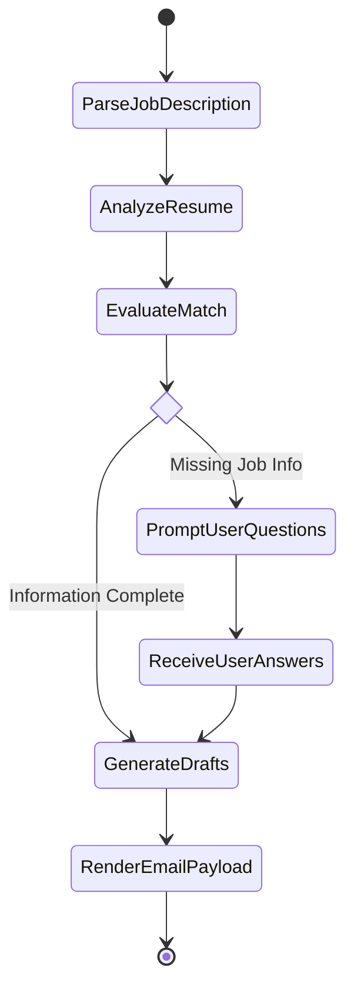

* **ATS Graph (`ats_graph.py`)**: Executes sequential nodes: `extract_text` -> `normalize_skills` -> `calculate_tfidf_cosine` -> `invoke_llm_gap_analysis` -> `format_json_result`.
* **Enhancer Graph (`enhancer_graph.py`)**: Operates an iterative refinement loop: takes candidate work experience bullet points, applies action-verb transformations, quantifies impact using candidate parameters, verifies section structure, and outputs enhanced markdown/PDF.
* **Apply Assistant Graph (`apply_assistant_graph.py`)**: Integrates human-in-the-loop execution. If a job description lacks critical parameters (e.g., target salary, preferred start date), the graph pauses at `PromptUserQuestions`, collects input from the frontend UI, and resumes to generate a personalized cold email draft.

---

### 2. Multi-Provider Authentication & OAuth Sequence

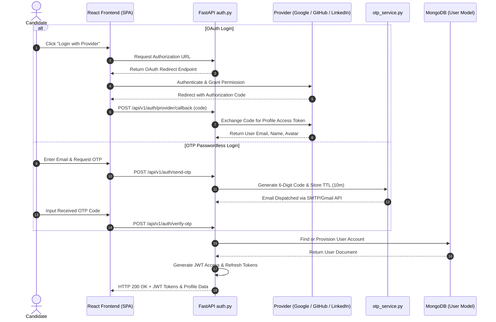

---

### 3. Deep-Scan ATS Resume Parsing & Scoring Pipeline

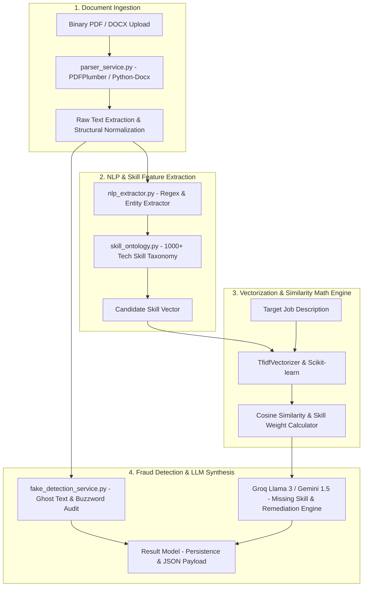

---

### 4. Computer Vision & Proctoring Engine

The cheating detection pipeline operates directly inside the candidate's browser via `useAdvancedDetection.js`, running four parallel detection layers to maintain high integrity without heavy backend streaming overhead.

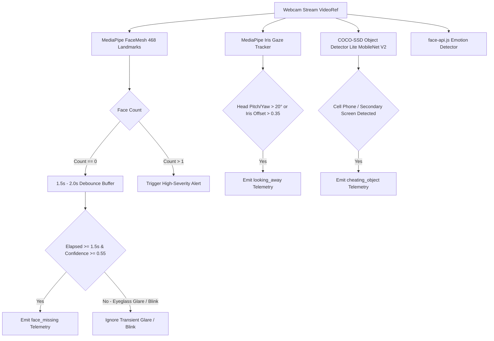

#### Eyeglasses Glare & Transient Movement Guardrail
To prevent false-positive `"No face detected"` warnings caused by eyeglasses glare, sudden lighting changes, or natural eye blinks:
1. **Debounce Buffer Window (1.5s – 2.0s)**: A missing face event is not dispatched immediately. The hook initializes `missingFaceStartTimeRef`. Only when `elapsed = Date.now() - startTime >= 1500ms` does the system change status to `missing`.
2. **Confidence Floor Threshold (`0.55`)**: Landmark tracking and object detection require a minimum confidence score of `0.55` (`minDetectionConfidence: 0.5`). Any detection below `0.55` is discarded as sensor noise.

---

### 5. Real-Time Proctored Live Interview Sequence

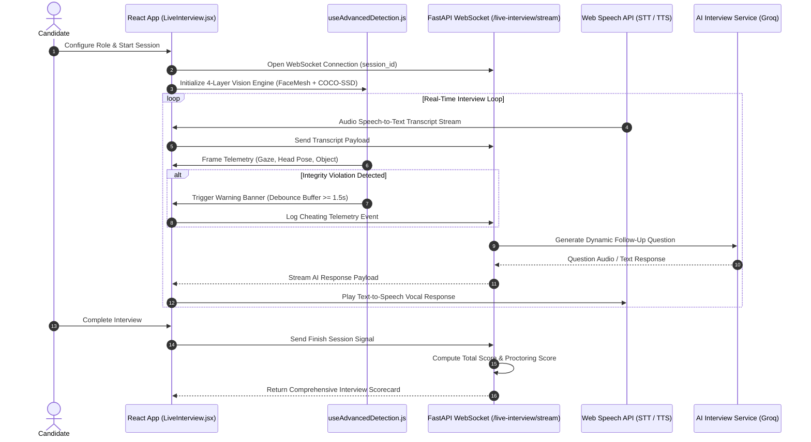

---

### 6. Gamification, Heatmap & Rolling Rewards Loop

The system implements a dual-layer retention engine governed by `gamification_service.py` and `user_model.py`.

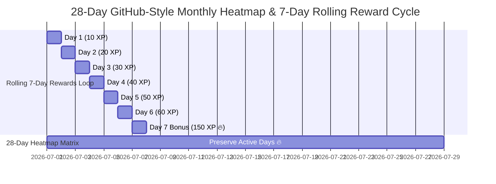

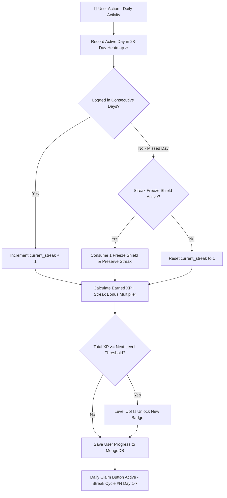

* **28-Day GitHub-Style Monthly Heatmap**: Preserves candidate activity history across a rolling 28-day grid (`activity_heatmap` array). Active days maintain historical active status (`intensity` 1–4, marked with `🔥`), ensuring past accomplishments remain permanently rendered regardless of minor streak lapses.
* **Rolling 7-Day Daily Rewards (`Streak Cycle #N`)**: Users claim daily escalating XP bonuses (10 XP -> 150 XP on Day 7). Completing Day 7 automatically rolls the reward cycle back to Day 1 (`cycle_count + 1`) while incrementing total candidate streak and level progress.

---

### 7. Zero-Network Certificate Generation Engine

Certificates are rendered strictly on the local backend server using ReportLab vector canvases to guarantee zero-network latency and high availability.

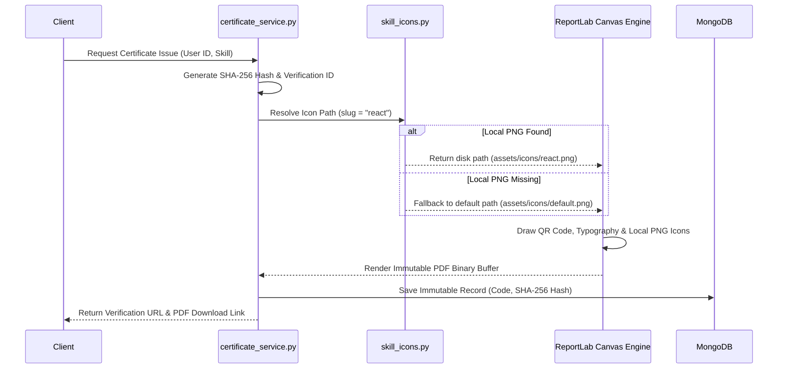

* **Icon Resolution Safety (`skill_icons.py`)**: The resolver checks the local disk for `f"{slug}.png"`. If an icon is missing or invalid, it instantly returns `default.png` from local disk. Zero external network API calls are made during PDF drawing.
* **Immutable Verification Snapshot**: Each certificate's metadata, skill list, and timestamp are cryptographically hashed using SHA-256 and saved in `certificate_model.py`. Any attempt to modify candidate details invalidates public verification checks at `/verify-certificate/{code}`.

---

### 8. Support, Recruiter & Email Dispatch Engines

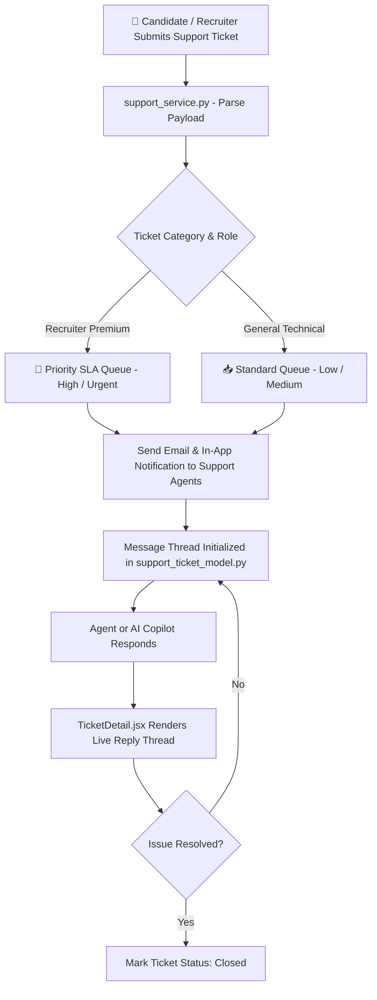

* **Dual-Mode Email Dispatch (`email_service.py`)**: Automatically detects available credentials. If `GMAIL_REFRESH_TOKEN` is present, it uses `gmail_token_service.py` to refresh OAuth tokens and send emails via Google REST API. If OAuth is unconfigured, it falls back seamlessly to `aiosmtplib` direct SMTP dispatch.
* **Recruiter V2 Engine (`recruiter_v2.py`)**: Enables recruiters to upload job descriptions and instantly rank applicant pools using pre-computed vector similarity matrices and skill gap scores.
* **Support Ticket SLA Queue (`support_service.py`)**: Automatically categorizes user tickets, routes priority candidate tickets to specialized SLA queues, and manages agent message threading.

---

## 🌐 Complete 100% API Route Inventory

Below is the exhaustive inventory of all REST API endpoints registered under `/api/v1` and core routes in FastAPI.

| Method | Endpoint Path | Auth Required | Request Payload / Params | Architectural Description |
| :--- | :--- | :---: | :--- | :--- |
| `GET` | `/health` | No | None | System health check, DB connection test, and version status |
| `POST` | `/api/v1/auth/signup` | No | `UserCreate` JSON | Candidate/Recruiter account creation & password hashing |
| `POST` | `/api/v1/auth/login` | No | `OAuth2PasswordRequestForm` | Authenticate credentials & return JWT access/refresh tokens |
| `POST` | `/api/v1/auth/refresh` | No | `RefreshToken` JSON | Issue fresh JWT access token using valid refresh token |
| `POST` | `/api/v1/auth/logout` | Yes | Token Header | Invalidate user session and clear auth cookies |
| `GET` | `/api/v1/auth/me` | Yes | Bearer Token | Fetch current authenticated user profile & permissions |
| `POST` | `/api/v1/auth/send-otp` | No | `SendOTPRequest` | Dispatch 6-digit OTP code to target email address |
| `POST` | `/api/v1/auth/verify-otp` | No | `VerifyOTPRequest` | Validate 6-digit OTP code for password reset or signup |
| `POST` | `/api/v1/auth/reset-password` | No | `ResetPasswordRequest` | Reset user password using verified OTP token |
| `GET` | `/api/v1/auth/google/login` | No | None | Returns Google OAuth2 authorization redirect URL |
| `GET` | `/api/v1/auth/google/callback` | No | `code`, `state` Query | Exchanges Google auth code for JWT user session |
| `GET` | `/api/v1/auth/github/login` | No | None | Returns GitHub OAuth authorization redirect URL |
| `GET` | `/api/v1/auth/github/callback` | No | `code` Query | Processes GitHub auth callback & provisions account |
| `GET` | `/api/v1/auth/linkedin/login` | No | None | Returns LinkedIn OAuth authorization redirect URL |
| `GET` | `/api/v1/auth/linkedin/callback` | No | `code` Query | Handles LinkedIn OAuth callback & profile import |
| `GET` | `/api/v1/auth/gmail/authorize` | Yes | None | Initiates user Gmail API OAuth authorization consent |
| `GET` | `/api/v1/auth/gmail/callback` | Yes | `code` Query | Saves user Gmail API refresh tokens for app dispatch |
| `GET` | `/api/v1/auth/gmail/status` | Yes | Bearer Token | Checks if candidate has connected active Gmail dispatch |
| `GET` | `/api/v1/users/me` | Yes | Bearer Token | Retrieve user profile, subscription tier, and stats |
| `PUT` | `/api/v1/users/me/profile` | Yes | `ProfileUpdate` JSON | Update full name, headline, target role, and bio |
| `POST` | `/api/v1/users/me/avatar` | Yes | Multipart File | Upload and update candidate avatar image via Cloudinary |
| `GET` | `/api/v1/users/me/gamification` | Yes | Bearer Token | Fetch level, XP, 28-day heatmap, and 7-day reward status |
| `POST` | `/api/v1/users/me/daily-claim` | Yes | Bearer Token | Claim rolling daily streak reward XP for active day |
| `GET` | `/api/v1/users/leaderboard` | Yes | `limit` Query | Fetch global candidate XP leaderboard rankings |
| `POST` | `/api/v1/resume/upload` | Yes | Multipart File (`.pdf`, `.docx`) | Parse and store candidate resume document |
| `GET` | `/api/v1/resume/my-resumes` | Yes | Bearer Token | List all resumes uploaded by authenticated candidate |
| `GET` | `/api/v1/resume/{resume_id}` | Yes | Path `resume_id` | Retrieve detailed parsed text and skills of a resume |
| `DELETE` | `/api/v1/resume/{resume_id}` | Yes | Path `resume_id` | Delete resume record and associated cloud files |
| `POST` | `/api/v1/ats/score` | Yes | `ATSScoreRequest` JSON | Evaluate resume against job description (TF-IDF + Cosine) |
| `POST` | `/api/v1/ats/evaluate-graph` | Yes | `ATSScoreRequest` JSON | Run LangGraph stateful multi-agent ATS evaluation |
| `POST` | `/api/v1/ats/batch-score` | Yes | `BatchATSRequest` | Recruiter batch scoring of candidate resume pool |
| `POST` | `/api/v1/explain/ats-score` | Yes | `ExplainScoreRequest` | Generate LLM-powered detailed score breakdown |
| `POST` | `/api/v1/explain/skill-gap` | Yes | `SkillGapRequest` | Extract missing technical skills & learning roadmap |
| `POST` | `/api/v1/enhance/resume` | Yes | `EnhanceResumeRequest` | Re-write resume bullet points for ATS optimization |
| `POST` | `/api/v1/enhance/bullet-point` | Yes | `BulletPointRequest` | Enhance single work experience bullet point with metrics |
| `GET` | `/api/v1/enhance/status/{job_id}` | Yes | Path `job_id` | Query async resume enhancement background task status |
| `POST` | `/api/v1/pdf/generate-enhanced-resume` | Yes | `PDFGenRequest` | Render enhanced resume into downloadable PDF document |
| `POST` | `/api/v1/fake-detect/analyze-resume` | Yes | `FakeDetectRequest` | Analyze resume for ghost text, buzzwords, & fake info |
| `POST` | `/api/v1/github/analyze-profile` | Yes | `GithubAnalysisRequest` | Extract developer repositories, languages, and stars |
| `GET` | `/api/v1/github/repos` | Yes | Bearer Token | List connected GitHub account public repositories |
| `POST` | `/api/v1/interview/start` | Yes | `StartInterviewRequest` | Initialize mock interview session & load question bank |
| `POST` | `/api/v1/interview/submit-answer` | Yes | `SubmitAnswerRequest` | Process audio/text answer and generate AI feedback |
| `POST` | `/api/v1/interview/cheating-log` | Yes | `CheatingLogRequest` | Record visual proctoring integrity violation event |
| `POST` | `/api/v1/interview/finish` | Yes | `FinishInterviewRequest` | Finalize session, compute total score, and issue report |
| `GET` | `/api/v1/interview/report/{session_id}` | Yes | Path `session_id` | Retrieve comprehensive interview scorecard and logs |
| `WS` | `/api/v1/live-interview/stream/{session_id}` | Yes | Path `session_id` | Real-time WebSocket connection for live speech & audio |
| `GET` | `/api/v1/interview-analytics/performance` | Yes | Bearer Token | Get historical candidate interview trends & metric graphs |
| `POST` | `/api/v1/certificates/issue` | Yes | `IssueCertificateRequest` | Issue verified skill certificate & generate ReportLab PDF |
| `GET` | `/api/v1/certificates/verify/{code}` | No | Path `code` | Public verification endpoint for certificate authenticity |
| `GET` | `/api/v1/certificates/my-certificates` | Yes | Bearer Token | List all verified certificates earned by candidate |
| `GET` | `/api/v1/certificates/download/{code}` | No | Path `code` | Download high-res ReportLab PDF certificate binary |
| `POST` | `/api/v1/copilot/chat` | Yes | `CopilotChatRequest` | Send prompt to AI Career Copilot floating widget |
| `POST` | `/api/v1/copilot/career-advice` | Yes | `AdviceRequest` | Generate personalized career development roadmap |
| `POST` | `/api/v1/apply-assistant/parse-job` | Yes | `ParseJobRequest` | Extract target job title, company, & key requirements |
| `POST` | `/api/v1/apply-assistant/generate-drafts` | Yes | `GenerateDraftsRequest` | Run LangGraph to draft custom cover letter & cold email |
| `POST` | `/api/v1/apply-assistant/send-application` | Yes | `SendApplicationRequest` | Dispatch application email via connected SMTP/Gmail API |
| `POST` | `/api/v1/support/tickets` | Yes | `CreateTicketRequest` | Open new candidate/recruiter support ticket |
| `GET` | `/api/v1/support/tickets` | Yes | `status` Query | List all support tickets submitted by current user |
| `GET` | `/api/v1/support/tickets/{ticket_id}` | Yes | Path `ticket_id` | Retrieve ticket details, message thread, & SLA status |
| `POST` | `/api/v1/support/tickets/{ticket_id}/reply` | Yes | Path `ticket_id` | Post user or support agent reply message to ticket |
| `GET` | `/api/v1/notifications/` | Yes | Bearer Token | Retrieve unread user system notification items |
| `PUT` | `/api/v1/notifications/{id}/read` | Yes | Path `id` | Mark specific notification item as read |
| `POST` | `/api/v1/payment/create-order` | Yes | `CreateOrderRequest` | Create Razorpay payment order for subscription upgrade |
| `POST` | `/api/v1/payment/verify` | Yes | `VerifyPaymentRequest` | Verify Razorpay HMAC signature & activate subscription |
| `GET` | `/api/v1/analytics/overview` | Yes (Recruiter) | Bearer Token | System-wide recruiter analytics dashboard summary |
| `GET` | `/api/v1/analytics/skills-demand` | Yes | Bearer Token | Aggregated tech skill demand trends across job posts |
| `GET` | `/api/v1/recruiter/candidates` | Yes (Recruiter) | `role` Query | Query candidates matching specific role criteria |
| `POST` | `/api/v1/recruiter/job-post` | Yes (Recruiter) | `JobPostRequest` | Create new recruiter job opening for candidate matching |
| `GET` | `/api/v1/recruiter/v2/search-candidates` | Yes (Recruiter) | Search parameters | Recruiter V2 search engine with skill filter matrices |
| `POST` | `/api/v1/recruiter/v2/rank-applicants` | Yes (Recruiter) | `RankApplicantsRequest` | Rank applicant resume pool against target job posting |

---

## 🗄️ Database Schemas & Entity Relationship Diagram (ERD)

The database layer utilizes **MongoDB Atlas** accessed asynchronously via **Motor**. Below is the complete field-by-field breakdown of all 8 collections.

```mermaid
erDiagram
    USERS ||--o{ RESUMES : owns
    USERS ||--o{ CERTIFICATES : earns
    USERS ||--o{ INTERVIEW_SESSIONS : conducts
    USERS ||--o{ APPLICATIONS : submits
    USERS ||--o{ SUPPORT_TICKETS : creates
    RESUMES ||--o{ RESULTS : evaluates_to
    
    USERS {
        string _id PK
        string email UK
        string password_hash
        string full_name
        string role
        string plan_tier
        int level
        int xp
        int current_streak
        array activity_heatmap
        object daily_rewards_state
        datetime created_at
    }

    RESUMES {
        string _id PK
        string user_id FK
        string filename
        string file_url
        string raw_text
        array extracted_skills
        array experience_history
        datetime uploaded_at
    }

    RESULTS {
        string _id PK
        string resume_id FK
        string job_title
        float overall_score
        float skill_match_percent
        array missing_skills
        object section_scores
        datetime evaluated_at
    }

    CERTIFICATES {
        string _id PK
        string user_id FK
        string certificate_code UK
        string skill_name
        string sha256_hash
        string pdf_url
        datetime issued_at
    }

    INTERVIEW_SESSIONS {
        string _id PK
        string user_id FK
        string target_role
        int score
        int cheating_flags_count
        array transcripts
        array proctoring_logs
        datetime completed_at
    }

    APPLICATIONS {
        string _id PK
        string user_id FK
        string company_name
        string job_title
        string draft_email
        object hitl_answers
        string status
        datetime created_at
    }

    SUPPORT_TICKETS {
        string _id PK
        string user_id FK
        string category
        string priority
        string status
        array messages
        datetime created_at
    }

    OTPS {
        string _id PK
        string email
        string code
        string type
        datetime expires_at TTL
    }
```

### Collection Schema Descriptions

1. **`users` Collection**: Stores user identities, authentication credentials, role RBAC (`candidate`, `recruiter`), premium tier subscriptions (`Free`, `Pro`, `Enterprise`), gamification XP/levels, the **28-Day GitHub-Style Heatmap**, and the **7-Day Rolling Reward Cycle State**.
2. **`resumes` Collection**: Holds raw and structured resume data extracted via `parser_service.py` and `nlp_extractor.py`, including skill lists, education, and experience timelines.
3. **`results` Collection**: Captures historical ATS analysis runs, storing overall match scores, TF-IDF cosine metrics, missing skill arrays, and section score breakdowns.
4. **`certificates` Collection**: Stores issued skill certificates, unique 12-character verification hex codes, skill categories, verification badge URLs, and immutable SHA-256 hashes.
5. **`interview_sessions` Collection**: Records AI mock interview sessions, audio transcript histories, question feedback, overall candidate performance scores, and cheating violation timestamps.
6. **`applications` Collection**: Tracks job application tailoring workflows operated by the Apply Assistant, holding target company details, tailored cover letters, draft emails, and HITL survey responses.
7. **`support_tickets` Collection**: Manages user support requests, issue classification categories, priority SLA ranks (`low`, `medium`, `high`, `urgent`), agent replies, and ticket closure states.
8. **`otps` Collection**: Manages transient 6-digit one-time password verification tokens with automatic 10-minute MongoDB TTL index expiration.

---

## 🛡️ Production Deployment Guardrails & Environment Secrets

### Complete `.env` Environment Secrets Reference

```env
# ── Server & Application Config ──────────────────────────────────────────────
APP_NAME="CareerShala AI Engine"
APP_VERSION="3.0.0"
ENVIRONMENT="production"
PORT=8000
ALLOWED_ORIGINS=["https://resume-screening-system-lyart.vercel.app","http://localhost:5173"]

# ── Database & Cache Secrets ──────────────────────────────────────────────────
MONGODB_URL="mongodb+srv://<username>:<password>@cluster.mongodb.net/careershala?retryWrites=true&w=majority"
REDIS_URL="redis://default:<password>@redis-12345.c1.us-east-1-1.ec2.cloud.redislabs.com:12345"

# ── JWT Authentication ────────────────────────────────────────────────────────
SECRET_KEY="super-secret-jwt-signing-key-change-in-production"
ALGORITHM="HS256"
ACCESS_TOKEN_EXPIRE_MINUTES=1440

# ── AI & LLM Provider API Keys ────────────────────────────────────────────────
GROQ_API_KEY="gsk_xxxxxxxxxxxxxxxxxxxxxxxxxxxxxxxx"
GEMINI_API_KEY="AIzaSyXxxxxxxxxxxxxxxxxxxxxxxxxxxx"

# ── Cloudinary Media Storage ──────────────────────────────────────────────────
CLOUDINARY_CLOUD_NAME="your-cloud-name"
CLOUDINARY_API_KEY="123456789012345"
CLOUDINARY_API_SECRET="abcdefghijklmnopqrstuvwxyz12345"

# ── Email Dispatch Config (SMTP / OAuth) ──────────────────────────────────────
SMTP_HOST="smtp.gmail.com"
SMTP_PORT=587
SMTP_USER="notifications@careershala.com"
SMTP_PASSWORD="app-specific-password"
GOOGLE_CLIENT_ID="1234567890-xxx.apps.googleusercontent.com"
GOOGLE_CLIENT_SECRET="GOCSPX-xxxxxxxxxxxxxxxx"

# ── Payment Gateway (Razorpay) ────────────────────────────────────────────────
RAZORPAY_KEY_ID="rzp_live_xxxxxxxxxxxxxx"
RAZORPAY_KEY_SECRET="xxxxxxxxxxxxxxxxxxxxxxxx"

# ── Monitoring & Telemetry ───────────────────────────────────────────────────
SENTRY_DSN="https://xxxxxxxx@o12345.ingest.sentry.io/67890"
```

---

### Strict Production Guardrails

#### 1. Linux File-System Case Sensitivity Guardrail
* **Issue**: Windows filesystems are case-insensitive (`logo.mp4` matches `Logo.mp4`), whereas Linux production hosts (Render, Vercel, AWS Linux) strictly enforce case sensitivity.
* **Guardrail**: All static media assets inside `/public/` and `/src/assets/` MUST use strictly lowercase filenames (`logo.mp4`, `default.png`, `avatar_placeholder.png`). Never reference uppercase extensions or mixed-case file paths in React imports or backend static mounts.

#### 2. Vite Production Asset Bundling Protocol
* **Issue**: Referencing video or image assets via relative string paths (e.g., `<video src="/assets/logo.mp4">`) causes missing asset 404 errors in production builds because Vite hashes asset filenames into `/dist/assets/logo-Cx812a.mp4`.
* **Guardrail**: Always import static media assets via ES Module import statements at the top of React components:
  ```javascript
  // ✅ Correct Production Import Syntax
  import brandLogoVideo from '../assets/logo.mp4';
  
  function HeroBanner() {
    return <video src={brandLogoVideo} autoPlay loop muted />;
  }
  ```

#### 3. Ephemeral Filesystem vs. Cloud Image Persistence
* **Issue**: Serverless container environments (Render, Heroku, Vercel) reset their local disk storage (`/uploads`) whenever containers restart or scale, resulting in broken image links.
* **Guardrail**: Never store permanent candidate profile photos, resume PDFs, or skill certificates on local disk storage. All file uploads MUST be dispatched to Cloudinary via `cloudinary_service.py`, returning permanent HTTPS CDN URLs for database persistence.

---

## 🤝 Developer & AI Assistant Handoff Guide

### 1. Adding a New Skill Certificate Template
1. Add the SVG/PNG badge icon inside `/backend/certificates/assets/icons/{skill_slug}.png`.
2. Register the skill category and layout configuration in `/backend/certificates/registry.py`:
   ```python
   CERTIFICATE_REGISTRY["kubernetes"] = {
       "title": "Kubernetes Cloud Architect",
       "category": "DevOps",
       "icon_slug": "kubernetes",
       "primary_color": "#326CE5"
   }
   ```
3. Test local zero-network canvas rendering by running:
   ```bash
   python backend/certificates/calibrate_layout.py --skill kubernetes
   ```

### 2. Adding a New Gamification Quest
1. Open `/backend/services/gamification_service.py` and register the quest dictionary:
   ```python
   QUEST_DEFINITIONS["complete_3_interviews"] = {
       "title": "Interview Master",
       "description": "Complete 3 proctored mock interview sessions",
       "reward_xp": 150,
       "target_count": 3
   }
   ```
2. Call `gamification_service.track_quest_progress(user_id, "complete_3_interviews")` inside `ai_interview_service.py` upon session finalization.

### 3. Adding a New REST API Endpoint
1. Create or open the router module in `/backend/api/routes/`.
2. Define the route using PyDantic request/response schemas and include authentication dependencies:
   ```python
   @router.post("/custom-action", response_model=CustomResponse)
   async def handle_custom_action(
       payload: CustomRequest,
       current_user: User = Depends(get_current_user)
   ):
       return await custom_service.execute(payload, current_user.id)
   ```
3. Register the router in `/backend/main.py` if adding a new router file:
   ```python
   app.include_router(custom_router, prefix=f"{p}/custom", tags=["Custom"])
   ```

### 4. Adding a New LangGraph Multi-Agent Workflow
1. Create the state graph definition in `/backend/workflows/custom_graph.py`.
2. Define the `TypedDict` graph state holding input parameters and intermediate LLM outputs:
   ```python
   class CustomWorkflowState(TypedDict):
       input_text: str
       intermediate_summary: str
       final_output: dict
   ```
3. Build the `StateGraph`, define node functions, add conditional edges, and compile:
   ```python
   workflow = StateGraph(CustomWorkflowState)
   workflow.add_node("summarize", summarize_node)
   workflow.add_node("evaluate", evaluate_node)
   workflow.set_entry_point("summarize")
   workflow.add_edge("summarize", "evaluate")
   workflow.add_edge("evaluate", END)
   custom_graph = workflow.compile()
   ```

---
*Documentation maintained automatically by Antigravity AI — Single Source of Truth (SSOT)*
