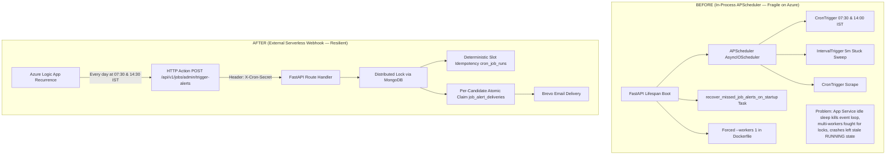

# Codebase Audit & Cleanup Planning: Scheduler Architecture Migration

**Document Version:** 1.0.0  
**Date:** October 4, 2026  
**Status:** Audit & Proposal (Read-Only — No Code Modified)  
**Author:** AI Pair Programmer  
**Target Repository:** CareerShala AI Career Platform (`backend`)

---

## Executive Summary

CareerShala has transitioned from an **in-process APScheduler background daemon** running inside the FastAPI container on Azure App Service to an **external serverless timer trigger** (Azure Logic App) invoking the authenticated webhook endpoint:
```http
POST /api/v1/jobs/admin/trigger-alerts
Headers:
  X-Cron-Secret: <CRON_SECRET>
```

### The "Before" vs "After" Architecture



By decoupling schedule generation (delegated to Azure Logic App) from batch execution (handled by FastAPI), substantial in-process scheduler boilerplate, defensive crash-recovery logic, and worker-count limitations are now obsolete.

---

## 1. Dead Dependencies

The following libraries in [`backend/requirements.txt`](file:///e:/FLASK_Clg/Resume-Screening-System/backend/requirements.txt) were introduced specifically for internal in-process cron scheduling and can be safely eliminated:

| Package | Current Version | Why It Was Added | Why It Is Now Dead | Action |
| :--- | :--- | :--- | :--- | :--- |
| **`apscheduler`** | `>=3.10.4` (Line 56) | Orchestrated background cron jobs (`AsyncIOScheduler`, `CronTrigger`, `IntervalTrigger`) inside Python's `asyncio` event loop. | Scheduling is now completely externalized to Azure Logic App. No background timers need to be spawned inside the container. | **Remove from `requirements.txt`** |
| **`tzdata`** | `>=2024.1` (Line 57) | Required by APScheduler and Python `zoneinfo` for `ZoneInfo("Asia/Kolkata")` lookups on Windows and minimal Docker images. | The webhook computes deterministic slot strings using standard Python `timezone(timedelta(hours=5, minutes=30))` (or zoneinfo if available). APScheduler was the primary reason for pinning this. | **Candidate for removal** (or retain only if needed by base image timezone resolution). |

### Benefits of Removing `apscheduler`:
1. **Container Image Size & Build Speed**: Fewer third-party wheels and C-extension dependencies to compile or unpack during Docker build.
2. **Zero Event-Loop Interruption Risk**: No background greenlet/asyncio tasks competing for I/O loops or delaying web request handling.
3. **Memory Footprint Reduction**: Strips out APScheduler job stores, execution queues, and listener threads.

---

## 2. Unnecessary Initialization in `main.py`

In [`backend/main.py`](file:///e:/FLASK_Clg/Resume-Screening-System/backend/main.py), several lifecycle events, imports, and environment-variable guards were created to support or temporarily disable in-process scheduling. All can be pruned.

### A. Dead Imports
[`backend/main.py` Lines 35-43](file:///e:/FLASK_Clg/Resume-Screening-System/backend/main.py#L35-L43):
```python
# OBSOLETE IMPORTS:
from scheduler import (
    start_job_alert_scheduler,           # Dead
    stop_job_alert_scheduler,            # Dead
    recover_missed_job_alerts_on_startup # Dead & Risky
)
```

### B. Obsolete Scheduler Startup & Kill-Switch
[`backend/main.py` Lines 131-140](file:///e:/FLASK_Clg/Resume-Screening-System/backend/main.py#L131-L140):
```python
# Nightly AI Job Alerts Scheduler (Phase D Retention Loops)
if os.getenv("DISABLE_IN_PROCESS_SCHEDULER", "false").lower() != "true":
    start_job_alert_scheduler()
else:
    logger.info(
        "In-process APScheduler disabled via DISABLE_IN_PROCESS_SCHEDULER=true; "
        "job alerts are expected to be triggered by an external Azure Logic App / Azure Functions timer."
    )
```
* **Why it's obsolete**: With no internal scheduler, neither `start_job_alert_scheduler()` nor the `DISABLE_IN_PROCESS_SCHEDULER` toggle is needed. The container simply runs the API server.

### C. Risky Startup Recovery Task (`_recover_missed_job_alerts`)
[`backend/main.py` Lines 153-163](file:///e:/FLASK_Clg/Resume-Screening-System/backend/main.py#L153-L163):
```python
# Non-blocking startup recovery of eligible missed scheduled job alerts in background
async def _recover_missed_job_alerts():
    try:
        from config.db import get_database
        db = get_database()
        await recover_missed_job_alerts_on_startup(db)
        logger.info("Startup missed job alerts recovery check completed")
    except Exception as r_err:
        logger.warning("Startup missed job alerts recovery check skipped", error=str(r_err))

asyncio.create_task(_recover_missed_job_alerts())
```
* **Why it's obsolete & hazardous**: In Azure App Service, containers frequently restart (deployments, scale-outs, daily recycling, health probe timeouts). If a container restarted between 07:30-09:30 AM or 02:00-04:00 PM IST, this task automatically triggered batch email dispatches on boot. Now that Azure Logic App has managed retries and a dedicated run history, running unrequested background job alerts on every container restart is dangerous and redundant.

### D. Obsolete Lifespan Teardown
[`backend/main.py` Line 168](file:///e:/FLASK_Clg/Resume-Screening-System/backend/main.py#L168):
```python
stop_job_alert_scheduler()
```
* **Why it's obsolete**: With no running scheduler instance, shutdown hooks for APScheduler do nothing.

---

## 3. Obsolete Functions, Fallbacks & Over-Engineered Workarounds

In [`backend/scheduler/job_alerts.py`](file:///e:/FLASK_Clg/Resume-Screening-System/backend/scheduler/job_alerts.py) and related files, significant code was added to handle missing libraries, process crashes, and multi-worker contention:

### A. Fallback Dummy Scheduler & Import Try-Catch
[`backend/scheduler/job_alerts.py` Lines 33-72](file:///e:/FLASK_Clg/Resume-Screening-System/backend/scheduler/job_alerts.py#L33-L72):
* `APSCHEDULER_AVAILABLE` flag
* Try/except blocks importing `AsyncIOScheduler`, `CronTrigger`, `IntervalTrigger`
* `class _DummyScheduler`: Mock class providing empty `add_job`, `start`, `shutdown`
* `job_alerts_scheduler: Any = AsyncIOScheduler() if APSCHEDULER_AVAILABLE else _DummyScheduler()`
* **Verdict**: **Delete completely**.

### B. In-Process Scheduler Lifecycle Functions
[`backend/scheduler/job_alerts.py` Lines 759-836](file:///e:/FLASK_Clg/Resume-Screening-System/backend/scheduler/job_alerts.py#L759-L836):
* `start_job_alert_scheduler()`: Registered `morning_job_alerts`, `afternoon_job_alerts`, `stuck_resumes_sweep`, and `external_job_scrape`.
* `stop_job_alert_scheduler()`: Shut down the scheduler.
* **Verdict**: **Delete completely**.

### C. Boot-Time Recovery & Window Heuristics
[`backend/scheduler/job_alerts.py` Lines 103-134 & 632-705](file:///e:/FLASK_Clg/Resume-Screening-System/backend/scheduler/job_alerts.py#L103-L134):
* `get_eligible_missed_slot(now)`: Computes if current IST time falls in the 2-hour window (7.5–9.5 or 14.0–16.0).
* `recover_missed_job_alerts_on_startup(db)`: Inspects `cron_job_runs`, checks for stale `RUNNING` slots, and launches `run_nightly_job_alerts`.
* **Verdict**: **Delete completely**. Azure Logic App ensures scheduled calls occur reliably and logs every execution in its Run History with built-in retry policies.

### D. Dead Subscription Expiry Registration
[`backend/scheduler/subscription_expiry.py` Lines 61-81](file:///e:/FLASK_Clg/Resume-Screening-System/backend/scheduler/subscription_expiry.py#L61-L81):
* `register_subscription_expiry_job(scheduler: Any)`: Function trying to import `apscheduler.triggers.cron.CronTrigger`.
* **Note**: It was never actually called from `start_job_alert_scheduler()`.
* **Verdict**: **Delete `register_subscription_expiry_job`**. Keep the core async logic `expire_overdue_subscriptions()` and expose it via an admin webhook endpoint (similar to `/admin/trigger-scrape`).

### E. Package Re-Exports in `backend/scheduler/__init__.py`
[`backend/scheduler/__init__.py`](file:///e:/FLASK_Clg/Resume-Screening-System/backend/scheduler/__init__.py):
* Prune exports for `start_job_alert_scheduler`, `stop_job_alert_scheduler`, `job_alerts_scheduler`, `recover_missed_job_alerts_on_startup`, `get_eligible_missed_slot`.
* Keep only core execution functions needed by routes: `run_nightly_job_alerts`, `calculate_slot_id`, `sweep_stuck_pending_resumes`, `run_external_job_scrape`.

### F. Unit Tests Testing APScheduler Internals
[`backend/tests/test_job_alerts.py` Lines 33-57](file:///e:/FLASK_Clg/Resume-Screening-System/backend/tests/test_job_alerts.py#L33-L57):
* `test_afternoon_trigger_hour_is_14()` directly starts `job_alerts_scheduler` and queries its internal `.get_job()` triggers.
* **Verdict**: Remove or replace with test verifying that `POST /api/v1/jobs/admin/trigger-alerts` authenticates `X-Cron-Secret` and executes correctly.

---

## 4. Opportunity: Re-Enabling Multi-Worker Uvicorn Scaling

In [`backend/docker/Dockerfile` Line 52](file:///e:/FLASK_Clg/Resume-Screening-System/backend/docker/Dockerfile#L52), we previously changed:
```dockerfile
CMD ["uvicorn", "main:app", "--host", "0.0.0.0", "--port", "8000", "--workers", "1", "--log-level", "info"]
```

### Why `--workers 1` was required previously:
With in-process APScheduler, if Uvicorn ran with `--workers 4`, **4 separate OS processes** each spun up their own independent `AsyncIOScheduler`. They competed for distributed locks, and when Azure recycled worker processes, the scheduler died silently.

### With Azure Logic App Webhook:
Because scheduling is external, **incoming webhook requests are standard HTTP POST requests handled statelessly by FastAPI**:
* The distributed lock in MongoDB (`cron:job_alerts:<slot_id>`) ensures that even with multiple Uvicorn workers or multiple horizontal container replicas, only **one worker** executes the batch!
* Uvicorn can now safely run with multiple workers (e.g., `--workers 2` or `--workers 4`) to handle high API traffic without any danger to the job alert scheduler.

---

## 5. Core Logic to PRESERVE (CRITICAL)

The external Azure Logic App only sends an HTTP POST trigger; **all the safety, idempotency, deduplication, and matching logic must remain in FastAPI**.

| Component / Function | Location | Why It MUST Be Preserved |
| :--- | :--- | :--- |
| **`run_nightly_job_alerts()`** | [`scheduler/job_alerts.py`](file:///e:/FLASK_Clg/Resume-Screening-System/backend/scheduler/job_alerts.py#L196) | **The Core Execution Engine.** Scans candidates, queries matching jobs, manages Brevo email calls, handles errors. |
| **Webhook Endpoint `/admin/trigger-alerts`** | [`api/routes/jobs.py`](file:///e:/FLASK_Clg/Resume-Screening-System/backend/api/routes/jobs.py#L1619) | The entry point called by Azure Logic App. Handles `X-Cron-Secret` verification, query params (`force_replay`, `slot_id`, `target_email`). |
| **Webhook Endpoint `/admin/trigger-scrape`** | [`api/routes/jobs.py`](file:///e:/FLASK_Clg/Resume-Screening-System/backend/api/routes/jobs.py#L1664) | Enables automated/manual JSearch external job scrapers via external cron. |
| **`calculate_slot_id()`** | [`scheduler/job_alerts.py`](file:///e:/FLASK_Clg/Resume-Screening-System/backend/scheduler/job_alerts.py#L74) | Computes deterministic slot identifiers (`YYYY-MM-DD_07:30`, `YYYY-MM-DD_14:00`). Essential for slot idempotency. |
| **Distributed Mutex Lock** | [`services/locking/distributed_lock.py`](file:///e:/FLASK_Clg/Resume-Screening-System/backend/services/locking/distributed_lock.py) | `distributed_lock(f"cron:job_alerts:{slot_id}", ttl=1800)`. Prevents duplicate runs if Logic App retries or admin double-clicks. |
| **Batch Audit Collection (`cron_job_runs`)** | [`models/cron_run_model.py`](file:///e:/FLASK_Clg/Resume-Screening-System/backend/models/cron_run_model.py) | Records batch state (`RUNNING` -> `COMPLETED` / `FAILED` / `SKIPPED`). Provides anti-replay protection. |
| **Per-Candidate Atomic Claim (`job_alert_deliveries`)** | [`models/cron_run_model.py`](file:///e:/FLASK_Clg/Resume-Screening-System/backend/models/cron_run_model.py) | Unique index on `(candidate_id, slot_id)`. Guarantees exactly-once email delivery per user, even across retries. |
| **Brevo Exponential Retries & Error Quarantine** | [`scheduler/job_alerts.py`](file:///e:/FLASK_Clg/Resume-Screening-System/backend/scheduler/job_alerts.py#L480-L580) | Handles 429 rate limits, 503 gateway timeouts, and quarantines `UNCERTAIN` timeouts without crashing. |
| **Pre-Check Optimization** | [`scheduler/job_alerts.py`](file:///e:/FLASK_Clg/Resume-Screening-System/backend/scheduler/job_alerts.py#L250-L290) | Bails out with `status: skipped` if 0 open jobs exist, avoiding unnecessary MongoDB scans. |
| **Authentication (`CRON_SECRET` & `SECRET_KEY`)** | [`core/config.py`](file:///e:/FLASK_Clg/Resume-Screening-System/backend/core/config.py#L63) | Validates incoming webhook requests from Azure Logic App via header `X-Cron-Secret`. |

---

## 6. What About Other Background Tasks?

Inside `start_job_alert_scheduler()`, there were two secondary recurring tasks:

1. **`sweep_stuck_pending_resumes`** (previously ran every 5 minutes):
   - *Purpose*: Marks resumes stuck in `pending`/`processing` for >10 mins as `failed`.
   - *Recommendation*: 
     - **Option A (Recommended)**: Expose as an endpoint `POST /api/v1/resume/admin/sweep-stuck` protected by `X-Cron-Secret`, and add a 10-minute recurrence in Azure Logic App.
     - **Option B**: A minimal `asyncio` background loop in `lifespan` with `asyncio.sleep(300)` (lightweight, no external scheduler needed).

2. **`run_external_job_scrape`** (previously ran twice daily at 06:30 and 13:00 IST):
   - *Status*: **Already has a dedicated webhook!** `POST /api/v1/jobs/admin/trigger-scrape`.
   - *Recommendation*: Simply create another action or trigger in Azure Logic App at 06:30 and 13:00 IST calling this endpoint.

3. **`expire_overdue_subscriptions`** (was intended for midnight IST):
   - *Recommendation*: Expose as `POST /api/v1/users/admin/expire-subscriptions` protected by `X-Cron-Secret`, and add a midnight trigger in Azure Logic App.

---

## 7. Action Plan & Phased Roadmap

When you are ready to proceed with the code cleanup, the recommended sequence is:

### Phase 1: Webhook Endpoint Expansion
- [ ] Add `POST /api/v1/resume/admin/sweep-stuck` to expose `sweep_stuck_pending_resumes`.
- [ ] Add `POST /api/v1/users/admin/expire-subscriptions` to expose `expire_overdue_subscriptions`.

### Phase 2: Codebase Decoupling
- [ ] In `backend/scheduler/job_alerts.py`:
  - Delete `APSCHEDULER_AVAILABLE`, `_DummyScheduler`, `job_alerts_scheduler`.
  - Delete `start_job_alert_scheduler()` and `stop_job_alert_scheduler()`.
  - Delete `recover_missed_job_alerts_on_startup()` and `get_eligible_missed_slot()`.
- [ ] In `backend/scheduler/subscription_expiry.py`:
  - Delete `register_subscription_expiry_job()`.
- [ ] In `backend/scheduler/__init__.py`:
  - Remove dead function exports.
- [ ] In `backend/main.py`:
  - Remove scheduler imports.
  - Remove `DISABLE_IN_PROCESS_SCHEDULER` block from `lifespan`.
  - Remove `_recover_missed_job_alerts` startup task from `lifespan`.
  - Remove `stop_job_alert_scheduler()` from lifespan shutdown.

### Phase 3: Dependencies & Dockerfile
- [ ] Remove `apscheduler>=3.10.4` from `backend/requirements.txt`.
- [ ] (Optional) Increase Dockerfile workers to 2 (`--workers 2`) if Azure App Service plan has >= 1 vCPU to improve concurrency.

### Phase 4: Test Suite Harmonization
- [ ] Update `backend/tests/test_job_alerts.py`:
  - Remove `test_afternoon_trigger_hour_is_14()` (which tested APScheduler internals).
  - Add test verifying `POST /api/v1/jobs/admin/trigger-alerts` with `X-Cron-Secret` header returns 200 and triggers `run_nightly_job_alerts`.
  - Keep all idempotency, delivery claims, Brevo retries, and lock tests.

---

## 8. Safety & Risk Matrix

| Component Cleaned | Risk Level | Rollback / Safeguard |
| :--- | :--- | :--- |
| **Remove `apscheduler`** | 🟢 Low | If needed, pip install can re-add it. External trigger does not use it. |
| **Remove `main.py` lifespan scheduler start/stop** | 🟢 Low | Prevents rogue in-process timers. Webhook is independent. |
| **Remove `recover_missed_job_alerts_on_startup`** | 🟢 Low | Eliminates unwanted email bursts when Azure restarts container. |
| **Preserve `run_nightly_job_alerts` & locks** | 🛡️ Critical | Kept 100% intact. Webhook directly executes this function. |

---

*This audit document serves as the architectural reference before making any code modifications.*
