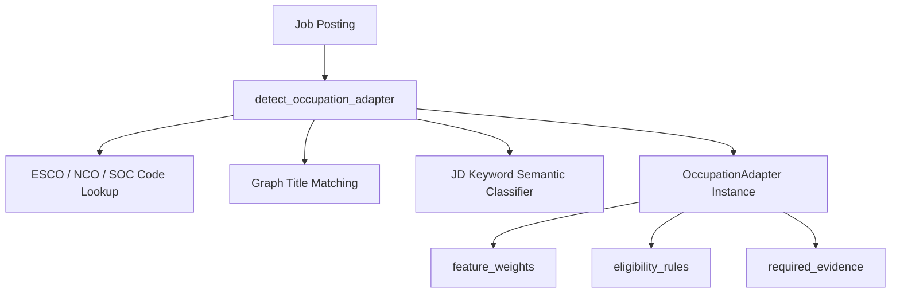

# Occupation-Family Scoring Adapters

CareerPilot ATS v2.0.0 uses specialized domain adapters to tailor feature weights, eligibility knockouts, and evidence extraction to the distinct reality of each occupation family.

## Architecture

---

## The 12 Domain Adapters

| # | Adapter Name | Family Codes | Feature Weights | Dominant Signals & Knockout Invariants |
|---|---|---|---|---|
| 1 | **SoftwareEngineeringAdapter** | `software_engineering`, `tech`, `it`, `web_development`, `devops`, `cloud` | Skills: 0.40 Experience: 0.30 Semantic: 0.20 Education: 0.10 | Repositories, GitHub profile, tech stack depth, system scale mentions, architecture experience. Baseline ATS behavior. |
| 2 | **HealthcareAdapter** | `healthcare`, `nursing`, `medical`, `clinical`, `pharmacy` | Credentials: 0.35 Experience: 0.35 Skills: 0.20 Education: 0.10 | Active RN / Nursing Council / NMC registration is a **hard knockout**. Clinical hours, specialty, shift availability, immunization. |
| 3 | **LegalFinanceAdapter** | `legal_finance`, `legal`, `finance`, `accounting`, `audit`, `compliance` | Credentials: 0.35 Experience: 0.30 Skills: 0.25 Education: 0.10 | Bar enrolment for advocates, ICAI CA / CPA for statutory auditors (**hard knockout**). Articleship completion, regulatory clearances. |
| 4 | **SkilledTradesAdapter** | `skilled_trades`, `trades`, `construction`, `welding`, `electrical`, `manufacturing` | Credentials: 0.35 Skills: 0.35 Experience: 0.20 Education: 0.10 | Trade certifications (welding 6G, wireman/electrician licence, OSHA/NEBOSH safety), equipment operated, physical/shift capabilities. |
| 5 | **CreativeDesignAdapter** | `creative_design`, `design`, `ui_ux`, `graphic_design`, `multimedia` | Portfolio: 0.35 Skills: 0.35 Experience: 0.15 Semantic: 0.10 Education: 0.05 | Portfolio URL presence (Behance, Dribbble, Figma) is prioritized. **Years of experience are downweighted** to 0.15; tool fluency dominates. |
| 6 | **AcademicResearchAdapter** | `academic_research`, `academia`, `research`, `scientific`, `postdoc` | Publications: 0.30 Experience: 0.25 Education: 0.25 Skills: 0.20 | Peer-reviewed publications, h-index, citations, funded grants, teaching load, advisor/PI pedigree, conference proceedings. |
| 7 | **SalesAdapter** | `sales`, `business_development`, `account_executive`, `growth`, `revenue` | Track Record: 0.35 Experience: 0.30 Skills: 0.25 Education: 0.10 | Quota attainment %, Annual Contract Value (ACV), sales cycle length, territory geography, B2B/B2C SaaS vertical focus. |
| 8 | **TeachingAdapter** | `teaching`, `education`, `k12`, `higher_ed`, `pedagogy` | Credentials: 0.35 Education: 0.30 Experience: 0.20 Skills: 0.15 | Mandatory **B.Ed / TET / CTET** certification (**hard knockout** for formal teaching). Grade band, curriculum board (CBSE/ICSE/IB), medium of instruction. |
| 9 | **HospitalityRetailAdapter** | `hospitality_retail`, `hospitality`, `retail`, `food_beverage`, `restaurant` | Experience: 0.35 Skills: 0.30 Credentials: 0.25 Education: 0.10 | Shift availability windows, multilingual fluency, food safety certification (FSSAI/ServSafe/HACCP), customer volume handling. |
| 10 | **LogisticsOperationsAdapter** | `logistics_operations`, `logistics`, `supply_chain`, `transportation`, `warehousing` | Credentials: 0.35 Experience: 0.35 Skills: 0.20 Education: 0.10 | Mandatory driving licence class (**HMV / Commercial / CDL** hard knockout for driving roles). Endorsements, route familiarity, WMS systems. |
| 11 | **DataAnalyticsAdapter** | `data_analytics`, `analytics`, `bi`, `data_science`, `statistics` | Skills: 0.35 Experience: 0.30 Semantic: 0.20 Education: 0.15 | Analytical tool depth (SQL, Python/R), BI reporting (PowerBI, Tableau), domain data depth, applied statistical modeling. |
| 12 | **GenericAdapter** | `generic`, `general`, `other`, `unclassified` | Skills: 0.40 Experience: 0.30 Semantic: 0.20 Education: 0.10 | Safe, conservative generalist weights. Never assumes domain-specific requirements or ungrounded knockouts. |

---

## Invariant Guarantees
1. **Shared Pass Stays Shared**: Expensive embeddings, text normalizations, and max-sim computations execute once via `_compute_shared_components`. Only weights and domain eligibility rules adapt.
2. **Deterministic & Replayable**: Adapter resolution depends strictly on job title, JD text, and occupation code.
3. **Graceful Fallback**: Any unclassified role defaults cleanly to `GenericAdapter` without crashing or guessing unverifiable signals.
